# Kaeva Master Blueprint

## Complete Application Architecture & User Journey

**Version:** 2.0 - Updated to reflect modular onboarding, AI proactive insights, meal planning, and 6-domain dashboard architecture.

---

## 1. Authentication & Entry Flow

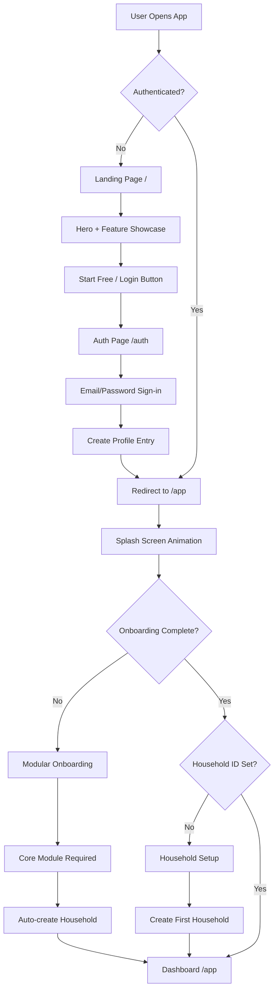

**Key Changes:**
- Landing page (/) serves as marketing homepage
- Authenticated users route to /app (not /)
- Splash screen shown on every authenticated entry
- Modular onboarding with 6 optional modules (only Core required for dashboard access)
- Households auto-created during onboarding

---

## 2. Modular Onboarding System

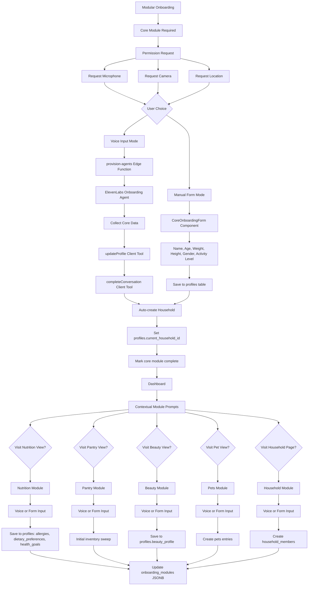

**Key Features:**
- 6 modules tracked in `profiles.onboarding_modules` JSONB: `{core, nutrition, pantry, beauty, pets, household}`
- Core module is required gate to dashboard access
- Other modules triggered contextually when user visits relevant dashboard view
- Each module supports dual input: voice conversation (ElevenLabs) or manual form
- Users can re-run modules anytime from Settings
- Voice mode preferences cached in localStorage

---

## 3. Dashboard 6-View Architecture

```mermaid
graph TD
    Dashboard[Dashboard /app] --> SwipeableViews[6 Swipeable Horizontal Views]
    
    SwipeableViews --> PULSE[PULSE View]
    SwipeableViews --> FUEL[FUEL View]
    SwipeableViews --> PANTRY[PANTRY View]
    SwipeableViews --> GLOW[GLOW View]
    SwipeableViews --> PETS[PETS View]
    SwipeableViews --> HOME[HOME View]
    
    PULSE --> PulseComponents[Wellness Hub]
    PulseComponents --> WelcomeBanner[Welcome Banner]
    PulseComponents --> PulseHeader[Pulse Header with Health Ring]
    PulseComponents --> SafetyShield[Safety Shield Status]
    
    FUEL --> FuelComponents[Nutrition Center]
    FuelComponents --> NutritionWidget[Nutrition Progress Widget]
    FuelComponents --> WaterTracking[Water Tracking Widget]
    FuelComponents --> StreakWidget[Logging Streak Widget]
    
    PANTRY --> PantryComponents[Food Inventory]
    PantryComponents --> FridgeCard[Fridge Inventory Card]
    PantryComponents --> PantryCard[Pantry Inventory Card]
    PantryComponents --> ExpiringItems[Expiring Items & Recipes]
    PantryComponents --> SmartCart[Smart Cart Widget]
    
    GLOW --> GlowComponents[Beauty Station]
    GlowComponents --> BeautySummary[Beauty Summary Card]
    GlowComponents --> BeautyInventory[Beauty Inventory List]
    GlowComponents --> ExpiringBeauty[Expiring Products Alert]
    
    PETS --> PetsComponents[Pet Care Hub]
    PetsComponents --> PetRoster[Pet Roster Card]
    PetsComponents --> PetSupplies[Pet Supplies Inventory]
    PetsComponents --> ToxicMonitor[Toxic Food Monitor]
    PetsComponents --> PetCareTips[Pet Care Tips Widget]
    
    HOME --> HomeComponents[Household Hub]
    HomeComponents --> HouseholdQuick[Household Quick Access]
    HomeComponents --> RecipeFeed[Recipe Feed]
    HomeComponents --> HouseholdActivity[Household Activity Feed]
    
    Dashboard --> GlobalSearch[Global Search Sticky Header]
    Dashboard --> PaginationDots[Pagination Dots with Labels/Icons]
    Dashboard --> FloatingDock[Floating Command Dock]
    
    FloatingDock --> SettingsButton[Settings Icon Left]
    FloatingDock --> LivingAperture[Living Aperture Center 64px]
    FloatingDock --> ProfileButton[Profile Avatar Right]
    
    LivingAperture --> ActionPicker[Action Picker Dialog]
    ActionPicker --> VoiceAssistant[Start Voice Assistant]
    ActionPicker --> VisionScanner[Open Vision Scanner]
```

**Key Features:**
- 6 dedicated domain views (not tabs) with horizontal swipe navigation
- Circular wrap navigation (HOME → PULSE → FUEL → ...)
- Haptic feedback on view changes
- View-specific entrance animations with staggered children
- Edge indicators showing adjacent content
- Per-view empty states with contextual CTAs
- Beauty and Pets domains elevated to equal prominence as Nutrition/Inventory

---

## 4. AI Proactive Transformation System

```mermaid
graph TD
    AISystem[AI Proactive System] --> DailyDigest[Daily AI Digest]
    AISystem --> LearningEngine[Learning Preferences Engine]
    AISystem --> TimeAware[Time-Aware Context]
    AISystem --> Explanations[Transparent Explanations]
    
    DailyDigest --> CronJob[Cron Job: Daily 7AM]
    CronJob --> DigestFunction[daily-ai-digest Edge Function]
    DigestFunction --> AnalyzeContext[Analyze Household Context]
    
    AnalyzeContext --> FetchExpiring[Fetch Expiring Items]
    AnalyzeContext --> FetchLowStock[Fetch Low Stock Items]
    AnalyzeContext --> FetchRecentMeals[Fetch Recent meal_logs]
    AnalyzeContext --> FetchInventory[Fetch Current Inventory]
    AnalyzeContext --> FetchProfile[Fetch User Preferences]
    
    FetchExpiring --> GeminiGenerate[Gemini 2.0 Flash Generation]
    FetchLowStock --> GeminiGenerate
    FetchRecentMeals --> GeminiGenerate
    FetchInventory --> GeminiGenerate
    FetchProfile --> GeminiGenerate
    
    GeminiGenerate --> GenerateInsights[Generate 3-4 Insights]
    GenerateInsights --> PriorityRank[Priority Rank Insights]
    PriorityRank --> SaveDigest[Save to daily_digests table]
    SaveDigest --> CreateNotification[Create notification entry]
    
    LearningEngine --> TrackMealLogs[Track meal_logs]
    LearningEngine --> TrackRecipeSaves[Track bookmarked recipes]
    TrackMealLogs --> ExtractPatterns[Extract Cuisine/Ingredient Patterns]
    TrackRecipeSaves --> ExtractPatterns
    ExtractPatterns --> StorePreferences[Store in learned_preferences]
    StorePreferences --> ApplyLearning[Apply to Future Suggestions]
    
    TimeAware --> DetectTime[Detect Current Time]
    DetectTime --> MorningContext[Morning: Breakfast Suggestions]
    DetectTime --> LunchContext[Midday: Lunch Ideas]
    DetectTime --> EveningContext[Evening: Dinner Planning]
    DetectTime --> NightContext[Night: Meal Prep Tomorrow]
    
    Explanations --> RecipeExplanation[Recipe "Why" Reasoning]
    Explanations --> ProductExplanation[Product Swap Reasoning]
    Explanations --> InsightExplanation[Insight Reasoning]
    
    RecipeExplanation --> ShowIngredientMatch[Show % Ingredient Match]
    RecipeExplanation --> ShowNutritionAlign[Show Nutrition Alignment]
    RecipeExplanation --> ShowPreferenceScore[Show Preference Score]
    
    AISystem --> AIInsightsWidget[AIInsightsWidget Component]
    AIInsightsWidget --> FetchDigest[Fetch Today's Digest]
    FetchDigest --> DisplayCards[Display Top 3-4 Priority Cards]
    DisplayCards --> ActionButtons[Action Buttons per Insight]
    
    ActionButtons --> ViewRecipe[View Recipe]
    ActionButtons --> AddToCart[Add to Cart]
    ActionButtons --> DismissInsight[Dismiss]
```

**Key Features:**
- **Daily AI Digest**: Proactive cron-generated insights delivered every morning
- **Learning Preferences**: Tracks user behavior (meal logs, recipe saves) to improve suggestions
- **Time-Aware**: Adapts suggestions by time of day and household needs
- **Transparent Reasoning**: All recommendations include "why" explanation text
- **Priority Ranking**: Insights ranked by urgency and relevance

---

## 5. Meal Planning & Cooking System

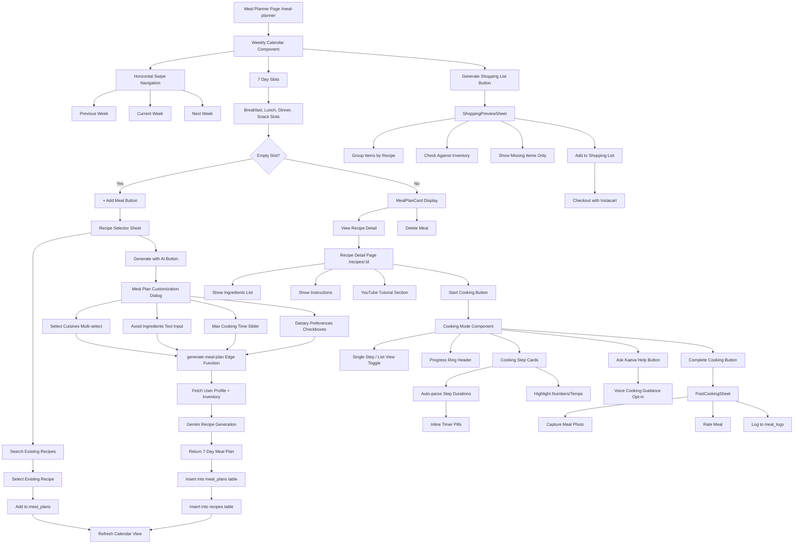

**Key Features:**
- **Weekly Calendar**: Horizontal swipe navigation with week indicator dots
- **AI Customization**: Users customize parameters BEFORE generation (cuisines, avoid ingredients, time limits)
- **Cooking Mode**: Single-step vs list-view toggle, auto-parsed timers, progress ring
- **Voice Cooking**: Opt-in voice guidance ("Ask Kaeva" button)
- **Post-Cooking**: Photo capture and engagement after completing recipe
- **Shopping Preview**: Grouped shopping lists with inventory matching

---

## 6. Smart Scanner Multi-Intent System

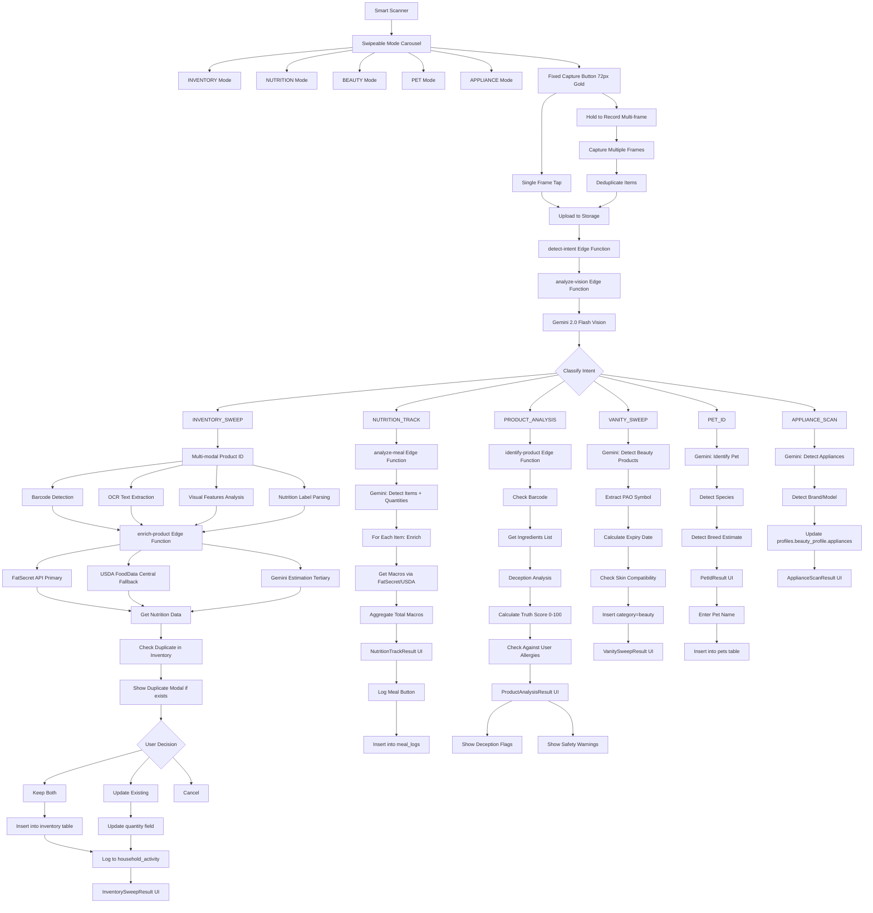

**Key Features:**
- **Multi-Intent Classification**: AI determines scan intent automatically
- **Multi-modal Product ID**: Cascading identification (barcode → OCR → visual → label)
- **Duplicate Detection**: Checks existing inventory before inserting
- **Nutrition Cascade**: FatSecret primary → USDA fallback → Gemini estimation
- **Deception Analysis**: Truth score calculation for marketing claims
- **Beauty PAO**: Period-After-Opening symbol extraction for expiry calculation
- **Pet Identification**: Species and breed detection for household pet management

---

## 7. Voice AI Dual-Agent System

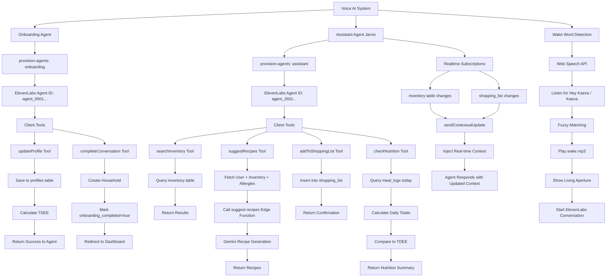

**Key Features:**
- **Dual-Agent Architecture**: Separate agents for onboarding vs in-app assistant
- **Client Tools**: Defined inline within useConversation to avoid stale closures
- **Realtime Context**: Assistant receives contextual updates via Supabase realtime subscriptions
- **Wake Word Detection**: Opt-in "Hey Kaeva" / "Kaeva" detection using Web Speech API
- **Contextual Awareness**: Agent knows current inventory, low stock, expiring items, allergies, pet restrictions

---

## 8. Household Sharing & Collaboration

```mermaid
graph TD
    HouseholdSystem[Household System] --> HouseholdPage[Household Page /household]
    
    HouseholdPage --> HeroHeader[Hero Header Banner]
    HouseholdPage --> MembersSection[MEMBERS Section]
    HouseholdPage --> PreferencesSection[PREFERENCES Section]
    
    MembersSection --> CompactRows[Compact Member Rows]
    CompactRows --> AbstractAvatar[Abstract Avatar Deterministic]
    CompactRows --> MemberName[Member Name + Subtitle]
    CompactRows --> ChevronRight[Chevron Right]
    
    ChevronRight --> DetailSheet[Member Detail Sheet]
    DetailSheet --> BiometricsSection[Biometrics Display]
    DetailSheet --> AllergiesSection[Allergies Display]
    DetailSheet --> DietarySection[Dietary Restrictions]
    DetailSheet --> HealthSection[Health Conditions]
    
    PreferencesSection --> EditName[Edit Household Name]
    PreferencesSection --> ManageRoles[Manage Member Roles Owner/Admin/Member]
    PreferencesSection --> NotificationToggles[Household Notifications Toggle]
    PreferencesSection --> SafetyToggles[Safety Alerts Toggle]
    PreferencesSection --> InviteButton[Invite Members Button]
    
    InviteButton --> CreateInvite[create-household-invite Edge Function]
    CreateInvite --> GenerateJWT[Generate JWT-signed Invite Code]
    GenerateJWT --> CreateInviteLink[Create Shareable URL]
    CreateInviteLink --> InsertInviteRecord[Insert into household_invites]
    InsertInviteRecord --> DisplayLink[Display Shareable Link]
    
    DisplayLink --> ShareOptions[Share via Copy/SMS/Email]
    ShareOptions --> RecipientReceives[Recipient Receives Link]
    RecipientReceives --> InviteRoute[/household/join/:code Route]
    
    InviteRoute --> AcceptInvite[accept-household-invite Edge Function]
    AcceptInvite --> VerifyJWT[Verify JWT Code]
    VerifyJWT --> CheckValidity{Valid & Unexpired?}
    
    CheckValidity -->|No| ErrorPage[Show Error]
    CheckValidity -->|Yes| CheckMaxUses{Max Uses Reached?}
    
    CheckMaxUses -->|Yes| ErrorPage
    CheckMaxUses -->|No| CheckUserAuth{User Authenticated?}
    
    CheckUserAuth -->|No| RedirectAuth[Redirect to /auth]
    CheckUserAuth -->|Yes| AddMembership[Insert into household_memberships]
    
    AddMembership --> SetCurrentHousehold[Update profiles.current_household_id]
    SetCurrentHousehold --> IncrementUses[Increment household_invites.times_used]
    IncrementUses --> LogActivity[Log to household_activity]
    LogActivity --> RedirectHouseholdPage[Redirect to /household]
    
    HouseholdPage --> ActivityFeed[Household Activity Feed]
    ActivityFeed --> RealtimeSubscription[Subscribe to household_activity]
    RealtimeSubscription --> DisplayEvents[Display Events]
    
    DisplayEvents --> MemberJoin[Member Joined Event]
    DisplayEvents --> InventoryAdd[Inventory Added Event]
    DisplayEvents --> RecipeAdd[Recipe Added Event]
    DisplayEvents --> InventoryUpdate[Inventory Updated Event]
```

**Key Features:**
- **Household-Level Data**: All inventory, recipes, shopping lists scoped to `household_id`
- **JWT Invite System**: Secure time-limited invite codes with max usage tracking
- **Role Management**: Owner/Admin/Member roles with permission hierarchy
- **Activity Feed**: Real-time household activity log with Supabase realtime
- **Abstract Avatars**: Deterministic avatar generation from member names (geometric patterns, gradient colors)

---

## 9. Database Schema & Relationships

```mermaid
erDiagram
    profiles ||--o{ household_memberships : "belongs_to"
    households ||--o{ household_memberships : "has"
    households ||--o{ household_invites : "generates"
    households ||--o{ household_activity : "logs"
    households ||--o{ inventory : "owns"
    households ||--o{ recipes : "owns"
    households ||--o{ meal_plans : "plans"
    households ||--o{ shopping_list : "maintains"
    households ||--o{ daily_digests : "receives"
    
    profiles ||--o{ household_members : "manages"
    profiles ||--o{ pets : "has"
    profiles ||--o{ meal_logs : "logs"
    profiles ||--o{ water_logs : "logs"
    profiles ||--o{ meal_templates : "saves"
    profiles ||--o{ saved_foods : "saves"
    profiles ||--o{ bookmarks : "bookmarks"
    profiles ||--o{ learned_preferences : "learns"
    profiles ||--o{ notifications : "receives"
    profiles ||--o{ conversation_history : "has"
    profiles ||--o{ conversation_events : "has"
    profiles ||--o{ user_roles : "has"
    
    recipes ||--o{ meal_plans : "scheduled_in"
    inventory ||--o| shopping_list : "links_to"
    
    profiles {
        uuid id PK
        string user_name
        int user_age
        string user_gender
        float user_height
        float user_weight
        string user_activity_level
        int calculated_tdee
        int daily_calorie_goal
        int daily_protein_goal
        int daily_carbs_goal
        int daily_fat_goal
        int water_goal_ml
        json allergies
        json dietary_preferences
        json health_goals
        json lifestyle_goals
        json beauty_profile
        string language
        string preferred_retailer_id
        string preferred_retailer_name
        timestamp last_retailer_refresh
        boolean agent_configured
        timestamp agent_configured_at
        string agent_prompt_version
        boolean onboarding_completed
        json onboarding_modules
        boolean permissions_granted
        string user_zip_code
        uuid current_household_id FK
        int current_streak
        int longest_streak
        date last_log_date
        date streak_start_date
        json notification_preferences
    }
    
    households {
        uuid id PK
        string name
        uuid owner_id FK
        timestamp created_at
        timestamp updated_at
    }
    
    household_memberships {
        uuid id PK
        uuid household_id FK
        uuid user_id FK
        string role
        timestamp joined_at
    }
    
    household_invites {
        uuid id PK
        uuid household_id FK
        uuid created_by FK
        string invite_code
        timestamp expires_at
        int max_uses
        int times_used
        timestamp created_at
    }
    
    household_activity {
        uuid id PK
        uuid household_id FK
        uuid actor_id FK
        string actor_name
        string activity_type
        string entity_type
        string entity_id
        string entity_name
        json metadata
        timestamp created_at
    }
    
    household_members {
        uuid id PK
        uuid user_id FK
        string member_type
        string name
        int age
        string age_group
        string gender
        float height
        float weight
        string activity_level
        int calculated_tdee
        json allergies
        json dietary_restrictions
        json health_conditions
        json medication_interactions
    }
    
    pets {
        uuid id PK
        uuid user_id FK
        string name
        string species
        string breed
        int age
        boolean toxic_flags_enabled
        float daily_serving_size
        string food_brand
        text notes
    }
    
    inventory {
        uuid id PK
        uuid household_id FK
        string name
        string brand_name
        string barcode
        enum category
        int quantity
        string unit
        int original_quantity
        float fill_level
        date expiry_date
        enum status
        json nutrition_data
        json allergens
        json dietary_flags
        string product_image_url
        string fatsecret_id
        timestamp last_enriched_at
        timestamp last_activity_at
        boolean auto_order_enabled
        int reorder_threshold
        float consumption_rate
    }
    
    recipes {
        uuid id PK
        uuid household_id FK
        uuid user_id FK
        string name
        json ingredients
        json instructions
        int servings
        int cooking_time
        int estimated_calories
        string difficulty
        string[] required_appliances
        float match_score
        boolean is_public
        string share_token
        timestamp shared_at
        int view_count
        timestamp cached_at
    }
    
    meal_plans {
        uuid id PK
        uuid household_id FK
        uuid user_id FK
        uuid recipe_id FK
        date planned_date
        string meal_type
        text notes
        timestamp created_at
        timestamp updated_at
    }
    
    meal_logs {
        uuid id PK
        uuid user_id FK
        timestamp logged_at
        string meal_type
        int calories
        float protein
        float carbs
        float fat
        float fiber
        json items
        string image_url
    }
    
    meal_templates {
        uuid id PK
        uuid user_id FK
        string template_name
        json items
        int total_calories
        float total_protein
        float total_carbs
        float total_fat
        float total_fiber
        timestamp created_at
        timestamp updated_at
    }
    
    water_logs {
        uuid id PK
        uuid user_id FK
        int amount_ml
        timestamp logged_at
    }
    
    shopping_list {
        uuid id PK
        uuid household_id FK
        uuid inventory_id FK
        string item_name
        int quantity
        string unit
        string source
        enum status
        enum priority
        timestamp created_at
        timestamp updated_at
    }
    
    daily_digests {
        uuid id PK
        uuid user_id FK
        uuid household_id FK
        date digest_date
        json insights
        timestamp generated_at
        timestamp viewed_at
    }
    
    bookmarks {
        uuid id PK
        uuid user_id FK
        string item_type
        string item_id
        timestamp created_at
    }
    
    learned_preferences {
        uuid id PK
        uuid user_id FK
        string preference_type
        string preference_value
        int occurrences
        float confidence
        string learned_from
        timestamp last_updated
    }
    
    saved_foods {
        uuid id PK
        uuid user_id FK
        string food_name
        json nutrition_data
        timestamp last_used_at
    }
    
    notifications {
        uuid id PK
        uuid user_id FK
        string type
        string title
        text message
        json metadata
        boolean read
        timestamp created_at
    }
    
    conversation_history {
        uuid id PK
        uuid user_id FK
        string conversation_id
        string role
        text message
        json metadata
        timestamp created_at
    }
    
    conversation_events {
        uuid id PK
        uuid user_id FK
        string conversation_id
        string agent_type
        string event_type
        string role
        json event_data
        timestamp created_at
    }
    
    user_roles {
        uuid id PK
        uuid user_id FK
        enum role
    }
    
    product_cache {
        uuid id PK
        string search_term
        json fatsecret_response
        json nutrition_summary
        string image_url
        timestamp cached_at
        timestamp expires_at
    }
    
    rate_limits {
        uuid id PK
        uuid user_id FK
        string endpoint
        int request_count
        timestamp window_start
    }
```

**Critical Changes:**
- **Household-Level Data Model**: `inventory`, `recipes`, `shopping_list`, `meal_plans` all use `household_id` FK instead of `user_id`
- **Household Tables**: `households`, `household_memberships`, `household_invites`, `household_activity` enable multi-user collaboration
- **Modular Onboarding**: `profiles.onboarding_modules` JSONB tracks completion of 6 modules
- **Meal Planning**: `meal_plans`, `meal_templates` tables for weekly planning
- **Learning System**: `learned_preferences`, `saved_foods`, `bookmarks` tables
- **Daily Digests**: `daily_digests` table stores AI-generated insights

---

## 10. Edge Functions Architecture

```mermaid
graph TB
    Client[React Frontend] --> EdgeFunctions[Edge Functions Layer]
    
    EdgeFunctions --> AuthCheck[check-admin]
    EdgeFunctions --> Provision[provision-agents]
    EdgeFunctions --> VisionIntent[detect-intent]
    EdgeFunctions --> VisionAnalyze[analyze-vision]
    EdgeFunctions --> ProductID[identify-product]
    EdgeFunctions --> ProductEnrich[enrich-product]
    EdgeFunctions --> MealAnalysis[analyze-meal]
    EdgeFunctions --> RecipeSuggest[suggest-recipes]
    EdgeFunctions --> RecipeVideos[search-recipe-videos]
    EdgeFunctions --> RecipeCook[cook-recipe]
    EdgeFunctions --> RecipeExtract[extract-social-recipe]
    EdgeFunctions --> MealPlanGen[generate-meal-plan]
    EdgeFunctions --> BeautyInspire[generate-beauty-inspiration]
    EdgeFunctions --> DailyDigest[daily-ai-digest]
    EdgeFunctions --> AutoRestock[check-auto-restock]
    EdgeFunctions --> Spoilage[notify-spoilage]
    EdgeFunctions --> Instacart[instacart-service]
    EdgeFunctions --> InstacartCart[instacart-create-cart]
    EdgeFunctions --> PlaceHours[get-place-hours]
    EdgeFunctions --> SignedURL[generate-signed-url]
    EdgeFunctions --> AppIcons[generate-app-icons]
    EdgeFunctions --> HouseholdInvite[create-household-invite]
    EdgeFunctions --> AcceptInvite[accept-household-invite]
    EdgeFunctions --> DeleteAccount[delete-account]
    
    Provision --> ElevenLabsAPI[ElevenLabs API]
    ElevenLabsAPI --> CreateAgent[Create/Update Agent]
    CreateAgent --> RegisterTools[Register Client Tools]
    
    VisionIntent --> GeminiVision1[Gemini 2.0 Flash Vision]
    VisionAnalyze --> GeminiVision1
    GeminiVision1 --> ClassifyIntent[Classify Intent]
    GeminiVision1 --> ExtractObjects[Extract Objects]
    
    ProductID --> BarcodeAPI[OpenFoodFacts API]
    ProductEnrich --> FatSecretAPI[FatSecret API]
    ProductEnrich --> USDAAPI[USDA FoodData Central]
    ProductEnrich --> GeminiEstimate[Gemini Estimation]
    
    MealAnalysis --> GeminiVision2[Gemini 2.0 Flash Vision]
    GeminiVision2 --> DetectItems[Detect Meal Items]
    DetectItems --> EnrichEach[Enrich Each Item]
    EnrichEach --> FatSecretAPI
    
    RecipeSuggest --> GeminiRecipe1[Gemini 2.0 Flash]
    GeminiRecipe1 --> GenerateRecipes[Generate Recipes with Explanations]
    
    RecipeVideos --> YouTubeAPI[YouTube Data API v3]
    YouTubeAPI --> SearchVideos[Search Cooking Tutorials]
    
    RecipeExtract --> SocialAPIs[TikTok/Instagram/Pinterest/YouTube]
    SocialAPIs --> ParseRecipe[Parse Recipe Data]
    
    MealPlanGen --> GeminiRecipe2[Gemini 2.0 Flash]
    GeminiRecipe2 --> Generate7Days[Generate 7-Day Meal Plan]
    
    BeautyInspire --> GeminiBeauty[Gemini 2.0 Flash]
    GeminiBeauty --> GenerateLooks[Generate Makeup/Skincare Looks]
    
    DailyDigest --> GeminiInsights[Gemini 2.0 Flash]
    GeminiInsights --> AnalyzeContext[Analyze Household Context]
    AnalyzeContext --> GenerateInsights[Generate 3-4 Priority Insights]
    
    AutoRestock --> CheckThresholds[Check Reorder Thresholds]
    CheckThresholds --> TriggerRestock[Trigger Instacart Cart]
    
    Instacart --> InstacartRetailerAPI[Instacart Retailer API]
    InstacartCart --> InstacartCartAPI[Instacart Create Cart API]
    
    PlaceHours --> GooglePlacesAPI[Google Places API]
    
    AppIcons --> LovableAI[Lovable AI Gateway]
    LovableAI --> GenerateIcon[Generate PWA Icons]
    
    HouseholdInvite --> JWTSign[Sign JWT Invite Code]
    AcceptInvite --> JWTVerify[Verify JWT Invite Code]
```

**Key Edge Functions:**
- **provision-agents**: Create/update ElevenLabs agents with client tools
- **daily-ai-digest**: Cron-triggered proactive insights generation
- **generate-meal-plan**: AI-powered weekly meal planning with customization
- **search-recipe-videos**: YouTube tutorial integration
- **extract-social-recipe**: Import recipes from social platforms
- **generate-beauty-inspiration**: Beauty looks and routines based on inventory
- **create-household-invite**: JWT-signed invite code generation
- **accept-household-invite**: Validate and join household via invite
- **check-auto-restock**: Evaluate auto-order triggers for Instacart carts
- **generate-app-icons**: PWA icon generation via Lovable AI Gateway

---

## 11. Design System: Engineered Organic

```mermaid
graph TD
    DesignSystem[Design System] --> Philosophy[Engineered Organic Philosophy]
    DesignSystem --> Palette[Seattle Fall Nano Palette]
    DesignSystem --> Typography[Typography System]
    DesignSystem --> Components[Signature Components]
    DesignSystem --> Interactions[Micro-interactions]
    
    Philosophy --> GlassLight[Glass & Light Metaphor]
    Philosophy --> PrecisionWarmth[Precision with Calming Warmth]
    Philosophy --> Glassmorphism[Heavy Glassmorphism]
    Philosophy --> DarkDefault[Dark Mode Default]
    
    Palette --> Primary[Primary: Autumn Gold D69E2E]
    Palette --> Secondary[Secondary: Electric Sage 70E098]
    Palette --> Destructive[Destructive: Terracotta D97757]
    Palette --> Accent[Accent: Electric Sky 38BDF8]
    Palette --> Background[Background: Void 08080A]
    Palette --> Foreground[Foreground: Mist E2E8F0]
    
    Typography --> Manrope[Manrope: Body & Display]
    Typography --> SpaceGrotesk[Space Grotesk: Technical Headers]
    Typography --> JetBrainsMono[JetBrains Mono: Data/Numbers]
    
    Components --> LivingAperture[Living Aperture Gold Hero Button]
    Components --> FloatingDock[Floating Command Dock Glass Capsule]
    Components --> GlassCards[Glass Cards with Inner Glow]
    Components --> HealthRing[Health Ring Progress Indicator]
    
    LivingAperture --> BreathingPulse[Slow Breathing Animation]
    LivingAperture --> GoldGlow[Gold Glow Effect]
    LivingAperture --> ExpandOnInteraction[Expand on Interaction]
    
    FloatingDock --> SatelliteArchitecture[Satellite Architecture]
    SatelliteArchitecture --> GlassCapsule[Glass Capsule Background Layer]
    SatelliteArchitecture --> ApertureNucleus[Aperture Nucleus Floating Above]
    
    Interactions --> HapticFeedback[Haptic Feedback]
    Interactions --> SlideTransitions[Slide-up Page Transitions]
    Interactions --> SkeletonLoaders[Skeleton Loading States]
    Interactions --> ProgressiveMicrocopy[Progressive Microcopy]
    
    HapticFeedback --> SuccessVibration[Success: Short Sharp]
    HapticFeedback --> WarningVibration[Warning: Double Heavy]
    HapticFeedback --> ScrollTick[Scroll: Light Tick]
```

**Design Principles:**
- **Engineered Organic**: Precision engineering with calming organic warmth
- **Glass & Light**: UI as transparent intelligent lens with depth via layering
- **Seattle Fall Nano**: 5-color semantic palette with Autumn Gold primary
- **Typography Hierarchy**: Manrope (body), Space Grotesk (technical), JetBrains Mono (data)
- **Living Aperture**: 64-72px gold hero button with breathing animation
- **Satellite Architecture**: Floating dock with asymmetric nucleus design
- **Haptic Feedback**: Contextual vibrations for success, warnings, navigation

---

## 12. Complete User Journey Timeline

```mermaid
gantt
    title KAEVA Complete User Journey
    dateFormat YYYY-MM-DD
    
    section Discovery
    Land on landing page        :milestone, m1, 2024-01-01, 0d
    Read value proposition      :a1, 2024-01-01, 1d
    View feature showcase       :a2, 2024-01-01, 1d
    Click Start Free            :milestone, m2, 2024-01-02, 0d
    
    section Authentication
    Sign up email/password      :active, b1, 2024-01-02, 1d
    Create profile entry        :b2, 2024-01-02, 1d
    Redirect to /app            :milestone, m3, 2024-01-03, 0d
    
    section Onboarding
    View splash screen          :c1, 2024-01-03, 1d
    Core module prompt          :active, c2, 2024-01-03, 1d
    Choose voice input          :c3, 2024-01-03, 1d
    Grant permissions           :c4, 2024-01-03, 1d
    Voice conversation          :active, c5, 2024-01-04, 1d
    Collect biometrics          :c6, 2024-01-04, 1d
    Auto-create household       :c7, 2024-01-04, 1d
    Mark core complete          :milestone, m4, 2024-01-05, 0d
    
    section Dashboard Use
    View 6-domain dashboard     :active, d1, 2024-01-05, 30d
    Swipe between views         :d2, 2024-01-05, 30d
    Receive daily digest        :d3, 2024-01-06, 30d
    Complete optional modules   :d4, 2024-01-06, 5d
    
    section Nutrition Tracking
    Open FUEL view              :e1, 2024-01-06, 1d
    Nutrition module prompt     :e2, 2024-01-06, 1d
    Complete nutrition module   :e3, 2024-01-07, 1d
    First meal scan             :milestone, m5, 2024-01-07, 0d
    Track daily meals           :active, e4, 2024-01-07, 20d
    View nutrition insights     :e5, 2024-01-10, 20d
    
    section Inventory Management
    Open PANTRY view            :f1, 2024-01-08, 1d
    Pantry module prompt        :f2, 2024-01-08, 1d
    Complete pantry module      :f3, 2024-01-09, 1d
    First inventory scan        :milestone, m6, 2024-01-09, 0d
    Sweep fridge/pantry         :active, f4, 2024-01-09, 5d
    Monitor expiring items      :f5, 2024-01-12, 20d
    
    section Beauty Domain
    Open GLOW view              :g1, 2024-01-10, 1d
    Beauty module prompt        :g2, 2024-01-10, 1d
    Complete beauty module      :g3, 2024-01-11, 1d
    Scan vanity items           :active, g4, 2024-01-11, 3d
    Get beauty inspiration      :g5, 2024-01-13, 10d
    
    section Pet Care
    Open PETS view              :h1, 2024-01-12, 1d
    Pets module prompt          :h2, 2024-01-12, 1d
    Complete pets module        :h3, 2024-01-13, 1d
    Scan pet photo              :h4, 2024-01-13, 1d
    Add pet supplies            :h5, 2024-01-13, 5d
    Monitor toxic foods         :h6, 2024-01-15, 15d
    
    section Meal Planning
    Open meal planner           :i1, 2024-01-15, 1d
    Generate 7-day plan         :active, i2, 2024-01-15, 1d
    Customize meal preferences  :i3, 2024-01-15, 1d
    Start cooking mode          :milestone, m7, 2024-01-16, 0d
    Follow recipe guidance      :i4, 2024-01-16, 2d
    Log completed meal          :i5, 2024-01-18, 1d
    
    section Smart Cart
    Add items to shopping list  :j1, 2024-01-18, 5d
    Generate shopping preview   :j2, 2024-01-20, 1d
    First Instacart checkout    :milestone, m8, 2024-01-20, 0d
    Complete purchase           :active, j3, 2024-01-20, 1d
    Auto-update inventory       :j4, 2024-01-21, 1d
    
    section Household Collaboration
    Visit household page        :k1, 2024-01-20, 1d
    Household module prompt     :k2, 2024-01-20, 1d
    Complete household module   :k3, 2024-01-21, 1d
    Invite family member        :k4, 2024-01-21, 1d
    Member accepts invite       :milestone, m9, 2024-01-22, 0d
    Share inventory access      :k5, 2024-01-22, 10d
    View activity feed          :k6, 2024-01-22, 10d
    
    section Voice Assistant
    Wake word Hey Kaeva         :milestone, m10, 2024-01-23, 0d
    Ask inventory question      :l1, 2024-01-23, 5d
    Request recipe suggestions  :active, l2, 2024-01-25, 10d
    Add to shopping via voice   :l3, 2024-01-27, 5d
```

**User Journey Highlights:**
- **Day 1-2**: Discovery and authentication via landing page
- **Day 3-5**: Core onboarding module with voice input, household auto-creation
- **Day 5-15**: Optional module completion triggered contextually by view visits
- **Day 6+**: Daily AI digests begin delivering proactive insights
- **Day 7+**: Meal tracking, inventory management, beauty, and pet care workflows active
- **Day 15+**: Meal planning with AI customization, cooking mode guidance
- **Day 20+**: Smart cart Instacart integration, household collaboration via invites
- **Day 23+**: Voice assistant usage with wake word detection

---

## 13. Security & RLS Policies

```mermaid
graph TD
    RLS[Row Level Security] --> HouseholdRLS[Household-Based RLS]
    RLS --> UserRLS[User-Based RLS]
    
    HouseholdRLS --> InventoryRLS[inventory RLS]
    HouseholdRLS --> RecipesRLS[recipes RLS]
    HouseholdRLS --> ShoppingRLS[shopping_list RLS]
    HouseholdRLS --> MealPlansRLS[meal_plans RLS]
    HouseholdRLS --> ActivityRLS[household_activity RLS]
    
    InventoryRLS --> InvSelect[SELECT: user in household_memberships]
    InventoryRLS --> InvInsert[INSERT: user in household_memberships]
    InventoryRLS --> InvUpdate[UPDATE: user in household_memberships]
    InventoryRLS --> InvDelete[DELETE: user in household_memberships]
    
    RecipesRLS --> RecSelect[SELECT: user in household OR is_public=true]
    RecipesRLS --> RecInsert[INSERT: user in household_memberships]
    RecipesRLS --> RecUpdate[UPDATE: user_id=auth.uid OR user in household admins]
    RecipesRLS --> RecDelete[DELETE: user_id=auth.uid OR user in household admins]
    
    ShoppingRLS --> ShopSelect[SELECT: user in household_memberships]
    ShoppingRLS --> ShopInsert[INSERT: user in household_memberships]
    ShoppingRLS --> ShopUpdate[UPDATE: user in household_memberships]
    ShoppingRLS --> ShopDelete[DELETE: user in household_memberships]
    
    MealPlansRLS --> PlanSelect[SELECT: user in household_memberships]
    MealPlansRLS --> PlanInsert[INSERT: user in household_memberships]
    MealPlansRLS --> PlanUpdate[UPDATE: user in household_memberships]
    MealPlansRLS --> PlanDelete[DELETE: user in household_memberships]
    
    ActivityRLS --> ActSelect[SELECT: user in household_memberships]
    ActivityRLS --> ActInsert[INSERT: auto-triggered by DB triggers]
    
    UserRLS --> ProfileRLS[profiles RLS]
    UserRLS --> MembersRLS[household_members RLS]
    UserRLS --> PetsRLS[pets RLS]
    UserRLS --> MealLogsRLS[meal_logs RLS]
    UserRLS --> WaterLogsRLS[water_logs RLS]
    UserRLS --> NotifRLS[notifications RLS]
    UserRLS --> ConvoRLS[conversation_history RLS]
    UserRLS --> BookmarksRLS[bookmarks RLS]
    UserRLS --> LearnedRLS[learned_preferences RLS]
    
    ProfileRLS --> ProfSelect[SELECT: id=auth.uid]
    ProfileRLS --> ProfUpdate[UPDATE: id=auth.uid]
    
    MembersRLS --> MemSelect[SELECT: user_id=auth.uid]
    MembersRLS --> MemInsert[INSERT: user_id=auth.uid]
    MembersRLS --> MemUpdate[UPDATE: user_id=auth.uid]
    MembersRLS --> MemDelete[DELETE: user_id=auth.uid]
    
    PetsRLS --> PetSelect[SELECT: user_id=auth.uid]
    PetsRLS --> PetInsert[INSERT: user_id=auth.uid]
    PetsRLS --> PetUpdate[UPDATE: user_id=auth.uid]
    PetsRLS --> PetDelete[DELETE: user_id=auth.uid]
    
    MealLogsRLS --> MealSelect[SELECT: user_id=auth.uid]
    MealLogsRLS --> MealInsert[INSERT: user_id=auth.uid]
    MealLogsRLS --> MealUpdate[UPDATE: user_id=auth.uid]
    MealLogsRLS --> MealDelete[DELETE: user_id=auth.uid]
    
    WaterLogsRLS --> WaterSelect[SELECT: user_id=auth.uid]
    WaterLogsRLS --> WaterInsert[INSERT: user_id=auth.uid]
    
    NotifRLS --> NotifSelect[SELECT: user_id=auth.uid]
    NotifRLS --> NotifUpdate[UPDATE: user_id=auth.uid]
    
    ConvoRLS --> ConvoSelect[SELECT: user_id=auth.uid]
    ConvoRLS --> ConvoInsert[INSERT: user_id=auth.uid]
    
    BookmarksRLS --> BookSelect[SELECT: user_id=auth.uid]
    BookmarksRLS --> BookInsert[INSERT: user_id=auth.uid]
    BookmarksRLS --> BookDelete[DELETE: user_id=auth.uid]
    
    LearnedRLS --> LearnSelect[SELECT: user_id=auth.uid]
    LearnedRLS --> LearnInsert[INSERT: user_id=auth.uid]
    LearnedRLS --> LearnUpdate[UPDATE: user_id=auth.uid]
```

**Security Strategy:**
- **Household-Based RLS**: `inventory`, `recipes`, `shopping_list`, `meal_plans`, `household_activity` use household membership checks
- **User-Based RLS**: `profiles`, `household_members`, `pets`, `meal_logs`, `water_logs` use `user_id=auth.uid()` checks
- **Public Recipe Sharing**: `recipes` allow SELECT for `is_public=true` recipes with share tokens
- **Role-Based Access**: Recipe UPDATE/DELETE restricted to recipe creator or household admins
- **Auto-Activity Logging**: `household_activity` inserts auto-triggered by database triggers (no direct user INSERT)

---

## 14. API Integrations Summary

```mermaid
graph TD
    KAEVA[KAEVA Application] --> NutritionAPIs[Nutrition APIs]
    KAEVA --> VisionAPIs[Vision AI APIs]
    KAEVA --> VoiceAPIs[Voice AI APIs]
    KAEVA --> ShoppingAPIs[Shopping APIs]
    KAEVA --> VideoAPIs[Video APIs]
    KAEVA --> LocationAPIs[Location APIs]
    KAEVA --> ImageGenAPIs[Image Generation APIs]
    
    NutritionAPIs --> FatSecret[FatSecret API Primary]
    NutritionAPIs --> USDA[USDA FoodData Central Fallback]
    NutritionAPIs --> GeminiNutrition[Gemini Estimation Tertiary]
    
    VisionAPIs --> GeminiVision[Google Gemini 2.0 Flash Vision]
    GeminiVision --> IntentClassification[Intent Classification]
    GeminiVision --> ObjectDetection[Object Detection]
    GeminiVision --> MealAnalysis[Meal Analysis]
    GeminiVision --> BeautyAnalysis[Beauty Product Analysis]
    GeminiVision --> PetIdentification[Pet Identification]
    
    VoiceAPIs --> ElevenLabs[ElevenLabs Conversational AI]
    ElevenLabs --> OnboardingAgent2[Onboarding Agent]
    ElevenLabs --> AssistantAgent2[Assistant Agent]
    VoiceAPIs --> WebSpeechAPI[Web Speech API]
    WebSpeechAPI --> WakeWordDetection2[Wake Word Detection]
    
    ShoppingAPIs --> Instacart2[Instacart API]
    Instacart2 --> RetailerSearch[Retailer Search]
    Instacart2 --> CartCreation[Cart Creation]
    
    VideoAPIs --> YouTube[YouTube Data API v3]
    YouTube --> RecipeVideoSearch[Recipe Tutorial Search]
    
    LocationAPIs --> GooglePlaces[Google Places API]
    GooglePlaces --> StoreHours[Store Hours Lookup]
    LocationAPIs --> Nominatim[Nominatim Geocoding]
    Nominatim --> ReverseGeocode[Reverse Geocode Zip]
    
    ImageGenAPIs --> LovableAI2[Lovable AI Gateway]
    LovableAI2 --> GeminiImage[Gemini 2.5 Flash Image]
    GeminiImage --> PWAIconGen[PWA Icon Generation]
```

**API Strategy:**
- **Nutrition Cascade**: FatSecret (primary) → USDA (fallback) → Gemini (tertiary estimation)
- **Vision AI**: Google Gemini 2.0 Flash Vision for all visual understanding tasks
- **Voice AI**: ElevenLabs dual-agent system + Web Speech API wake word detection
- **Shopping**: Instacart for cart creation and retailer search
- **Video Content**: YouTube Data API v3 for recipe tutorial discovery
- **Location Services**: Google Places for store hours, Nominatim for geocoding
- **Image Generation**: Lovable AI Gateway (Gemini 2.5 Flash Image) for PWA icons

---

## Summary

This master blueprint documents the complete KAEVA 2.0 application architecture including:

- **Modular Onboarding**: 6-module system (core, nutrition, pantry, beauty, pets, household) with dual input modes (voice/form)
- **6-Domain Dashboard**: Equal prominence for PULSE, FUEL, PANTRY, GLOW, PETS, HOME views with swipeable navigation
- **AI Proactive Transformation**: Daily digests, learning preferences engine, time-aware context, transparent explanations
- **Meal Planning**: Weekly calendar, AI customization before generation, cooking mode with voice guidance
- **Smart Scanner**: Multi-intent classification, multi-modal product identification, duplicate detection
- **Voice AI**: Dual-agent system (onboarding + assistant) with realtime contextual updates and wake word detection
- **Household Collaboration**: JWT invite system, role-based access, activity feed, household-level data model
- **Design System**: Engineered Organic philosophy, Seattle Fall Nano palette, Living Aperture gold hero button
- **Database**: Household-centric schema with 20+ tables, comprehensive RLS policies
- **Edge Functions**: 26 serverless functions integrating 8 external APIs
- **Security**: Household-based and user-based RLS policies protecting all data

All diagrams use mermaid syntax and can be rendered in any markdown viewer or mermaid-compatible tool.
