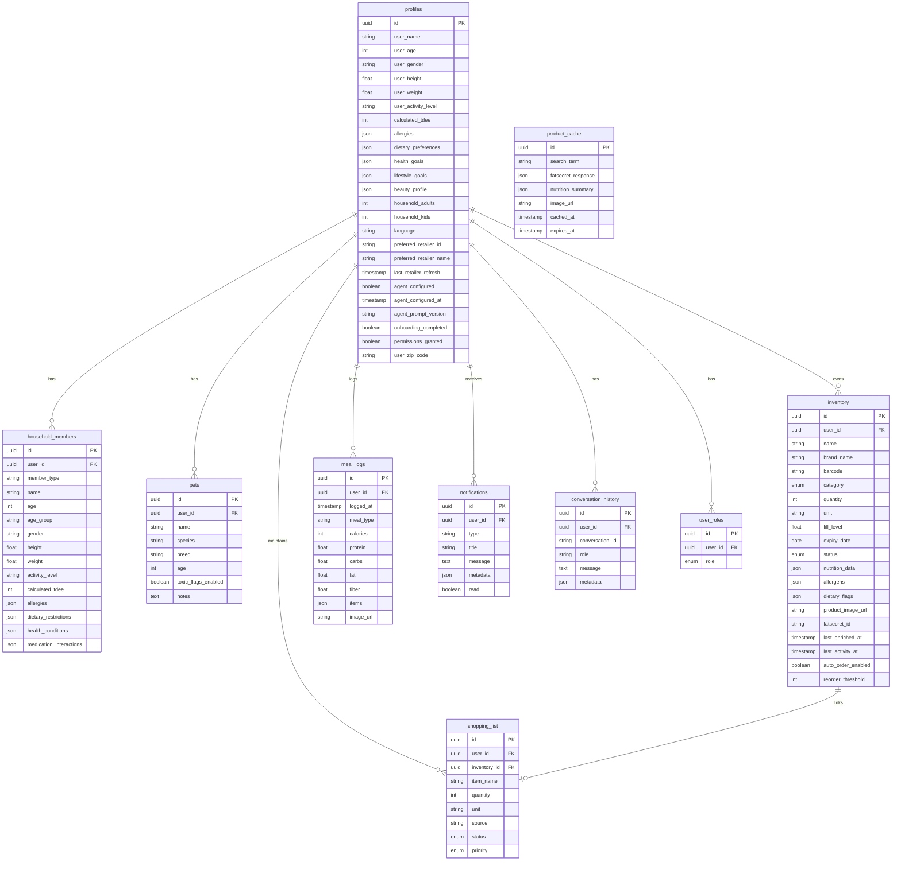

# Kaeva Master Blueprint

## Complete Application Architecture & User Journey

---

## 1. Authentication & Onboarding Flow


---

## 2. Dashboard Architecture

```mermaid
graph TB
    Dashboard[Dashboard Component] --> VoiceAssist[Voice Assistant]
    Dashboard --> PulseHeader[Pulse Header]
    Dashboard --> SafetyShield[Safety Shield]
    Dashboard --> HouseholdQuick[Household Quick Access]
    Dashboard --> NutritionWidget[Nutrition Widget]
    Dashboard --> SmartCart[Smart Cart Widget]
    Dashboard --> InventoryMatrix[Inventory Matrix]
    Dashboard --> RecentActivity[Recent Activity]
    Dashboard --> FAB[Floating Action Button]
    
    VoiceAssist --> WakeWord[Hey Kaeva Detection]
    VoiceAssist --> ElevenLabs[ElevenLabs Agent]
    ElevenLabs --> ClientTools[Client Tools]
    ClientTools --> SearchInv[searchInventory]
    ClientTools --> SuggestRecipe[suggestRecipes]
    ClientTools --> AddToCart[addToShoppingList]
    
    PulseHeader --> UserGreet[User Greeting]
    PulseHeader --> QuickStats[Quick Stats]
    
    SafetyShield --> AllergyCheck[Allergy Monitoring]
    SafetyShield --> ToxicCheck[Pet Toxicity Check]
    SafetyShield --> QueryProfiles[Query profiles.allergies]
    SafetyShield --> QueryPets[Query pets.toxic_flags_enabled]
    
    HouseholdQuick --> FetchMembers[Fetch household_members]
    HouseholdQuick --> DisplayCards[Display Member Cards]
    
    NutritionWidget --> FetchTDEE[Fetch profiles.calculated_tdee]
    NutritionWidget --> FetchMeals[Fetch Today's meal_logs]
    NutritionWidget --> CalcProgress[Calculate Calories Progress]
    NutritionWidget --> DisplayPhotos[Display 3 Meal Photos]
    
    SmartCart --> FetchLowInv[Fetch Low Inventory]
    SmartCart --> CheckStatus{status=low|critical?}
    CheckStatus --> DisplayList[Display Shopping List]
    
    InventoryMatrix --> FetchAllInv[Fetch All Inventory Items]
    InventoryMatrix --> GroupByCat[Group by Category]
    InventoryMatrix --> DisplayFridge[Fridge Items]
    InventoryMatrix --> DisplayPantry[Pantry Items]
    InventoryMatrix --> DisplayBeauty[Beauty Items]
    InventoryMatrix --> DisplayPets[Pet Items]
    
    RecentActivity --> FetchActivity[Fetch Last 10 Activities]
    RecentActivity --> ShowTimeline[Show Timeline]
    
    FAB --> OpenScanner[Open Smart Scanner]
```

---

## 3. Smart Scanner Complete Flow


---

## 4. Voice Assistant Post-Onboarding


---

## 5. Household Management Flow

```mermaid
graph TD
    HouseholdPage[/household Route] --> FetchProfile[Fetch User Profile]
    HouseholdPage --> FetchMembers[Fetch household_members]
    HouseholdPage --> FetchPets[Fetch pets]
    
    FetchProfile --> DisplayUserCard[Display User DigitalTwinCard]
    FetchMembers --> DisplayMemberCards[Display Member Cards]
    FetchPets --> DisplayPetCards[Display Pet Cards]
    
    DisplayUserCard --> EditUser{Edit User?}
    DisplayMemberCards --> EditMember{Edit Member?}
    DisplayMemberCards --> AddMember{Add Member?}
    DisplayPetCards --> EditPet{Edit Pet?}
    
    EditUser --> OpenForm[Open HouseholdMemberForm]
    EditMember --> OpenForm
    AddMember --> OpenForm
    
    OpenForm --> EnterData[Enter/Edit Data]
    EnterData --> CalcTDEE[Calculate TDEE]
    CalcTDEE --> ValidateForm[Validate Form]
    ValidateForm --> SaveMember{Save?}
    
    SaveMember -->|New| InsertMember[Insert into household_members]
    SaveMember -->|Existing| UpdateMember[Update household_members]
    
    InsertMember --> RefreshList[Refresh Member List]
    UpdateMember --> RefreshList
    RefreshList --> ShowSuccess[Show Success Toast]
    
    EditPet --> OpenPetForm[Open Pet Form]
    OpenPetForm --> EnterPetData[Enter Pet Data]
    EnterPetData --> SavePet[Update pets table]
    SavePet --> RefreshPets[Refresh Pet List]
    
    DisplayUserCard --> InviteLink[Generate Invite Link]
    InviteLink --> ShareLink[Share Family Invite]
```

---

## 6. Smart Cart & Instacart Integration


---

## 7. Settings Management

```mermaid
graph TD
    SettingsPage[/settings Route] --> TabSelection{Tab Selected}
    
    TabSelection --> ProfileTab[Profile Tab]
    TabSelection --> SafetyTab[Safety Tab]
    TabSelection --> HouseholdTab[Household Tab]
    TabSelection --> HistoryTab[History Tab]
    TabSelection --> StoreTab[Store Tab]
    
    ProfileTab --> EditName[Edit Name]
    ProfileTab --> EditBio[Edit Biometrics]
    ProfileTab --> EditActivity[Edit Activity Level]
    EditName --> UpdateProfile[Update profiles table]
    EditBio --> RecalcTDEE[Recalculate TDEE]
    RecalcTDEE --> UpdateProfile
    EditActivity --> RecalcTDEE
    UpdateProfile --> SaveProfile[Save Changes]
    
    SafetyTab --> EditAllergies[Edit Allergies]
    SafetyTab --> EditDietary[Edit Dietary Restrictions]
    SafetyTab --> EditHealth[Edit Health Conditions]
    EditAllergies --> UpdateProfile
    EditDietary --> UpdateProfile
    EditHealth --> UpdateProfile
    
    HouseholdTab --> ViewMembers[View Members Summary]
    ViewMembers --> LinkToHousehold[Link to /household]
    
    HistoryTab --> ViewMealLogs[View meal_logs History]
    ViewMealLogs --> FilterByDate[Filter by Date]
    FilterByDate --> ExportData[Export Option]
    
    StoreTab --> ChangeStore[Change Preferred Store]
    ChangeStore --> OpenStoreSelector2[Open Store Selector]
    OpenStoreSelector2 --> UpdateRetailer[Update profiles.preferred_retailer_id]
```

---

## 8. Database Schema & Relationships



---

## 9. Edge Functions Architecture


---

## 10. Complete User Journey Timeline


---

## 11. Data Flow Summary


---

## 12. Security & RLS Policies


---

## Summary

This master blueprint documents the complete Kaeva application architecture including:

- **Authentication & Onboarding**: Multi-step voice-first onboarding with ElevenLabs integration
- **Dashboard**: Real-time widgets for nutrition, inventory, household, and safety monitoring
- **Smart Scanner**: Multi-intent vision AI system with 7 different scanning modes
- **Meal Tracking**: Complete flow from image capture to nutrition analysis to meal logging
- **Voice Assistant**: Post-onboarding conversational AI with client tools
- **Household Management**: CRUD operations for family members and pets with TDEE calculations
- **Smart Cart**: Instacart integration with automatic shopping list management
- **Settings**: Comprehensive user preference management
- **Database**: Complete schema with RLS policies for security
- **Edge Functions**: 12 serverless functions integrating 6 external APIs
- **Security**: Row-level security policies protecting all user data

All diagrams use mermaid syntax and can be rendered in any markdown viewer or mermaid-compatible tool.
