# KAEVA - Master Technical Documentation

## Table of Contents

1. [Project Overview](#project-overview)
2. [Architecture Overview](#architecture-overview)
3. [Technology Stack](#technology-stack)
4. [Database Schema](#database-schema)
5. [Authentication & Authorization](#authentication--authorization)
6. [Application Structure](#application-structure)
7. [Pages & Routes](#pages--routes)
8. [Components Architecture](#components-architecture)
9. [Hooks & Custom Logic](#hooks--custom-logic)
10. [Utility Libraries](#utility-libraries)
11. [Edge Functions](#edge-functions)
12. [API Integrations](#api-integrations)
13. [Voice AI System](#voice-ai-system)
14. [Smart Scanner System](#smart-scanner-system)
15. [Design System](#design-system)
16. [User Flows](#user-flows)
17. [Security & RLS Policies](#security--rls-policies)
18. [Environment Variables](#environment-variables)
19. [Deployment & Configuration](#deployment--configuration)

---

## Project Overview

### Product Description
Kaeva is a voice-first, AI-powered household management platform that combines:
- Voice-based onboarding and interaction using ElevenLabs conversational AI
- Smart inventory management across fridge, pantry, beauty products, and pet supplies
- Multi-intent smart scanner with Google Gemini Vision integration
- Household health tracking with TDEE calculations and nutrition monitoring
- Allergen and toxicity detection for household safety
- Instacart integration for smart shopping
- Real-time spoilage detection and notifications

### Core Value Proposition
Kaeva transforms household management from a chore into a seamless, voice-first experience. Users can manage their entire household inventory, track nutrition, ensure safety for family members and pets, and automate shopping—all through natural conversation with an AI assistant.

### Target Users
- Families with children and/or pets
- Health-conscious individuals tracking nutrition
- Busy households seeking automation
- Users with dietary restrictions or allergies
- Anyone wanting a voice-first home management solution

---

## Architecture Overview

### High-Level Architecture

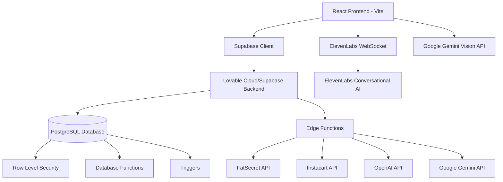

### System Components

1. **Frontend Layer** (React + TypeScript + Tailwind CSS)
   - Single Page Application (SPA) architecture
   - React Router for navigation
   - TanStack Query for server state management
   - Framer Motion for animations
   - Shadcn UI components

2. **Backend Layer** (Lovable Cloud/Supabase)
   - PostgreSQL database with RLS
   - Serverless Edge Functions (Deno runtime)
   - Real-time subscriptions
   - Authentication (Email/Password + Google OAuth)

3. **AI/ML Layer**
   - ElevenLabs Conversational AI for voice interactions
   - Google Gemini Vision for image analysis
   - OpenAI GPT for intent detection and recipe generation
   - Custom allergen detection logic

4. **Third-Party Integrations**
   - FatSecret API for nutrition data
   - Instacart API for shopping
   - ElevenLabs SDK for voice
   - Google Gemini for vision

---

## Technology Stack

### Frontend Dependencies

```json
{
  "@11labs/react": "^0.2.0",
  "@elevenlabs/client": "^0.11.0",
  "@radix-ui/*": "Latest versions",
  "@supabase/supabase-js": "^2.84.0",
  "@tanstack/react-query": "^5.83.0",
  "framer-motion": "^11.18.2",
  "lucide-react": "^0.462.0",
  "react": "^18.3.1",
  "react-dom": "^18.3.1",
  "react-router-dom": "^6.30.1",
  "react-webcam": "^7.2.0",
  "tailwindcss": "Latest",
  "typescript": "Latest"
}
```

### Backend Technologies

- **Runtime**: Deno (for Edge Functions)
- **Database**: PostgreSQL (via Supabase)
- **Authentication**: Supabase Auth
- **Storage**: Supabase Storage (configured but not currently used)
- **Serverless Functions**: Supabase Edge Functions

### Development Tools

- **Build Tool**: Vite
- **Package Manager**: npm/bun
- **Linting**: ESLint
- **Type Checking**: TypeScript
- **Version Control**: Git
- **Hosting**: Lovable Cloud

---

## Database Schema

### Entity Relationship Diagram

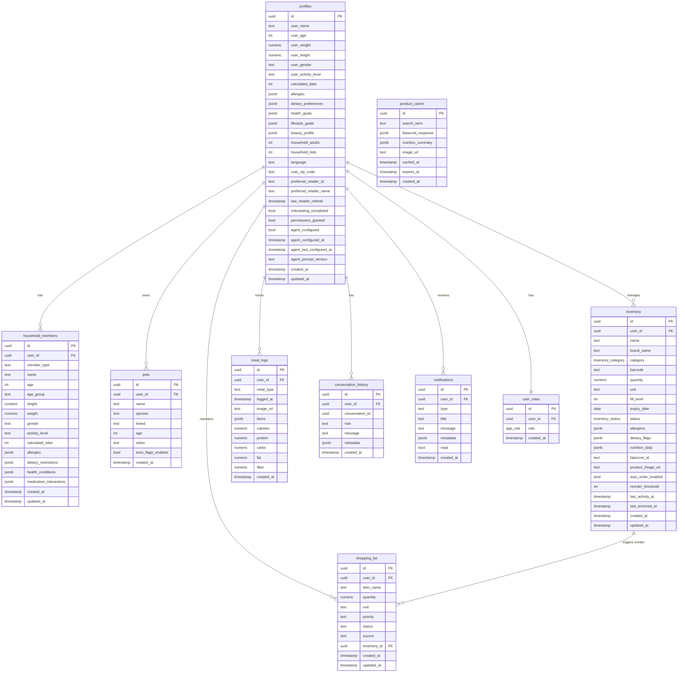

### Table Descriptions

#### `profiles`
Stores user profile information including biometric data, preferences, household composition, and onboarding status.

**Key Fields:**
- `calculated_tdee`: Total Daily Energy Expenditure calculated from biometric data
- `allergies`, `dietary_preferences`: JSON arrays of user dietary constraints
- `health_goals`, `lifestyle_goals`: JSON arrays of user objectives
- `beauty_profile`: JSON object for beauty product preferences
- `agent_configured`: Boolean tracking if ElevenLabs agent is set up
- `onboarding_completed`: Gates access to main app features

**Indexes:**
- Primary key on `id`
- Foreign key reference to `auth.users(id)`

#### `household_members`
Tracks additional household members (partners, children, elderly) with their own health profiles.

**Key Fields:**
- `member_type`: 'partner', 'child', 'elderly', etc.
- `age_group`: For children without specific age
- `calculated_tdee`: Individual TDEE calculation
- `medication_interactions`: JSON array of drug interactions to watch for

**Use Cases:**
- Multi-person TDEE calculations
- Household-wide allergen tracking
- Age-appropriate meal suggestions

#### `pets`
Pet profiles for toxicity checking and pet-specific inventory.

**Key Fields:**
- `species`: 'dog', 'cat', etc.
- `toxic_flags_enabled`: Controls toxicity warnings in scanner

**Use Cases:**
- Toxic food detection (chocolate, grapes for dogs)
- Pet food inventory management
- Age-based dietary recommendations

#### `inventory`
Core table for all household inventory items across categories.

**Categories:** `fridge`, `pantry`, `beauty`, `pets`

**Key Fields:**
- `fill_level`: 0-100 percentage for auto-reordering
- `status`: `sufficient`, `low`, `critical`, `out`, `out_of_stock`, `likely_spoiled`
- `allergens`: JSON array of detected allergens
- `nutrition_data`: Full FatSecret API response
- `fatsecret_id`: For re-enrichment and updates
- `auto_order_enabled`: Enables automatic shopping list addition
- `reorder_threshold`: Fill level that triggers reorder (default 20)
- `last_activity_at`: Updated on any interaction, used for spoilage detection

**Triggers:**
- `update_inventory_activity`: Sets `last_activity_at` on update

#### `meal_logs`
Nutrition tracking for meals analyzed via camera.

**Key Fields:**
- `meal_type`: 'breakfast', 'lunch', 'dinner', 'snack'
- `items`: JSON array of detected food items
- `calories`, `protein`, `carbs`, `fat`, `fiber`: Calculated macros

**Use Cases:**
- Daily nutrition tracking
- Macro goal progress
- Meal history and patterns

#### `shopping_list`
Auto-generated and manual shopping list items.

**Key Fields:**
- `source`: 'auto_reorder', 'voice_request', 'recipe', 'manual'
- `priority`: 'high', 'normal', 'low'
- `status`: 'pending', 'in_cart', 'purchased'
- `inventory_id`: Links to inventory item for auto-reorder

**Use Cases:**
- Automatic low-stock reordering
- Recipe ingredient aggregation
- Instacart cart creation

#### `conversation_history`
Persistent storage of all voice conversations with Kaeva.

**Key Fields:**
- `conversation_id`: Groups messages by session
- `role`: 'user', 'assistant', 'system'
- `metadata`: JSON for additional context (intent, confidence, etc.)

**Use Cases:**
- Conversation continuity
- Intent pattern analysis
- Debugging voice interactions

#### `notifications`
System-generated notifications for users.

**Types:**
- `spoilage_alert`: Items likely spoiled
- `reorder_needed`: Low stock items
- `allergen_warning`: Scanned item contains allergen
- `toxicity_warning`: Scanned item toxic to pet

#### `user_roles`
Role-based access control.

**Roles:**
- `admin`: Full system access (admin panel)
- `user`: Standard user access

#### `product_cache`
Caches FatSecret API responses to reduce API calls and costs.

**Key Fields:**
- `search_term`: Normalized search string
- `expires_at`: Default 30 days from cache
- `nutrition_summary`: Extracted key nutrition info

**Use Cases:**
- Reducing redundant API calls
- Faster product enrichment
- Cost optimization

### Database Functions

#### `check_spoilage()`
Returns inventory items likely spoiled based on age and last activity.

**Logic:**
- Fridge items: >14 days since last activity
- Pantry items: >90 days since last activity

**Returns:**
```sql
TABLE(inventory_id uuid, item_name text, days_old integer, category inventory_category)
```

#### `mark_spoilage(_inventory_id uuid)`
Marks an inventory item as likely spoiled.

**Updates:**
- Sets `status = 'likely_spoiled'`
- Updates `updated_at` timestamp

#### `has_role(_user_id uuid, _role app_role)`
Checks if a user has a specific role.

**Security:** `SECURITY DEFINER` - runs with elevated privileges

#### `handle_new_user()`
Trigger function that creates a profile when a new user signs up.

**Execution:** Runs on `INSERT` to `auth.users`

**Creates:**
- Profile entry with user's email/name
- Sets `onboarding_completed = false`

#### `handle_updated_at()`
Generic trigger function to update `updated_at` timestamps.

**Attached to:** Multiple tables with `updated_at` columns

#### `update_inventory_activity()`
Trigger function to update `last_activity_at` on inventory changes.

**Execution:** Runs on `UPDATE` to `inventory` table

### Enums

#### `app_role`
- `admin`
- `user`

#### `inventory_category`
- `fridge`
- `pantry`
- `beauty`
- `pets`

#### `inventory_status`
- `sufficient`
- `low`
- `critical`
- `out`
- `out_of_stock`
- `likely_spoiled`

---

## Authentication & Authorization

### Authentication Flow

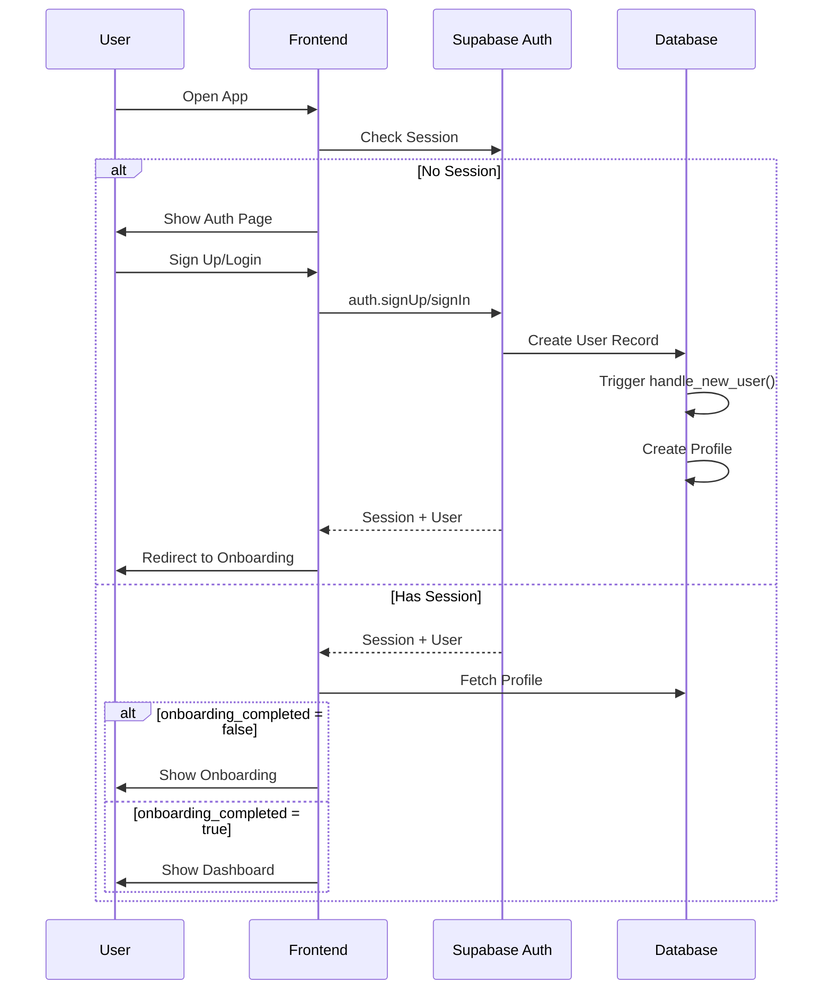

### Auth Implementation

**Provider:** Supabase Auth

**Methods Supported:**
1. **Email/Password** - Standard signup/login
2. **Google OAuth** - Social authentication

**Configuration:**
```typescript
// src/integrations/supabase/client.ts
export const supabase = createClient(
  import.meta.env.VITE_SUPABASE_URL,
  import.meta.env.VITE_SUPABASE_PUBLISHABLE_KEY
);
```

**Auto-Confirm Email:** Enabled for non-production (Lovable Cloud default)

### Authorization System

#### Row Level Security (RLS)

**Principle:** Users can only access their own data via `auth.uid()` checks.

**Example Policy:**
```sql
CREATE POLICY "Users can view own inventory"
ON inventory FOR SELECT
USING (auth.uid() = user_id);
```

#### Role-Based Access Control (RBAC)

**Admin Role:**
- Access to `/admin` panel
- User management capabilities
- System configuration
- Analytics and logs

**Implementation:**
```typescript
// src/lib/authUtils.ts
export const checkAdminStatus = async (): Promise<boolean> => {
  const { data: { session } } = await supabase.auth.getSession();
  if (!session) return false;

  const { data } = await supabase.functions.invoke("check-admin", {
    headers: { Authorization: `Bearer ${session.access_token}` },
  });

  return data?.isAdmin || false;
};
```

**Admin Route Protection:**
```typescript
// src/components/AdminRoute.tsx
export const AdminRoute = ({ children }: AdminRouteProps) => {
  const [isAdmin, setIsAdmin] = useState<boolean | null>(null);
  
  useEffect(() => {
    checkAdminStatus().then(setIsAdmin);
  }, []);
  
  if (isAdmin === null) return <LoadingState />;
  if (!isAdmin) return <Navigate to="/" replace />;
  
  return <>{children}</>;
};
```

### Session Management

**Session Storage:** LocalStorage (Supabase default)

**Session Persistence:** Automatic across page reloads

**Session Refresh:** Handled automatically by Supabase client

**Logout:**
```typescript
await supabase.auth.signOut();
navigate('/auth');
```

---

## Application Structure

### Directory Layout

```
kaeva/
├── public/
│   ├── robots.txt
│   └── sounds/
│       └── wake.mp3
├── src/
│   ├── components/
│   │   ├── ui/                    # Shadcn UI primitives
│   │   ├── voice/                 # Voice interaction components
│   │   ├── scanner/               # Smart scanner components
│   │   ├── dashboard/             # Dashboard widgets
│   │   ├── admin/                 # Admin panel components
│   │   └── layout/                # Layout components
│   ├── pages/
│   │   ├── Index.tsx              # Dashboard
│   │   ├── Auth.tsx               # Login/Signup
│   │   ├── ConfigureAgent.tsx     # ElevenLabs setup
│   │   ├── Settings.tsx           # User settings
│   │   ├── Household.tsx          # Household management
│   │   ├── Admin.tsx              # Admin panel
│   │   └── NotFound.tsx           # 404 page
│   ├── hooks/
│   │   ├── useVoiceManager.ts     # Voice state management
│   │   ├── useVoiceAssistant.ts   # Voice assistant hook
│   │   ├── useVoiceCommand.ts     # Voice commands
│   │   ├── useOnboardingConversation.ts
│   │   ├── useVisionCapture.ts    # Camera/scanner
│   │   └── useKaevaMotion.ts      # Animation states
│   ├── lib/
│   │   ├── authUtils.ts           # Auth helpers
│   │   ├── conversationUtils.ts   # Conversation storage
│   │   ├── inventoryUtils.ts      # Inventory transforms
│   │   ├── onboardingTransforms.ts
│   │   ├── onboardingSave.ts
│   │   ├── voiceClientTools.ts    # ElevenLabs tools
│   │   ├── tdeeCalculator.ts      # TDEE calculation
│   │   ├── elevenLabsAudio.ts     # Audio handling
│   │   ├── audioMonitoring.ts     # Wake word detection
│   │   └── utils.ts               # General utilities
│   ├── integrations/
│   │   └── supabase/
│   │       ├── client.ts          # Supabase client
│   │       └── types.ts           # Generated types
│   ├── config/
│   │   └── agent.ts               # ElevenLabs agent config
│   ├── App.tsx                    # Root component
│   ├── main.tsx                   # Entry point
│   └── index.css                  # Global styles + design tokens
├── supabase/
│   ├── functions/
│   │   ├── _shared/               # Shared utilities
│   │   ├── analyze-meal/
│   │   ├── analyze-vision/
│   │   ├── check-admin/
│   │   ├── configure-elevenlabs-agent/
│   │   ├── cook-recipe/
│   │   ├── detect-intent/
│   │   ├── enrich-product/
│   │   ├── generate-signed-url/
│   │   ├── identify-product/
│   │   ├── instacart-create-cart/
│   │   ├── instacart-service/
│   │   ├── notify-spoilage/
│   │   └── suggest-recipes/
│   ├── migrations/                # Database migrations
│   └── config.toml                # Supabase configuration
├── .env                           # Environment variables
├── capacitor.config.ts            # Mobile app config
├── tailwind.config.ts             # Tailwind configuration
├── vite.config.ts                 # Vite configuration
└── package.json                   # Dependencies
```

### Key Architectural Patterns

#### 1. Component Composition
Small, focused components composed into larger features.

**Example:**
```
Dashboard
├── PulseHeader
├── SafetyShield
│   └── ShieldStatus
├── InventoryMatrix
│   └── InventoryCard
├── NutritionWidget
├── SmartCartWidget
└── FloatingActionButton
```

#### 2. Custom Hooks for Logic Separation
Business logic extracted into reusable hooks.

**Examples:**
- `useVoiceManager` - Manages ElevenLabs WebSocket connection
- `useVisionCapture` - Handles camera and image capture
- `useKaevaMotion` - Manages aperture animation states

#### 3. Edge Functions for Backend Logic
All server-side operations handled via Supabase Edge Functions.

**Pattern:**
```typescript
const { data, error } = await supabase.functions.invoke('function-name', {
  body: { payload },
  headers: { Authorization: `Bearer ${session.access_token}` }
});
```

#### 4. Type-Safe Database Access
Generated TypeScript types from Supabase schema.

```typescript
import { Database } from '@/integrations/supabase/types';

type Profile = Database['public']['Tables']['profiles']['Row'];
type InventoryInsert = Database['public']['Tables']['inventory']['Insert'];
```

#### 5. Centralized State with React Query
Server state managed via TanStack Query with automatic caching and refetching.

```typescript
const { data: profile } = useQuery({
  queryKey: ['profile', userId],
  queryFn: async () => {
    const { data } = await supabase
      .from('profiles')
      .select('*')
      .eq('id', userId)
      .single();
    return data;
  }
});
```

---

## Pages & Routes

### Route Configuration

```typescript
// src/App.tsx
<Routes>
  <Route path="/" element={<Index />} />
  <Route path="/auth" element={<Auth />} />
  <Route path="/configure-agent" element={<ConfigureAgent />} />
  <Route path="/settings" element={<Settings />} />
  <Route path="/household" element={<Household />} />
  <Route path="/admin" element={<AdminRoute><Admin /></AdminRoute>} />
  <Route path="*" element={<NotFound />} />
</Routes>
```

### Page Descriptions

#### `/` - Index (Dashboard)
**File:** `src/pages/Index.tsx`

**Purpose:** Main application dashboard after onboarding.

**Key Features:**
- Conditional rendering based on onboarding status
- Splash screen while loading
- Voice onboarding flow if not completed
- Dashboard view with all widgets if completed

**Flow:**
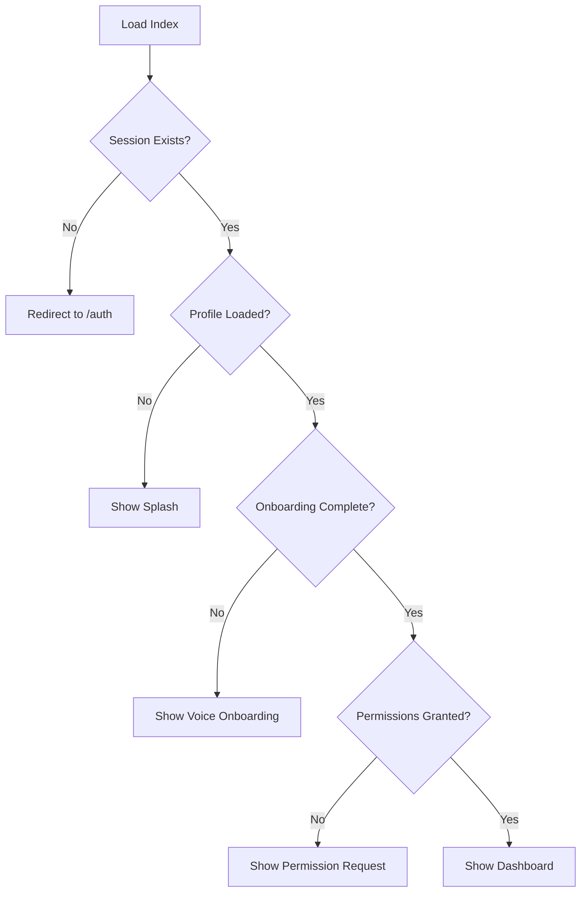

**Components Used:**
- `Splash` - Loading state
- `VoiceOnboarding` - Guided voice setup
- `PermissionRequest` - Camera/mic permissions
- `Dashboard` - Main dashboard view

#### `/auth` - Authentication
**File:** `src/pages/Auth.tsx`

**Purpose:** User login and registration.

**Features:**
- Email/password authentication
- Google OAuth integration
- Automatic redirect after successful auth
- Redirect to dashboard if already logged in

**UI Elements:**
- Email input
- Password input
- Sign In / Sign Up toggle
- Google Sign In button
- Form validation

#### `/configure-agent` - ElevenLabs Setup
**File:** `src/pages/ConfigureAgent.tsx`

**Purpose:** One-time setup of ElevenLabs conversational agent.

**Process:**
1. Fetch user profile data
2. Build custom prompt with user context
3. Call `configure-elevenlabs-agent` edge function
4. Update `agent_configured` in profile
5. Redirect to dashboard

**Agent Context Includes:**
- User name and biometrics
- Household members and pets
- Allergies and dietary restrictions
- Health and lifestyle goals
- Inventory summary
- Shopping list

**Auto-redirect:** If agent already configured, redirects to `/`

#### `/settings` - User Settings
**File:** `src/pages/Settings.tsx`

**Purpose:** Manage all user preferences and data.

**Tabs:**
1. **Profile** - Edit biometric data, goals
2. **Safety** - Manage allergies, dietary restrictions
3. **Household** - Quick access to household management
4. **History** - View conversation logs
5. **Store** - Select preferred retailer for Instacart

**Features:**
- Real-time updates to profile
- Conversation history viewer with filtering
- Retailer selection with geolocation
- Logout functionality

#### `/household` - Household Management
**File:** `src/pages/Household.tsx`

**Purpose:** Manage household members and pets.

**Features:**
- Add/edit/delete household members
- Add/edit/delete pets
- View calculated TDEE for each member
- Digital twin summaries
- Biometric data entry

**Components:**
- `HouseholdMemberForm` - Add/edit members
- `HouseholdMemberCard` - Display member info
- `DigitalTwinSummary` - Visual summary of household

#### `/admin` - Admin Panel
**File:** `src/pages/Admin.tsx`

**Purpose:** System administration and monitoring.

**Access:** Protected by `AdminRoute` component.

**Features:**
- User management (view all users, change roles)
- System health monitoring
- Database inspector (view tables, run queries)
- Agent configuration management
- Analytics dashboard
- System logs viewer
- Testing tools (API testing, data generation)
- Deployment checklist

**Tabs:**
1. Users - User management
2. Health - System health metrics
3. Database - Database inspection
4. Agent - Agent config
5. Analytics - Usage analytics
6. Logs - System logs
7. Testing - Development tools
8. Deployment - Pre-launch checklist

---

## Components Architecture

### Component Categories

#### 1. UI Primitives (`src/components/ui/`)
Shadcn UI components with custom styling.

**Key Components:**
- `button.tsx` - Multiple variants (default, premium, hero, outline, ghost)
- `card.tsx` - Container with header, content, footer
- `dialog.tsx` - Modal dialogs
- `drawer.tsx` - Bottom/side drawers (mobile-friendly)
- `form.tsx` - Form building blocks with react-hook-form
- `input.tsx` - Text inputs with variants
- `select.tsx` - Dropdown selects
- `tabs.tsx` - Tab navigation
- `toast.tsx` - Notification toasts
- `skeleton.tsx` - Loading placeholders

**Customization:**
All UI components use design tokens from `index.css` for theming.

#### 2. Voice Components (`src/components/voice/`)

##### `VoiceAssistant.tsx`
Main voice assistant interface post-onboarding.

**Features:**
- Floating action button to start conversation
- Full-screen conversation overlay
- Real-time transcription display
- Aperture animation based on speaking state
- ESC key to close

**Props:**
```typescript
interface VoiceAssistantProps {
  userProfile: any;
  onProfileUpdate?: (profile: any) => void;
}
```

**Hook Used:** `useVoiceManager`

##### `ConversationOverlay.tsx`
Full-screen overlay during active conversation.

**Features:**
- Animated aperture (Kaeva's "eye")
- User transcript display
- AI response display
- Audio amplitude visualization
- Close button

**States:**
- `idle` - No conversation
- `listening` - User speaking
- `processing` - AI thinking
- `speaking` - AI responding

##### `KeywordFeedback.tsx`
Visual feedback when wake word is detected.

**Animation:** Fade in/out pulse effect

##### `SleepingIndicator.tsx`
Shows when Kaeva is in sleep mode (listening for wake word).

**Visual:** Subtle breathing animation

##### `OnboardingStatus.tsx`
Progress indicator during voice onboarding.

**Shows:**
- Current onboarding stage
- Collected data checkmarks
- Next steps

#### 3. Scanner Components (`src/components/scanner/`)

##### `SmartScanner.tsx`
Multi-intent camera scanner.

**Modes:**
- Inventory Sweep
- Nutrition Tracking
- Product Analysis
- Appliance Scan
- Pet ID
- Vanity Sweep

**Features:**
- Camera preview via `react-webcam`
- Capture button with animation
- Mode selector
- Loading states during analysis
- Results display via `ScanResults`

**Flow:**
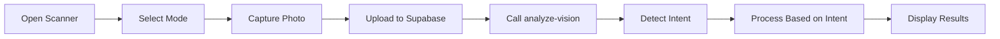

##### `ScanResults.tsx`
Drawer displaying scan results.

**Dynamic Content Based on Intent:**
- `INVENTORY_SWEEP` → `InventorySweepResult`
- `APPLIANCE_SCAN` → `ApplianceScanResult`
- `NUTRITION_TRACK` → `NutritionTrackResult`
- `PET_ID` → `PetIdResult`
- `PRODUCT_ANALYSIS` → `ProductAnalysisResult`
- `VANITY_SWEEP` → `VanitySweepResult`

**Features:**
- Confidence percentage display
- Intent-specific icon
- Animated entry
- Confirm button to add to inventory/logs

##### Result Mode Components

**`InventorySweepResult.tsx`**
- Lists detected items with confidence scores
- Add to inventory button (batch insert)
- Allergen warnings for each item

**`NutritionTrackResult.tsx`**
- Meal type selector
- Detected food items
- Total macro calculations
- Log meal button

**`ProductAnalysisResult.tsx`**
- Product details (name, brand, nutrition)
- Allergen flags
- Deception warnings
- Product truth analysis
- Add to inventory

**`PetIdResult.tsx`**
- Detected pet species/breed
- Age estimation
- Add pet to household
- Toxic food warnings

**`ApplianceScanResult.tsx`**
- Detected appliance type
- Suggested products for that appliance
- Quick add to inventory

**`VanitySweepResult.tsx`**
- Beauty product details
- Ingredient analysis
- Skin type compatibility
- Add to beauty inventory

#### 4. Dashboard Components (`src/components/dashboard/`)

##### `PulseHeader.tsx`
Top header with user greeting and quick stats.

**Displays:**
- Personalized greeting with user name
- Current time
- Quick stats (inventory count, low stock, meals logged)

##### `SafetyShield.tsx`
Household safety monitoring widget.

**Features:**
- Allergen check for household members
- Pet toxicity warnings
- Medication interaction alerts
- Visual shield with status indicator

**Component:** Uses `ShieldStatus` for visual representation

##### `InventoryMatrix.tsx`
Grid view of inventory categories.

**Categories:**
- Fridge
- Pantry
- Beauty
- Pets

**Each Card Shows:**
- Category icon
- Item count
- Fill level indicator
- Quick action button

**Loading State:** `InventoryMatrixSkeleton`

##### `NutritionWidget.tsx`
Daily nutrition tracking.

**Features:**
- Macro breakdown (protein, carbs, fat)
- Calorie count vs TDEE goal
- Progress rings for each macro
- Quick log meal button

##### `SmartCartWidget.tsx`
Shopping list and Instacart integration.

**Features:**
- Shopping list item count
- Create cart button (Instacart)
- Auto-reorder indicators
- Priority item highlights

##### `RecentActivity.tsx`
Timeline of recent household events.

**Event Types:**
- Item added to inventory
- Meal logged
- Shopping completed
- Spoilage detected
- Agent conversation

##### `FloatingActionButton.tsx`
Multi-action FAB (Floating Action Button).

**Actions:**
- Talk to Kaeva (voice)
- Scan item (camera)
- Add manual entry
- View notifications

**Animation:** Expands to show action menu on click

##### `ConfigurationBanner.tsx`
Alert banner shown when ElevenLabs agent not configured.

**Action:** Redirects to `/configure-agent`

##### `ProductSelector.tsx`
Search and select products from FatSecret database.

**Features:**
- Debounced search input
- Product suggestions
- Nutrition preview
- Quick add to inventory

##### `StoreSelector.tsx`
Retailer selection for Instacart integration.

**Features:**
- Geolocation-based retailer search
- Store logos and names
- Save preferred retailer
- Refresh retailer list

#### 5. Onboarding Components

##### `VoiceOnboarding.tsx`
Guided voice-first onboarding experience.

**Flow:**
1. Permission grant screen
2. Sleeping Kaeva (waiting for wake word)
3. Active conversation with ElevenLabs
4. Data collection via natural conversation
5. Profile completion
6. Redirect to dashboard

**Hook Used:** `useOnboardingConversation`

**Data Collected:**
- User name, age, weight, height, gender
- Activity level
- Dietary preferences and allergies
- Health goals
- Household composition (adults, kids, pets)
- Language preference

##### `PermissionRequest.tsx`
Requests camera and microphone permissions.

**Features:**
- Clear explanation of why permissions needed
- Grant button
- Skip button (with limitations explained)
- Permission status indicators

##### `SleepingKaeva.tsx`
Animated "sleeping" state before conversation starts.

**Features:**
- Pulsing aperture animation
- "Say 'Hey Kaeva' to begin" prompt
- Wake word detection active

##### `TutorialOverlay.tsx`
Optional first-time user tutorial.

**Screens:**
1. Welcome to Kaeva
2. Voice control basics
3. Scanner features
4. Inventory management
5. Safety features

**Dismissible:** Never shown again after completion

#### 6. Household Components

##### `HouseholdMemberForm.tsx`
Form for adding/editing household members.

**Fields:**
- Member type (partner, child, elderly, other)
- Name
- Age (or age group for children)
- Gender
- Height, weight (for TDEE calculation)
- Activity level
- Allergies
- Dietary restrictions
- Health conditions
- Medication interactions

**Validation:** Zod schema with react-hook-form

**Features:**
- TDEE auto-calculation on biometric change
- Conditional fields based on member type
- Allergen multi-select
- Submit creates/updates database record

##### `HouseholdMemberCard.tsx`
Display card for a household member.

**Shows:**
- Name and type
- Age
- TDEE (if calculated)
- Allergen tags
- Dietary restriction tags
- Edit/delete buttons

**Actions:**
- Edit (opens form in dialog)
- Delete (with confirmation)

##### `DigitalTwinSummary.tsx`
Visual summary of household composition.

**Features:**
- Avatar icons for each member/pet
- Color-coded by type
- Household totals
- Quick navigation to member details

##### `DigitalTwinCard.tsx`
Individual digital twin profile card.

**Shows:**
- Avatar
- Name
- Type
- Key health metrics
- Recent activity

#### 7. Layout Components

##### `AppShell.tsx`
Main application layout wrapper.

**Structure:**
```
AppShell
├── Navigation Bar (top)
├── Main Content (center)
└── Footer (optional)
```

**Features:**
- Responsive design (mobile/desktop)
- Navigation with active state
- User profile dropdown
- Theme toggle (light/dark)

##### `NavLink.tsx`
Navigation link component with active state.

**Features:**
- Icon + label
- Active state styling
- Keyboard accessible
- Mobile-responsive

#### 8. Admin Components (`src/components/admin/`)

All admin panel components are protected by admin role check.

##### `UserManagement.tsx`
Manage all users in the system.

**Features:**
- User list table
- Search/filter users
- View user details
- Change user roles
- Impersonate user (for debugging)

##### `AgentHealthDashboard.tsx`
Monitor ElevenLabs agent health.

**Metrics:**
- Total conversations
- Average conversation length
- Success rate
- Error rate
- Response time

##### `DatabaseInspector.tsx`
View database tables and records.

**Features:**
- Table selector
- Row browser
- Column filters
- SQL query executor (read-only for safety)

##### `SystemLogs.tsx`
View system logs and errors.

**Features:**
- Log level filtering (error, warn, info, debug)
- Search logs
- Date range filter
- Export logs

##### `Analytics.tsx`
Usage analytics dashboard.

**Charts:**
- Daily active users
- Conversation volume
- Scanner usage by mode
- Inventory growth
- Top allergens detected

##### `TestingTools.tsx`
Development and debugging tools.

**Features:**
- API endpoint tester
- Sample data generator
- Database reset (dev only)
- Webhook tester

##### `DeploymentChecklist.tsx`
Pre-launch checklist.

**Checks:**
- RLS policies enabled
- Admin user created
- API keys configured
- Edge functions deployed
- Error logging enabled

---

## Hooks & Custom Logic

### Voice Management Hooks

#### `useVoiceManager` 
**File:** `src/hooks/useVoiceManager.ts`

**Purpose:** Manages ElevenLabs WebSocket connection and conversation state for post-onboarding voice assistant.

**State:**
```typescript
{
  apertureState: ApertureState;        // Animation state
  voiceState: VoiceState;              // Conversation state
  audioAmplitude: number;              // Mic amplitude 0-1
  userTranscript: string;              // Real-time user speech
  aiTranscript: string;                // AI response text
  showConversation: boolean;           // UI visibility
  conversationHistory: Message[];      // Session history
}
```

**Methods:**
```typescript
{
  startConversation: () => Promise<void>;
  endConversation: () => Promise<void>;
}
```

**Key Features:**
- ElevenLabs `useConversation` hook integration
- Real-time transcript updates via WebSocket events
- Client tools for profile updates and navigation
- Conversation history persistence
- Auto-cleanup on unmount

**Client Tools Provided to ElevenLabs:**
1. `updateProfile(field, value)` - Update user profile field
2. `completeConversation(reason)` - End conversation with reason
3. `navigateTo(page)` - Navigate to app page

**Events Handled:**
- `onConnect` - Session started
- `onDisconnect` - Session ended
- `onMessage` - Transcript update
- `onError` - Error handling

#### `useOnboardingConversation`
**File:** `src/hooks/useOnboardingConversation.ts`

**Purpose:** Manages voice-first onboarding flow with ElevenLabs.

**Similar to `useVoiceManager` but with onboarding-specific tools:**

**Client Tools:**
1. `updateProfile(field, value)` - Update onboarding state
2. `completeConversation(reason)` - Save data and finish onboarding
3. `navigateTo(page)` - Navigate (logged only, not executed)

**Special Features:**
- Tracks onboarding progress
- Calculates TDEE on biometric data collection
- Saves household members and pets to database
- Transforms conversation state to profile format
- Redirects to dashboard on completion

**Onboarding Data Collected:**
```typescript
{
  userName: string;
  userAge: number;
  userWeight: number;
  userHeight: number;
  userGender: string;
  userActivityLevel: string;
  allergies: string[];
  dietaryPreferences: string[];
  healthGoals: string[];
  lifestyleGoals: string[];
  household: {
    adults: number;
    kids: number;
    dogs: Pet[];
    cats: Pet[];
  };
  language: string;
}
```

#### `useVoiceCommand`
**File:** `src/hooks/useVoiceCommand.ts`

**Purpose:** Legacy hook for simple voice commands (may be deprecated in favor of ElevenLabs tools).

**Features:**
- Wake word detection
- Command pattern matching
- Intent extraction
- Action dispatching

**Example Commands:**
- "Add milk to shopping list"
- "What's in my fridge?"
- "Suggest a recipe for dinner"
- "Is this food safe for my dog?"

### Vision & Scanner Hooks

#### `useVisionCapture`
**File:** `src/hooks/useVisionCapture.ts`

**Purpose:** Handles camera capture, image upload, and vision analysis.

**State:**
```typescript
{
  isCapturing: boolean;
  imageUrl: string | null;
  analysisResults: any | null;
  error: string | null;
}
```

**Methods:**
```typescript
{
  captureImage: (mode: ScanMode) => Promise<void>;
  resetCapture: () => void;
}
```

**Flow:**
1. User clicks capture button
2. Get image data from webcam ref
3. Convert to blob
4. Upload to Supabase Storage (or direct base64 to edge function)
5. Call `analyze-vision` edge function with image URL and mode
6. Receive detection results
7. Call `detect-intent` edge function for intent classification
8. Display results in `ScanResults` component

**Vision Analysis Pipeline:**
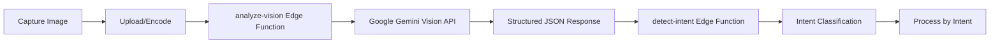

### Animation Hooks

#### `useKaevaMotion`
**File:** `src/hooks/useKaevaMotion.ts`

**Purpose:** Manages Kaeva aperture animation states.

**States:**
```typescript
enum ApertureState {
  SLEEPING = 'sleeping',      // Slow pulse
  LISTENING = 'listening',    // Active pulse
  PROCESSING = 'processing',  // Spinning/thinking
  SPEAKING = 'speaking',      // Synced to audio amplitude
  IDLE = 'idle'              // Neutral state
}
```

**Transitions:**
```typescript
SLEEPING -> LISTENING (on wake word)
LISTENING -> PROCESSING (on speech end)
PROCESSING -> SPEAKING (on AI response start)
SPEAKING -> LISTENING (on AI response end)
LISTENING -> SLEEPING (on conversation end)
```

**Animation Details:**
- `SLEEPING`: 0.5 Hz sine wave (0.7-1.0 scale)
- `LISTENING`: 1 Hz pulse (0.9-1.0 scale)
- `PROCESSING`: 360° rotation over 2s
- `SPEAKING`: Amplitude-reactive scale (0.8-1.2 scale)

### Utility Hooks

#### `use-mobile`
**File:** `src/hooks/use-mobile.tsx`

**Purpose:** Responsive design hook for mobile detection.

**Returns:** `boolean` - true if screen width < 768px

**Usage:**
```typescript
const isMobile = useMobile();

return (
  <div className={isMobile ? "mobile-layout" : "desktop-layout"}>
    {/* content */}
  </div>
);
```

#### `use-toast`
**File:** `src/hooks/use-toast.ts`

**Purpose:** Toast notification management (Shadcn UI).

**Methods:**
```typescript
{
  toast: (options: ToastOptions) => void;
  dismiss: (toastId: string) => void;
}
```

**Usage:**
```typescript
const { toast } = useToast();

toast({
  title: "Success!",
  description: "Item added to inventory",
  variant: "default" // or "destructive"
});
```

---

## Utility Libraries

### Authentication Utilities
**File:** `src/lib/authUtils.ts`

#### `checkAdminStatus()`
Checks if current user has admin role.

**Returns:** `Promise<boolean>`

**Implementation:**
```typescript
export const checkAdminStatus = async (): Promise<boolean> => {
  const { data: { session } } = await supabase.auth.getSession();
  if (!session) return false;

  const { data } = await supabase.functions.invoke("check-admin", {
    headers: { Authorization: `Bearer ${session.access_token}` },
  });

  return data?.isAdmin || false;
};
```

#### `getCurrentSession()`
Gets current user session.

**Returns:** `Promise<Session | null>`

#### `getCurrentUserId()`
Gets current user ID.

**Returns:** `Promise<string | null>`

### Conversation Utilities
**File:** `src/lib/conversationUtils.ts`

#### `storeMessage()`
Stores a conversation message in database.

**Signature:**
```typescript
storeMessage(
  role: 'user' | 'assistant' | 'system',
  message: string,
  conversationId: string
): Promise<void>
```

#### `fetchRecentHistory()`
Fetches recent conversation history for context.

**Signature:**
```typescript
fetchRecentHistory(limit: number = 10): Promise<Message[]>
```

**Returns:** Array of messages ordered by `created_at`

#### `generateConversationId()`
Generates unique conversation ID for grouping messages.

**Returns:** `string` (UUID v4)

### Inventory Utilities
**File:** `src/lib/inventoryUtils.ts`

#### `transformInventoryItem()`
Transforms database inventory record to UI format.

**Transforms:**
- `fill_level` → status ('good', 'medium', 'low')
- `auto_order_enabled` → `autoOrdering`
- Database column names → camelCase

#### `groupInventoryByCategory()`
Groups inventory items by category.

**Returns:**
```typescript
{
  fridge: InventoryItem[];
  pantry: InventoryItem[];
  beauty: InventoryItem[];
  pets: InventoryItem[];
}
```

#### `getInventoryStatus()`
Calculates overall status for a category.

**Logic:**
- Average fill level >= 60%: `good`
- Average fill level <= 30%: `warning`
- Otherwise: `normal`

### Onboarding Utilities

#### `onboardingTransforms.ts`
**File:** `src/lib/onboardingTransforms.ts`

##### `transformProfileData()`
Transforms conversation state to database profile format.

**Signature:**
```typescript
transformProfileData(state: ConversationState): ProfileData
```

**Transformations:**
- Calculates TDEE from biometric data
- Counts household adults and kids
- Formats JSON arrays for database
- Sets `onboarding_completed = true`

#### `onboardingSave.ts`
**File:** `src/lib/onboardingSave.ts`

##### `saveOnboardingData()`
Saves all onboarding data to database.

**Process:**
1. Update user profile
2. Insert household members
3. Insert pets (legacy support for dogs/cats)
4. Log errors to `conversation_history` if failures

**Returns:** `Promise<boolean>` - Success status

##### `logError()`
Logs errors to database for debugging.

**Signature:**
```typescript
logError(step: string, error: any, data?: any): Promise<void>
```

**Stores in:** `conversation_history` table with `role = 'error'`

### Voice Client Tools
**File:** `src/lib/voiceClientTools.ts`

Factory functions for creating ElevenLabs client tools.

#### `createUpdateProfileTool()`
Creates tool for updating user profile from conversation.

**Signature:**
```typescript
createUpdateProfileTool(
  onProfileUpdate?: (profile: any) => void
): (parameters: { field: string; value: any }) => Promise<string>
```

**Supported Fields:**
- `householdMembers` - Adds/updates household member
- `household.dogs` / `household.cats` - Adds pets
- `userBiometrics` - Updates age, weight, height, etc.
- `allergies`, `dietaryPreferences`, `healthGoals`, etc. - Updates arrays
- Direct profile fields (name, language, etc.)

**Features:**
- Automatic TDEE recalculation on biometric changes
- Household member TDEE calculation
- Real-time database updates
- Optional callback for UI updates

#### `createCompleteConversationTool()`
Creates tool for ending conversation and cleanup.

**Signature:**
```typescript
createCompleteConversationTool(
  conversationEndSession: () => Promise<void>,
  setters: {
    setShowConversation: (show: boolean) => void;
    setUserTranscript: (text: string) => void;
    setAiTranscript: (text: string) => void;
    setVoiceState: (state: any) => void;
    setApertureState: (state: any) => void;
  },
  onComplete?: (reason: string) => void
): (parameters: { reason: string }) => Promise<string>
```

**Actions:**
1. End ElevenLabs session
2. Reset all UI state
3. Call completion callback (for onboarding: save data)
4. Return success message

#### `createNavigateToTool()`
Creates tool for navigating to different pages.

**Signature:**
```typescript
createNavigateToTool(
  navigate: NavigateFunction
): (parameters: { page: string }) => string
```

**Supported Pages:**
- `/` - Dashboard
- `/settings` - Settings
- `/household` - Household management
- Any valid route path

### TDEE Calculator
**File:** `src/lib/tdeeCalculator.ts`

#### `calculateTDEE()`
Calculates Total Daily Energy Expenditure.

**Formula:** Mifflin-St Jeor Equation

**Men:**
```
BMR = (10 × weight in kg) + (6.25 × height in cm) - (5 × age in years) + 5
TDEE = BMR × Activity Factor
```

**Women:**
```
BMR = (10 × weight in kg) + (6.25 × height in cm) - (5 × age in years) - 161
TDEE = BMR × Activity Factor
```

**Activity Factors:**
- Sedentary: 1.2
- Lightly active: 1.375
- Moderately active: 1.55
- Very active: 1.725
- Extra active: 1.9

**Signature:**
```typescript
calculateTDEE(
  age: number,
  weight: number,  // kg
  height: number,  // cm
  gender: 'male' | 'female',
  activityLevel: ActivityLevel
): number
```

### Audio Utilities

#### `elevenLabsAudio.ts`
**File:** `src/lib/elevenLabsAudio.ts`

Audio handling for ElevenLabs WebSocket.

**Functions:**
- `initAudioContext()` - Initialize Web Audio API
- `playAudioChunk()` - Play PCM audio data
- `getAudioAmplitude()` - Calculate audio level for visualization

#### `audioMonitoring.ts`
**File:** `src/lib/audioMonitoring.ts`

Wake word detection and audio monitoring.

**Features:**
- Microphone stream capture
- Audio level monitoring
- Wake word detection (client-side)
- Audio visualization data

**Note:** Current implementation uses ElevenLabs built-in wake word detection. This file may be for future custom implementation.

### General Utilities
**File:** `src/lib/utils.ts`

#### `cn()`
Class name merger using `clsx` and `tailwind-merge`.

**Usage:**
```typescript
<div className={cn(
  "base-classes",
  condition && "conditional-classes",
  variant === 'primary' && "primary-classes"
)} />
```

**Purpose:** Safely merge Tailwind classes, resolving conflicts.

---

## Edge Functions

All Edge Functions run on Deno runtime and are deployed automatically.

### Shared Utilities (`supabase/functions/_shared/`)

#### `apiClients.ts`
Centralized API client configurations.

**Clients:**
1. **FatSecret OAuth 1.0 Client**
   - Consumer key/secret from env
   - OAuth signature generation
   - Cached token management

2. **Instacart API Client**
   - API key authentication
   - Base URL configuration

3. **Google Gemini Client**
   - API key from env
   - Vision and text models

4. **OpenAI Client**
   - API key from env
   - GPT model configurations

#### `allergenDetection.ts`
Allergen detection and matching logic.

**Functions:**

##### `detectAllergens()`
Scans product ingredients/description for allergens.

**Algorithm:**
1. Normalize text (lowercase, remove punctuation)
2. Check against allergen keyword dictionary
3. Score matches (exact > partial > similar)
4. Return detected allergens with confidence

**Allergen Categories:**
- Dairy (milk, cheese, whey, casein, lactose)
- Eggs (egg, albumin, lysozyme)
- Peanuts (peanut, groundnut)
- Tree Nuts (almond, walnut, cashew, etc.)
- Soy (soy, soya, tofu, edamame)
- Wheat (wheat, gluten, flour)
- Fish (fish, cod, salmon, tuna, etc.)
- Shellfish (shrimp, crab, lobster, etc.)
- Sesame (sesame, tahini)

**Returns:**
```typescript
{
  allergen: string;
  confidence: number; // 0-1
  foundIn: string;    // "ingredients" | "description" | "name"
}[]
```

##### `checkHouseholdAllergens()`
Cross-references detected allergens with household member allergies.

**Process:**
1. Fetch all household members for user
2. Compile all allergies
3. Match against detected allergens
4. Return warnings with member names

**Returns:**
```typescript
{
  allergen: string;
  affectedMembers: string[];
  severity: 'high' | 'medium' | 'low';
}[]
```

##### `checkPetToxicity()`
Checks if a product is toxic to household pets.

**Toxic Foods by Species:**

**Dogs:**
- Chocolate (theobromine)
- Grapes/raisins (kidney failure)
- Onions/garlic (Heinz body anemia)
- Xylitol (hypoglycemia)
- Macadamia nuts (paralysis)
- Avocado (persin)
- Alcohol (ethanol poisoning)

**Cats:**
- Onions/garlic
- Chocolate
- Grapes/raisins
- Alcohol
- Caffeine
- Lilies (in beauty products)
- Xylitol

**Returns:**
```typescript
{
  isPotentiallyToxic: boolean;
  toxicIngredients: string[];
  affectedPets: {
    name: string;
    species: string;
    severity: 'fatal' | 'dangerous' | 'harmful' | 'mild';
    symptoms: string[];
  }[];
}
```

#### `productProcessors.ts`
Product data enrichment and processing.

**Functions:**

##### `enrichProductData()`
Enriches basic product data with nutrition and metadata.

**Process:**
1. Check `product_cache` for existing data
2. If cached and not expired, return cached data
3. Otherwise, call FatSecret API
4. Extract and normalize nutrition data
5. Detect allergens
6. Cache response
7. Return enriched data

**Enriched Data Structure:**
```typescript
{
  name: string;
  brand: string;
  barcode?: string;
  nutrition: {
    calories: number;
    protein: number;
    carbs: number;
    fat: number;
    fiber: number;
    servingSize: string;
  };
  allergens: string[];
  dietaryFlags: string[]; // "vegan", "gluten-free", etc.
  fatsecretId: string;
  imageUrl?: string;
  cached: boolean;
}
```

##### `searchFatSecretProduct()`
Searches FatSecret API by product name or barcode.

**Parameters:**
- `query: string` - Product name or barcode
- `type: 'name' | 'barcode'`

**Returns:** Array of matching products with basic info

##### `normalizeFatSecretResponse()`
Normalizes varying FatSecret API response formats.

**Handles:**
- Single vs multiple results
- Different JSON structures
- Missing fields
- Unit conversions (g, mg, IU, etc.)

#### `oauth1.ts`
OAuth 1.0 signature generation for FatSecret API.

**Functions:**

##### `percentEncode()`
RFC 3986 compliant percent encoding.

##### `generateOAuthSignature()`
Generates HMAC-SHA1 signature for OAuth 1.0.

**Process:**
1. Sort parameters alphabetically
2. Create signature base string
3. Create signing key (consumer secret + token secret)
4. HMAC-SHA1 hash
5. Base64 encode

##### `generateNonce()` & `generateTimestamp()`
Generate OAuth parameters.

##### `buildOAuth1Request()`
Builds complete OAuth 1.0 signed request URL.

**Parameters:**
- HTTP method
- Base URL
- Query parameters
- Consumer key/secret

**Returns:** Fully signed request URL

### Edge Function Endpoints

#### `analyze-meal`
**Path:** `/supabase/functions/analyze-meal/index.ts`

**Purpose:** Analyzes meal photo to log nutrition.

**Input:**
```typescript
{
  imageUrl: string;
  mealType: 'breakfast' | 'lunch' | 'dinner' | 'snack';
  userId: string;
}
```

**Process:**
1. Call Google Gemini Vision with meal photo
2. Detect food items in image
3. For each item, search FatSecret API
4. Calculate total macros
5. Insert into `meal_logs` table
6. Return summary

**Output:**
```typescript
{
  items: {
    name: string;
    quantity: string;
    calories: number;
    protein: number;
    carbs: number;
    fat: number;
  }[];
  totals: {
    calories: number;
    protein: number;
    carbs: number;
    fat: number;
    fiber: number;
  };
  logId: string;
}
```

#### `analyze-vision`
**Path:** `/supabase/functions/analyze-vision/index.ts`

**Purpose:** Multi-intent vision analysis using Google Gemini Vision.

**Input:**
```typescript
{
  imageUrl: string;
  mode: 'inventory' | 'nutrition' | 'product' | 'appliance' | 'pet' | 'vanity';
  context?: any;
}
```

**Process:**
1. Build mode-specific prompt for Gemini
2. Call Gemini Vision API with image + prompt
3. Parse structured JSON response
4. Return mode-specific data

**Mode-Specific Prompts:**

**Inventory Mode:**
"Identify all food items visible in this image. For each item, provide: name, estimated quantity, category (fridge/pantry), brand if visible. Return as JSON array."

**Nutrition Mode:**
"Analyze this meal. Identify all food items and estimate portions. Return as JSON with item names, quantities, and meal type."

**Product Mode:**
"Analyze this product. Extract: product name, brand, ingredients list, nutrition facts, allergen warnings, serving size. Return as structured JSON."

**Appliance Mode:**
"Identify the appliance in this image. Return: appliance type, brand, model number if visible, suggested products for this appliance."

**Pet Mode:**
"Identify the pet in this image. Return: species, breed (best guess), estimated age, distinctive features."

**Vanity Mode:**
"Identify beauty/personal care products. For each: name, brand, product type, key ingredients, skin type suitability."

**Output:**
```typescript
{
  mode: string;
  confidence: number;
  results: any; // Mode-specific structure
}
```

#### `check-admin`
**Path:** `/supabase/functions/check-admin/index.ts`

**Purpose:** Verifies if authenticated user has admin role.

**Input:** None (uses JWT from Authorization header)

**Process:**
1. Extract user ID from JWT
2. Query `user_roles` table
3. Check if role = 'admin'
4. Return boolean

**Output:**
```typescript
{
  isAdmin: boolean;
  userId: string;
}
```

**Security:** Requires valid JWT token

#### `configure-elevenlabs-agent`
**Path:** `/supabase/functions/configure-elevenlabs-agent/index.ts`

**Purpose:** Configures ElevenLabs conversational agent with user context.

**Input:**
```typescript
{
  userId: string;
  agentId?: string; // Optional, uses default if not provided
  promptData: {
    userName: string;
    allergies: string[];
    dietaryPreferences: string[];
    healthGoals: string[];
    householdMembers: any[];
    pets: any[];
    inventorySummary: string;
    // ... more context
  };
}
```

**Process:**
1. Build comprehensive system prompt with user data
2. Call ElevenLabs Agent Configuration API
3. Update agent's knowledge base
4. Set agent's first message
5. Update `profiles.agent_configured` = true
6. Store `agent_prompt_version` for tracking
7. Return agent details

**System Prompt Template:**
```
You are Kaeva, a friendly AI household assistant for [userName].

User Profile:
- Name: [userName]
- Allergies: [allergies]
- Dietary Preferences: [dietaryPreferences]
- Health Goals: [healthGoals]
- TDEE: [calculatedTdee] calories/day

Household:
[List of members with their data]
[List of pets with their data]

Current Inventory:
[Summary of inventory items by category]

Your role is to help with:
1. Inventory management
2. Recipe suggestions based on available ingredients
3. Shopping list management
4. Nutrition tracking and advice
5. Safety warnings (allergens, pet toxicity)
6. General household questions

Always prioritize safety and be aware of household allergies and dietary restrictions.
```

**Output:**
```typescript
{
  success: boolean;
  agentId: string;
  promptVersion: string;
  configuredAt: string;
}
```

**API Used:** ElevenLabs Agent Configuration API

#### `cook-recipe`
**Path:** `/supabase/functions/cook-recipe/index.ts`

**Purpose:** Generates step-by-step cooking instructions with inventory awareness.

**Input:**
```typescript
{
  recipeName: string;
  ingredients?: string[]; // Optional, uses inventory if not provided
  servings?: number;
  dietaryRestrictions?: string[];
}
```

**Process:**
1. Fetch user's dietary restrictions and allergies
2. If ingredients not provided, fetch from inventory
3. Call OpenAI GPT with recipe request
4. Generate cooking steps
5. Calculate nutrition estimate
6. Check ingredient availability
7. Return recipe with warnings

**Output:**
```typescript
{
  recipe: {
    name: string;
    servings: number;
    prepTime: string;
    cookTime: string;
    ingredients: {
      item: string;
      amount: string;
      inInventory: boolean;
    }[];
    steps: string[];
    nutrition: {
      calories: number;
      protein: number;
      carbs: number;
      fat: number;
    };
    allergenWarnings: string[];
    missingIngredients: string[];
  };
}
```

**AI Model:** OpenAI GPT-4

#### `detect-intent`
**Path:** `/supabase/functions/detect-intent/index.ts`

**Purpose:** Classifies user intent from vision analysis or text.

**Input:**
```typescript
{
  visionResults: any;
  userMessage?: string;
  context?: {
    currentMode?: string;
    recentHistory?: string[];
  };
}
```

**Process:**
1. Combine vision results + user message + context
2. Call OpenAI GPT for intent classification
3. Extract confidence score
4. Return classified intent

**Supported Intents:**
- `INVENTORY_SWEEP` - Adding items to inventory
- `NUTRITION_TRACK` - Logging a meal
- `PRODUCT_ANALYSIS` - Analyzing specific product
- `APPLIANCE_SCAN` - Identifying appliance
- `PET_ID` - Identifying pet
- `VANITY_SWEEP` - Beauty product scan
- `RECIPE_REQUEST` - Recipe suggestion
- `SHOPPING_HELP` - Shopping list management
- `GENERAL_QUERY` - General question

**Output:**
```typescript
{
  intent: string;
  confidence: number; // 0-1
  extractedData: any; // Intent-specific extracted info
}
```

**AI Model:** OpenAI GPT-4

#### `enrich-product`
**Path:** `/supabase/functions/enrich-product/index.ts`

**Purpose:** Enriches product with nutrition data, allergens, and metadata.

**Input:**
```typescript
{
  productName: string;
  barcode?: string;
  brand?: string;
  userId: string;
}
```

**Process:**
1. Check product cache
2. If not cached, search FatSecret API
3. Fetch detailed nutrition data
4. Detect allergens from ingredients
5. Check household allergen warnings
6. Check pet toxicity if pets exist
7. Extract dietary flags
8. Cache result
9. Return enriched data

**Output:**
```typescript
{
  product: {
    name: string;
    brand: string;
    barcode?: string;
    fatsecretId: string;
    nutrition: NutritionData;
    allergens: string[];
    allergenWarnings: AllergenWarning[];
    toxicityWarnings: ToxicityWarning[];
    dietaryFlags: string[];
    imageUrl?: string;
  };
  cached: boolean;
  expiresAt: string;
}
```

**Uses:** FatSecret API, shared utility functions

#### `generate-signed-url`
**Path:** `/supabase/functions/generate-signed-url/index.ts`

**Purpose:** Generates signed URL for temporary file upload.

**Input:**
```typescript
{
  fileName: string;
  fileType: string;
  bucket?: string; // Default: 'vision-uploads'
}
```

**Process:**
1. Validate user authentication
2. Generate unique file path with user ID
3. Create signed upload URL (expires in 1 hour)
4. Return URL and file path

**Output:**
```typescript
{
  signedUrl: string;
  path: string;
  expiresAt: number;
}
```

**Security:** Requires authentication, URLs expire

**Note:** Currently, the app uploads images directly to edge functions as base64. This function is for future Supabase Storage integration.

#### `identify-product`
**Path:** `/supabase/functions/identify-product/index.ts`

**Purpose:** Identifies product from image using vision + barcode detection.

**Input:**
```typescript
{
  imageUrl: string;
  userId: string;
}
```

**Process:**
1. Call Gemini Vision to identify product
2. Extract product name, brand
3. Attempt barcode extraction if visible
4. Call `enrich-product` to get full data
5. Return identified product with enrichment

**Output:**
```typescript
{
  identified: {
    name: string;
    brand: string;
    barcode?: string;
    confidence: number;
  };
  enriched: EnrichedProductData;
}
```

**Chains to:** `enrich-product` function

#### `instacart-create-cart`
**Path:** `/supabase/functions/instacart-create-cart/index.ts`

**Purpose:** Creates Instacart cart from shopping list.

**Input:**
```typescript
{
  items: {
    name: string;
    quantity: number;
    unit?: string;
  }[];
  retailerId: string;
  userId: string;
}
```

**Process:**
1. Fetch user's shopping list
2. Call Instacart API to create cart
3. For each item, search Instacart catalog
4. Add best matches to cart
5. Return cart URL and summary

**Output:**
```typescript
{
  cartId: string;
  cartUrl: string;
  addedItems: {
    requestedItem: string;
    matchedProduct: string;
    quantity: number;
    price: number;
  }[];
  failedItems: string[];
  totalPrice: number;
}
```

**API Used:** Instacart Developer API

**Webhook:** Instacart sends callback on purchase completion to update inventory.

#### `instacart-service`
**Path:** `/supabase/functions/instacart-service/index.ts`

**Purpose:** Handles Instacart API interactions and webhooks.

**Endpoints:**

##### `POST /search-products`
Search Instacart catalog.

**Input:**
```typescript
{
  query: string;
  retailerId: string;
  limit?: number;
}
```

**Output:** Array of matching products

##### `POST /webhook`
Webhook for order completion.

**Payload from Instacart:**
```typescript
{
  orderId: string;
  status: 'completed' | 'canceled';
  items: {
    productId: string;
    name: string;
    quantity: number;
  }[];
}
```

**Process:**
1. Verify webhook signature
2. If order completed:
   - Add items to inventory
   - Update shopping list status
   - Create notification
3. Return 200 OK

##### `GET /retailers`
Fetch available retailers by location.

**Input (query params):**
- `zipCode: string`

**Output:** Array of nearby retailers

#### `notify-spoilage`
**Path:** `/supabase/functions/notify-spoilage/index.ts`

**Purpose:** Scheduled function to check for spoiled items and notify users.

**Trigger:** Cron job (daily at 9 AM user local time)

**Process:**
1. Call `check_spoilage()` database function
2. For each spoiled item:
   - Mark as `likely_spoiled`
   - Create notification
   - Send email (if configured)
3. Return summary

**Output:**
```typescript
{
  checkedItems: number;
  spoiledItems: number;
  notificationsSent: number;
}
```

**Notifications Created:**
```typescript
{
  type: 'spoilage_alert',
  title: 'Food Spoilage Alert',
  message: '[Item] in your [category] may be spoiled (added [days] days ago)',
  metadata: {
    inventoryId: string;
    itemName: string;
    daysOld: number;
  }
}
```

#### `suggest-recipes`
**Path:** `/supabase/functions/suggest-recipes/index.ts`

**Purpose:** AI-powered recipe suggestions based on inventory.

**Input:**
```typescript
{
  userId: string;
  preferences?: {
    mealType?: string;
    cuisine?: string;
    maxPrepTime?: number;
    servings?: number;
  };
  includeItems?: string[]; // Must include these items
  excludeItems?: string[]; // Must exclude these items
}
```

**Process:**
1. Fetch user's current inventory
2. Fetch dietary restrictions and allergies
3. Build prompt with constraints:
   - Available ingredients
   - Allergies to avoid
   - Dietary preferences
   - Meal type, cuisine, time constraints
4. Call OpenAI GPT for recipe generation
5. Generate 3-5 recipe options
6. For each recipe:
   - Check ingredient availability
   - Calculate nutrition estimate
   - Highlight missing ingredients
7. Return ranked suggestions

**Output:**
```typescript
{
  recipes: {
    name: string;
    description: string;
    prepTime: string;
    cookTime: string;
    servings: number;
    ingredients: {
      item: string;
      amount: string;
      inInventory: boolean;
    }[];
    steps: string[];
    nutrition: NutritionEstimate;
    matchScore: number; // % of ingredients in inventory
    missingItems: string[];
  }[];
}
```

**AI Model:** OpenAI GPT-4

**Ranking Algorithm:**
1. Highest match score (most ingredients available)
2. Respects dietary restrictions
3. No allergens
4. Meets time constraints
5. Variety (different cuisines)

---

## API Integrations

### ElevenLabs Conversational AI

**Purpose:** Voice-first interaction and onboarding

**SDK:** `@11labs/react` + `@elevenlabs/client`

**Features Used:**
- Conversational AI with custom prompts
- Real-time WebSocket transcription
- Client-side tools for function calling
- Wake word detection
- Audio streaming

**Configuration:**
```typescript
// src/config/agent.ts
export const AGENT_CONFIG = {
  agentId: process.env.ELEVENLABS_AGENT_ID,
  defaultVoice: 'Rachel', // Voice ID: 21m00Tcm4TlvDq8ikWAM
  language: 'en',
  firstMessage: "Hey! I'm Kaeva, your household AI assistant..."
};
```

**Connection Setup:**
```typescript
const { startSession, endSession, conversation } = useConversation({
  onConnect: () => console.log('Connected to Kaeva'),
  onDisconnect: () => console.log('Disconnected'),
  onMessage: (message) => {
    // Update transcripts
  },
  onError: (error) => {
    // Handle errors
  }
});

// Start conversation
await startSession({
  agentId: AGENT_CONFIG.agentId,
  clientTools: {
    updateProfile: (params) => { /* ... */ },
    completeConversation: (params) => { /* ... */ },
    navigateTo: (params) => { /* ... */ }
  },
  customVariables: {
    userName: user.name,
    allergies: user.allergies.join(', '),
    // ... more context
  }
});
```

**Client Tools:** Functions the AI can call during conversation
1. `updateProfile` - Update user data
2. `completeConversation` - End session
3. `navigateTo` - Navigate app (limited)

**Custom Variables:** Context provided to agent at session start
- User profile data
- Household composition
- Current inventory summary
- Shopping list items
- Recent conversation history

**Pricing:** Pay-per-use (charged by ElevenLabs)

**Limits:** None specified, usage-based billing

### FatSecret Platform API

**Purpose:** Nutrition data for food products

**API Type:** REST with OAuth 1.0

**Authentication:** 
- Consumer Key + Consumer Secret
- OAuth 1.0 signature generation
- Access token (reusable)

**Endpoints Used:**

1. **Food Search**
   ```
   GET /foods/search.v1
   Params: search_expression, max_results
   ```

2. **Food Get**
   ```
   GET /food/get.v2
   Params: food_id
   ```

3. **Barcode Search**
   ```
   GET /foods/search.v1
   Params: barcode
   ```

**Response Caching:**
- All responses cached in `product_cache` table
- 30-day expiration
- Reduces API calls and costs

**Rate Limits:**
- Free tier: 10,000 calls/month
- Exceeded: Relies on cache

**Data Structure:**
```typescript
{
  food_id: string;
  food_name: string;
  brand_name: string;
  servings: {
    serving: {
      serving_description: string;
      calories: string;
      protein: string;
      carbohydrate: string;
      fat: string;
      fiber: string;
      // ... more nutrients
    }
  }
}
```

**Normalization:** `normalizeFatSecretResponse()` converts to consistent format

### Instacart Developer API

**Purpose:** Shopping list to cart conversion

**API Type:** REST with API Key

**Authentication:**
```
Authorization: Bearer {INSTACART_API_KEY}
```

**Endpoints Used:**

1. **Search Retailers**
   ```
   GET /v2/retailers
   Params: zip_code, limit
   ```

2. **Search Products**
   ```
   GET /v2/products
   Params: retailer_id, query, limit
   ```

3. **Create Cart**
   ```
   POST /v2/carts
   Body: {
     retailer_id: string,
     items: { product_id, quantity }[]
   }
   ```

4. **Get Cart**
   ```
   GET /v2/carts/{cart_id}
   ```

**Webhook:**
Instacart sends POST to `/instacart-service/webhook` on order completion.

**Webhook Payload:**
```typescript
{
  event_type: 'order.completed',
  order: {
    id: string,
    status: string,
    items: {
      product_id: string,
      name: string,
      quantity: number,
      price: number
    }[]
  }
}
```

**Webhook Security:**
- Signature verification
- IP whitelist (Instacart IPs only)

**Flow:**
1. User creates cart in Kaeva
2. Cart created in Instacart
3. User completes purchase in Instacart
4. Webhook triggers
5. Items added to Kaeva inventory
6. Shopping list marked as purchased

**Rate Limits:** Not specified in docs, likely generous

### Google Gemini Vision API

**Purpose:** Image analysis for smart scanner

**Model Used:** `gemini-1.5-pro-vision`

**Authentication:**
```
X-Goog-Api-Key: {GOOGLE_GEMINI_API_KEY}
```

**Endpoint:**
```
POST https://generativelanguage.googleapis.com/v1/models/gemini-1.5-pro-vision:generateContent
```

**Request Format:**
```typescript
{
  contents: [
    {
      parts: [
        {
          text: "Identify all food items in this image..." // Prompt
        },
        {
          inline_data: {
            mime_type: "image/jpeg",
            data: "{base64_image_data}"
          }
        }
      ]
    }
  ],
  generationConfig: {
    temperature: 0.4, // Lower for more deterministic results
    topK: 32,
    topP: 1,
    maxOutputTokens: 4096,
  }
}
```

**Response Format:**
```typescript
{
  candidates: [
    {
      content: {
        parts: [
          {
            text: "{JSON response from AI}"
          }
        ]
      }
    }
  ]
}
```

**Usage Patterns:**
- **Product Identification:** Extract name, brand, barcode
- **Ingredient Parsing:** OCR nutrition label
- **Meal Analysis:** Identify food items and portions
- **Appliance Detection:** Recognize kitchen appliances
- **Pet Identification:** Detect species and breed
- **Beauty Products:** Read product labels and ingredients

**Prompting Strategy:**
- Request structured JSON output
- Provide clear schema in prompt
- Use examples for complex tasks
- Set low temperature for consistency

**Rate Limits:**
- Free tier: 60 requests/minute
- Paid tier: Unlimited (usage-based)

**Cost Optimization:**
- Compress images before sending (max 1024px width)
- Cache results when possible
- Batch analyze when feasible

### OpenAI GPT API

**Purpose:** Intent detection, recipe generation, conversation

**Models Used:**
- `gpt-4` - Complex reasoning (recipes, intent)
- `gpt-3.5-turbo` - Simple tasks (classification)

**Authentication:**
```
Authorization: Bearer {OPENAI_API_KEY}
```

**Endpoint:**
```
POST https://api.openai.com/v1/chat/completions
```

**Request Format:**
```typescript
{
  model: "gpt-4",
  messages: [
    {
      role: "system",
      content: "You are an assistant that..." // System prompt
    },
    {
      role: "user",
      content: "..." // User message
    }
  ],
  temperature: 0.7,
  max_tokens: 2000,
  response_format: { type: "json_object" } // For structured output
}
```

**Use Cases:**

1. **Intent Detection**
   ```typescript
   System: "Classify user intent from vision results and message. Return JSON."
   User: "{visionResults: [...], message: 'What is this?'}"
   Output: {intent: 'PRODUCT_ANALYSIS', confidence: 0.95}
   ```

2. **Recipe Generation**
   ```typescript
   System: "Generate recipe based on available ingredients. Respect allergies."
   User: "Ingredients: chicken, rice, broccoli. Allergies: dairy."
   Output: {recipe: {...}, nutrition: {...}}
   ```

3. **Conversation Context**
   ```typescript
   System: "You are Kaeva's backend reasoning. Provide factual responses."
   User: "{conversationHistory}, {currentQuestion}"
   Output: Factual answer with sources
   ```

**Rate Limits:**
- Tier 1 (new accounts): 3,500 requests/day
- Tier 2 ($5 spent): 3,500,000 tokens/day

**Cost Management:**
- Use GPT-3.5-turbo for simple tasks
- Keep prompts concise
- Cache repeated queries
- Set max_tokens limits

---

## Voice AI System

### Architecture Overview

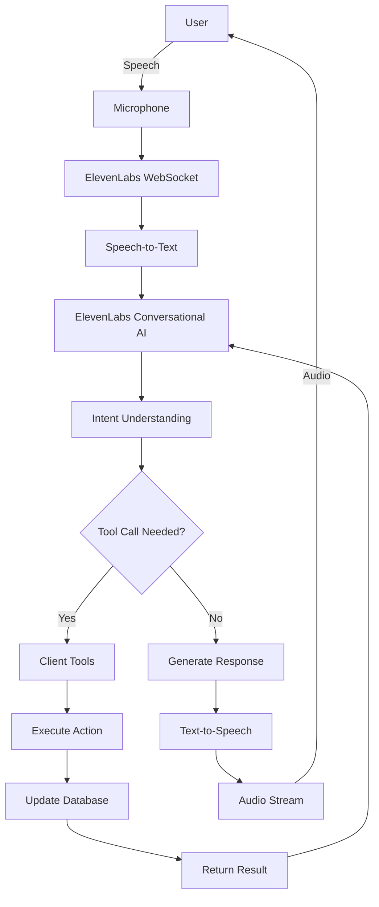

### Voice Flow States

#### 1. Pre-Onboarding Flow

**Entry Point:** User opens app for first time

**States:**
- `PERMISSION_REQUEST` - Asking for mic/camera
- `SLEEPING` - Waiting for wake word
- `WAKING` - Wake word detected
- `ONBOARDING_ACTIVE` - In conversation
- `ONBOARDING_COMPLETE` - Redirect to dashboard

**Wake Word:** "Hey Kaeva" or "OK Kaeva"

**Onboarding Conversation Flow:**
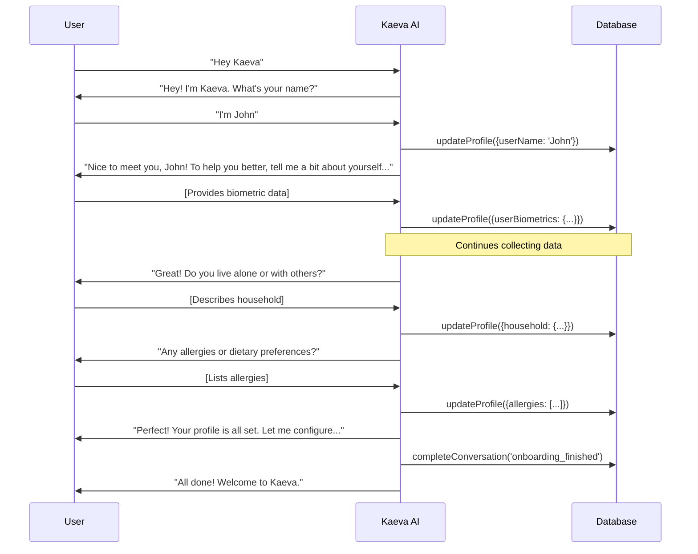

**Data Collected:**
- Personal: Name, age
- Biometric: Weight, height, gender, activity level
- Household: Adults, children, pets
- Health: Allergies, dietary restrictions, health goals
- Lifestyle: Goals, language preference

**Completion Trigger:** `completeConversation` tool call

**Post-Completion:**
1. Calculate TDEE
2. Save all data to database
3. Set `onboarding_completed = true`
4. Redirect to dashboard

#### 2. Post-Onboarding Flow

**Entry Points:**
- Wake word detection (continuous listening)
- Voice button press (manual trigger)

**States:**
- `IDLE` - No active conversation
- `LISTENING` - User speaking
- `PROCESSING` - AI thinking
- `SPEAKING` - AI responding
- `WAITING_FOR_RESPONSE` - Paused for user

**Conversation Types:**

1. **Inventory Queries**
   ```
   User: "What's in my fridge?"
   Kaeva: [Queries inventory] "You have milk, eggs, cheese, and some vegetables..."
   ```

2. **Recipe Suggestions**
   ```
   User: "What can I make for dinner?"
   Kaeva: [Calls suggest-recipes] "Based on your inventory, you could make..."
   ```

3. **Shopping Assistance**
   ```
   User: "Add milk to my shopping list"
   Kaeva: [Updates shopping_list] "Added milk to your shopping list."
   ```

4. **Safety Checks**
   ```
   User: "Is this chocolate safe for my dog?"
   Kaeva: [Checks pet toxicity] "No, chocolate is toxic to dogs. Please keep it away."
   ```

5. **Nutrition Questions**
   ```
   User: "How many calories have I eaten today?"
   Kaeva: [Queries meal_logs] "You've logged 1,200 calories so far today..."
   ```

6. **General Questions**
   ```
   User: "What's the healthiest cooking oil?"
   Kaeva: [Uses general knowledge] "Olive oil is generally considered..."
   ```

### ElevenLabs Integration Details

#### Session Management

**Starting a Session:**
```typescript
const { startSession } = useConversation();

await startSession({
  agentId: AGENT_CONFIG.agentId,
  clientTools: {
    updateProfile: createUpdateProfileTool(onProfileUpdate),
    completeConversation: createCompleteConversationTool(...),
    navigateTo: createNavigateToTool(navigate)
  },
  customVariables: {
    userName: profile.user_name,
    currentInventory: JSON.stringify(inventorySummary),
    allergies: profile.allergies.join(', '),
    // ... more context
  }
});
```

**Custom Variables:** Injected into agent's context
- Updated at session start
- Available to AI for decision making
- Used for personalization

**Client Tools:** Functions AI can invoke
- Defined in `voiceClientTools.ts`
- Executed client-side
- Can update database, UI, navigation

#### Real-Time Transcription

**User Transcript:**
```typescript
conversation.onMessage((message) => {
  if (message.source === 'user') {
    setUserTranscript(message.text);
  }
});
```

**AI Transcript:**
```typescript
conversation.onMessage((message) => {
  if (message.source === 'agent') {
    setAiTranscript(message.text);
    storeMessage('assistant', message.text, conversationId);
  }
});
```

**Storage:** All messages stored in `conversation_history`

#### Audio Visualization

**Audio Amplitude Tracking:**
```typescript
const { isSpeaking, audioLevel } = conversation;

useEffect(() => {
  setAudioAmplitude(audioLevel);
  
  if (isSpeaking) {
    setApertureState('SPEAKING');
  } else {
    setApertureState('LISTENING');
  }
}, [isSpeaking, audioLevel]);
```

**Aperture Animation:**
- Synced to audio amplitude
- Scale 0.8-1.2 based on volume
- Smooth transitions (ease-in-out)

#### Error Handling

**Connection Errors:**
```typescript
conversation.onError((error) => {
  console.error('Voice error:', error);
  
  if (error.code === 'NETWORK_ERROR') {
    toast({
      title: "Connection Lost",
      description: "Please check your internet connection.",
      variant: "destructive"
    });
  }
  
  endConversation();
});
```

**Timeout Handling:**
- 30s no speech → prompt user
- 60s no speech → end conversation
- Reconnect on network recovery

#### Wake Word Detection

**Built-in Wake Word:**
ElevenLabs supports built-in wake word detection.

**Configuration:**
```typescript
// In agent configuration
{
  wakeWord: "Hey Kaeva",
  sensitivity: 0.7, // 0-1, higher = more sensitive
  continuous: true  // Keep listening after conversation
}
```

**Custom Wake Word (Future):**
`audioMonitoring.ts` prepared for custom implementation using Web Audio API + ML model.

### Voice UI Components

#### Aperture Animation

**Component:** `KaevaAperture.tsx`

**States:**
- `sleeping` - Slow pulse (breathing)
- `listening` - Active pulse (ready)
- `processing` - Spinning (thinking)
- `speaking` - Amplitude-reactive (talking)

**Implementation:**
```typescript
const variants = {
  sleeping: {
    scale: [1, 1.05, 1],
    transition: { repeat: Infinity, duration: 2 }
  },
  listening: {
    scale: [1, 1.1, 1],
    transition: { repeat: Infinity, duration: 1 }
  },
  processing: {
    rotate: 360,
    transition: { repeat: Infinity, duration: 2, ease: "linear" }
  },
  speaking: {
    scale: 0.8 + (audioAmplitude * 0.4),
    transition: { duration: 0.1 }
  }
};
```

**Visual Design:**
- Circular gradient mesh
- Glow effect on active
- Color shifts by state
  - Sleeping: Soft blue
  - Listening: Bright cyan
  - Processing: Purple pulse
  - Speaking: Dynamic green-blue

#### Transcript Display

**Component:** `ConversationOverlay.tsx`

**Layout:**
```
┌─────────────────────────────────┐
│         [Close Button]          │
│                                 │
│       [Kaeva Aperture]          │
│                                 │
│  ┌─────────────────────────┐   │
│  │   User Transcript       │   │
│  │   "What's in my..."     │   │
│  └─────────────────────────┘   │
│                                 │
│  ┌─────────────────────────┐   │
│  │   AI Response           │   │
│  │   "You have milk..."    │   │
│  └─────────────────────────┘   │
└─────────────────────────────────┘
```

**Features:**
- Real-time updates
- Auto-scroll to latest
- Typing indicator during processing
- Fade-in animations
- Accessibility (ARIA labels)

#### Voice Button

**Component:** `FloatingActionButton.tsx` (Voice action)

**States:**
- `idle` - Blue pulsing button
- `active` - Recording indicator
- `disabled` - Grayed out

**Animation:**
```typescript
<motion.button
  whileHover={{ scale: 1.1 }}
  whileTap={{ scale: 0.9 }}
  animate={isRecording ? { scale: [1, 1.2, 1] } : {}}
  transition={{ repeat: isRecording ? Infinity : 0 }}
>
  <Mic />
</motion.button>
```

### Conversation Context Management

#### Context Building

**What AI Knows:**
1. **User Profile**
   - Name, biometrics, goals
   - Allergies, dietary preferences
   - Household composition

2. **Current State**
   - Inventory summary (counts by category)
   - Shopping list items
   - Recent meals logged
   - Low stock alerts

3. **Conversation History**
   - Last 10 messages from database
   - Current session messages
   - Previous intents

**Context Injection:**
```typescript
const context = `
User: ${profile.user_name}
Allergies: ${profile.allergies.join(', ')}
Inventory: ${inventorySummary}
Recent History: ${recentMessages.map(m => `${m.role}: ${m.message}`).join('\n')}
`;

await startSession({
  customVariables: { context }
});
```

#### Context Refresh

**When to Refresh:**
- Inventory changes (item added/removed)
- Profile updates
- New household member
- Shopping list changes

**How to Refresh:**
Currently requires new session. Future: Dynamic context updates via ElevenLabs API.

---

## Smart Scanner System

### Multi-Intent Scanner Architecture

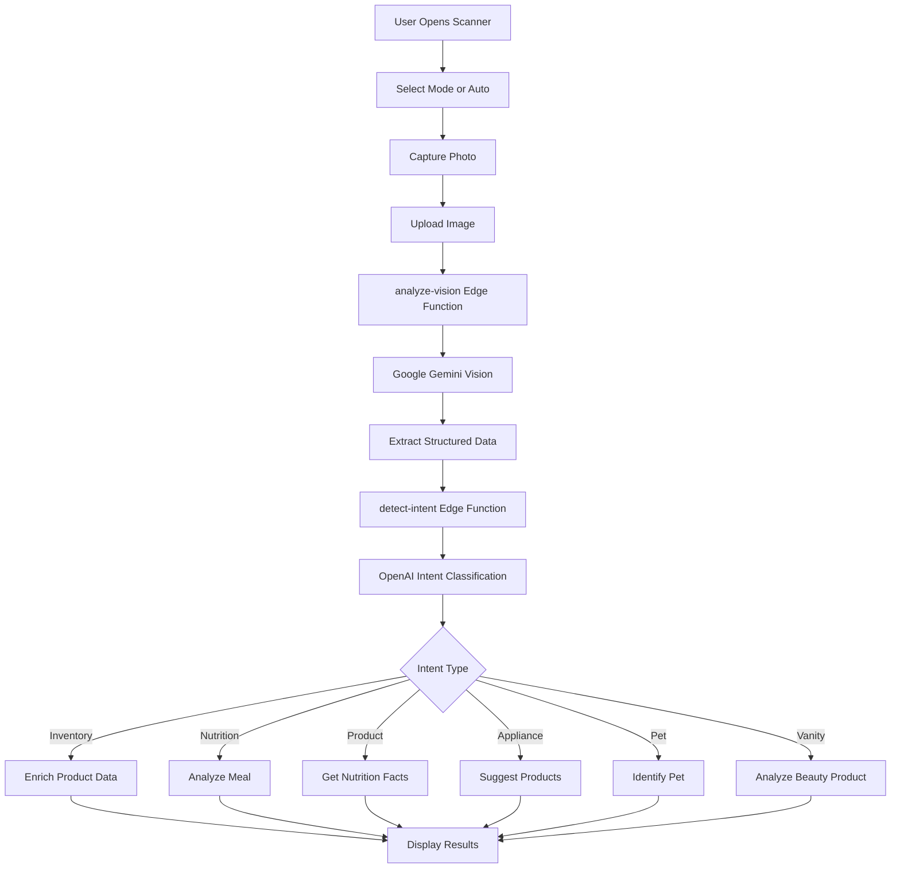

### Scanner Modes

#### 1. Inventory Sweep
**Purpose:** Bulk add items to inventory

**Use Case:** User scans fridge/pantry shelf

**Process:**
1. Capture wide shot of items
2. Gemini identifies all visible products
3. For each product:
   - Extract name, brand
   - Estimate quantity
   - Classify category (fridge/pantry)
4. Batch enrich via FatSecret
5. Check allergens for each
6. Display list with checkboxes
7. User confirms which to add
8. Batch insert to inventory

**Vision Prompt:**
```
Identify all packaged food products visible in this image.
For each product, provide:
- Product name
- Brand name (if visible)
- Estimated quantity (count if multiple)
- Category: fridge or pantry

Return as JSON array:
[
  {
    "name": "Whole Milk",
    "brand": "Organic Valley",
    "quantity": 1,
    "category": "fridge"
  },
  ...
]
```

**UI:**
```typescript
<InventorySweepResult
  items={detectedItems}
  onConfirm={(selectedItems) => {
    // Batch insert
    selectedItems.forEach(item => {
      supabase.from('inventory').insert({
        name: item.name,
        brand: item.brand,
        quantity: item.quantity,
        category: item.category,
        user_id: userId
      });
    });
  }}
/>
```

#### 2. Nutrition Tracking
**Purpose:** Log a meal for calorie/macro tracking

**Use Case:** User scans plate of food

**Process:**
1. Capture photo of meal
2. Gemini identifies food items and portions
3. For each item, search FatSecret
4. Calculate total macros
5. User selects meal type
6. Insert into `meal_logs`

**Vision Prompt:**
```
Analyze this meal photo. Identify all food items and estimate portion sizes.

Return as JSON:
{
  "items": [
    {
      "name": "Grilled Chicken Breast",
      "portion": "6 oz",
      "quantity": 1
    },
    {
      "name": "Steamed Broccoli",
      "portion": "1 cup",
      "quantity": 1
    }
  ],
  "estimatedMealType": "lunch"
}
```

**Macro Calculation:**
```typescript
const totals = items.reduce((acc, item) => {
  const nutrition = await searchFatSecret(item.name);
  const portionMultiplier = calculatePortionMultiplier(
    item.portion,
    nutrition.serving_size
  );
  
  return {
    calories: acc.calories + (nutrition.calories * portionMultiplier),
    protein: acc.protein + (nutrition.protein * portionMultiplier),
    carbs: acc.carbs + (nutrition.carbs * portionMultiplier),
    fat: acc.fat + (nutrition.fat * portionMultiplier)
  };
}, { calories: 0, protein: 0, carbs: 0, fat: 0 });
```

**UI:**
```typescript
<NutritionTrackResult
  items={detectedItems}
  totals={calculatedTotals}
  onLog={(mealType) => {
    supabase.from('meal_logs').insert({
      user_id: userId,
      meal_type: mealType,
      items: detectedItems,
      ...totals,
      logged_at: new Date(),
      image_url: capturedImageUrl
    });
  }}
/>
```

#### 3. Product Analysis
**Purpose:** Deep dive into specific product

**Use Case:** User scans a product to learn about it

**Process:**
1. Capture close-up of product
2. Gemini extracts:
   - Product name and brand
   - Ingredients list (OCR)
   - Nutrition label (OCR)
   - Barcode (if visible)
3. Enrich via FatSecret
4. Detect allergens
5. Check pet toxicity
6. Analyze "product truth" (marketing vs reality)
7. Display comprehensive report

**Vision Prompt:**
```
Analyze this product packaging in detail.

Extract:
- Product name
- Brand name
- Full ingredients list (read the label)
- Nutrition facts (all fields from label)
- Barcode number (if visible)
- Any health claims or marketing language

Return as JSON:
{
  "name": "...",
  "brand": "...",
  "ingredients": ["ingredient1", "ingredient2", ...],
  "nutrition": {
    "servingSize": "...",
    "calories": ...,
    "protein": ...,
    ...
  },
  "barcode": "...",
  "marketingClaims": ["claim1", "claim2"]
}
```

**Product Truth Analysis:**
```typescript
const analyzeProductTruth = (product) => {
  const deceptions = [];
  
  // Check "natural" claim
  if (product.marketingClaims.includes('natural')) {
    const artificialIngredients = product.ingredients.filter(i =>
      i.includes('artificial') || i.includes('synthetic')
    );
    if (artificialIngredients.length > 0) {
      deceptions.push({
        claim: 'Natural',
        reality: `Contains ${artificialIngredients.length} artificial ingredients`,
        severity: 'medium'
      });
    }
  }
  
  // Check "low sugar" claim
  if (product.marketingClaims.includes('low sugar')) {
    if (product.nutrition.sugar > 10) {
      deceptions.push({
        claim: 'Low Sugar',
        reality: `Contains ${product.nutrition.sugar}g sugar per serving`,
        severity: 'high'
      });
    }
  }
  
  // More checks...
  
  return deceptions;
};
```

**UI:**
```typescript
<ProductAnalysisResult
  product={enrichedProduct}
  allergenWarnings={detectedAllergens}
  toxicityWarnings={petToxicity}
  deceptionFlags={productTruth}
  onAddToInventory={() => {
    supabase.from('inventory').insert({
      ...product,
      user_id: userId
    });
  }}
/>
```

#### 4. Appliance Scan
**Purpose:** Identify appliance and suggest compatible products

**Use Case:** User scans coffee maker, wants to buy filters

**Process:**
1. Capture photo of appliance
2. Gemini identifies type, brand, model
3. Query database/API for compatible products
4. Suggest products to add to inventory
5. Add to shopping list

**Vision Prompt:**
```
Identify this kitchen appliance.

Return:
- Appliance type (e.g., "Coffee Maker")
- Brand (if visible)
- Model number (if visible)
- Key features observed

JSON format:
{
  "type": "Coffee Maker",
  "brand": "Keurig",
  "model": "K-Elite",
  "features": ["Single Serve", "Iced Coffee", "Strong Brew"]
}
```

**Product Suggestions:**
```typescript
const suggestProducts = (appliance) => {
  const suggestions = {
    'Coffee Maker': ['Coffee Filters', 'Coffee Beans', 'Descaling Solution'],
    'Blender': ['Blender Bottles', 'Protein Powder', 'Frozen Fruit'],
    'Air Fryer': ['Air Fryer Liners', 'Cooking Spray', 'Seasoning Blends']
  };
  
  return suggestions[appliance.type] || [];
};
```

**UI:**
```typescript
<ApplianceScanResult
  appliance={identifiedAppliance}
  suggestedProducts={productSuggestions}
  onAddToInventory={(products) => {
    products.forEach(product => {
      supabase.from('shopping_list').insert({
        item_name: product,
        source: 'appliance_scan',
        user_id: userId
      });
    });
  }}
/>
```

#### 5. Pet ID
**Purpose:** Add pet to household

**Use Case:** User scans their pet

**Process:**
1. Capture photo of pet
2. Gemini identifies species, breed
3. Estimate age from appearance
4. Pre-fill pet form
5. User confirms/edits
6. Insert into `pets` table

**Vision Prompt:**
```
Identify this pet.

Provide:
- Species (dog, cat, bird, etc.)
- Breed (best guess)
- Estimated age (puppy/kitten, young, adult, senior)
- Distinctive features

JSON:
{
  "species": "dog",
  "breed": "Golden Retriever",
  "estimatedAge": "adult (3-7 years)",
  "features": ["golden coat", "friendly expression"]
}
```

**UI:**
```typescript
<PetIdResult
  petData={identifiedPet}
  onAddPet={(petDetails) => {
    supabase.from('pets').insert({
      user_id: userId,
      species: petDetails.species,
      breed: petDetails.breed,
      age: petDetails.age,
      name: petDetails.name, // User-provided
      toxic_flags_enabled: true
    });
  }}
/>
```

#### 6. Vanity Sweep
**Purpose:** Add beauty/personal care products

**Use Case:** User scans bathroom cabinet

**Process:**
1. Capture photo of beauty products
2. Gemini identifies each product
3. Extract ingredients if visible
4. Classify product type
5. Analyze skin type compatibility
6. Add to beauty inventory

**Vision Prompt:**
```
Identify all beauty/personal care products in this image.

For each:
- Product name
- Brand
- Product type (moisturizer, cleanser, serum, etc.)
- Key ingredients (if label visible)

JSON array:
[
  {
    "name": "Hydrating Gel Cream",
    "brand": "CeraVe",
    "type": "moisturizer",
    "ingredients": ["hyaluronic acid", "ceramides", "niacinamide"]
  }
]
```

**Skin Type Analysis:**
```typescript
const analyzeSkinTypeCompatibility = (product, userSkinType) => {
  const compatibilityRules = {
    'oily': {
      avoid: ['heavy oils', 'thick creams'],
      prefer: ['gel', 'water-based', 'oil-free']
    },
    'dry': {
      avoid: ['alcohol', 'astringent'],
      prefer: ['hyaluronic acid', 'ceramides', 'rich creams']
    },
    'sensitive': {
      avoid: ['fragrance', 'alcohol', 'harsh acids'],
      prefer: ['fragrance-free', 'hypoallergenic']
    }
  };
  
  const rules = compatibilityRules[userSkinType];
  const warnings = [];
  const benefits = [];
  
  product.ingredients.forEach(ingredient => {
    if (rules.avoid.some(avoid => ingredient.includes(avoid))) {
      warnings.push(`May not be suitable: contains ${ingredient}`);
    }
    if (rules.prefer.some(prefer => ingredient.includes(prefer))) {
      benefits.push(`Great for your skin: contains ${ingredient}`);
    }
  });
  
  return { warnings, benefits };
};
```

**UI:**
```typescript
<VanitySweepResult
  products={detectedProducts}
  compatibility={skinTypeAnalysis}
  onAddToInventory={(products) => {
    products.forEach(product => {
      supabase.from('inventory').insert({
        name: product.name,
        brand: product.brand,
        category: 'beauty',
        user_id: userId,
        metadata: {
          productType: product.type,
          ingredients: product.ingredients
        }
      });
    });
  }}
/>
```

### Image Capture & Processing

#### Camera Component

**Library:** `react-webcam`

**Configuration:**
```typescript
<Webcam
  ref={webcamRef}
  screenshotFormat="image/jpeg"
  videoConstraints={{
    facingMode: "environment", // Use back camera on mobile
    width: 1920,
    height: 1080
  }}
  audio={false}
/>
```

#### Capture Flow

1. **User Clicks Capture Button**
2. **Get Image Data:**
   ```typescript
   const imageSrc = webcamRef.current.getScreenshot();
   // imageSrc is base64 data URL
   ```

3. **Compress Image:**
   ```typescript
   const compressImage = async (base64) => {
     const img = new Image();
     img.src = base64;
     await img.decode();
     
     const canvas = document.createElement('canvas');
     const ctx = canvas.getContext('2d');
     
     // Max width 1024px
     const maxWidth = 1024;
     const scale = maxWidth / img.width;
     canvas.width = maxWidth;
     canvas.height = img.height * scale;
     
     ctx.drawImage(img, 0, 0, canvas.width, canvas.height);
     
     return canvas.toDataURL('image/jpeg', 0.8); // 80% quality
   };
   ```

4. **Send to Edge Function:**
   ```typescript
   const { data, error } = await supabase.functions.invoke('analyze-vision', {
     body: {
       imageData: compressedImage,
       mode: selectedMode,
       userId
     }
   });
   ```

#### Result Display

**ScanResults Component:**
- Animated drawer (slides up from bottom)
- Confidence meter
- Intent-specific icon
- Dynamic content area
- Confirm/Cancel buttons

**Animations:**
```typescript
<Drawer open={isOpen} onOpenChange={onClose}>
  <DrawerContent>
    <motion.div
      initial={{ opacity: 0, y: 20 }}
      animate={{ opacity: 1, y: 0 }}
      transition={{ duration: 0.3 }}
    >
      {/* Results content */}
    </motion.div>
  </DrawerContent>
</Drawer>
```

### Error Handling

**Common Errors:**

1. **Camera Permission Denied**
   ```typescript
   if (error.name === 'NotAllowedError') {
     toast({
       title: "Camera Access Denied",
       description: "Please enable camera permissions to use scanner.",
       variant: "destructive"
     });
   }
   ```

2. **Poor Image Quality**
   ```typescript
   if (visionResults.confidence < 0.5) {
     toast({
       title: "Low Confidence",
       description: "Try capturing a clearer photo with better lighting.",
       variant: "warning"
     });
   }
   ```

3. **No Items Detected**
   ```typescript
   if (visionResults.items.length === 0) {
     toast({
       title: "No Items Found",
       description: "Make sure items are clearly visible in the frame.",
     });
   }
   ```

4. **API Errors**
   ```typescript
   if (error.code === 'RATE_LIMIT_EXCEEDED') {
     toast({
       title: "Too Many Requests",
       description: "Please wait a moment before scanning again.",
       variant: "destructive"
     });
   }
   ```

---

## Design System

### Design Philosophy

**Kaeva's Visual Identity:**
- **Futuristic Minimalism** - Clean, spacious layouts with high-tech accents
- **Biophilic Elements** - Organic shapes, nature-inspired colors
- **Conversational** - Friendly, approachable typography
- **Intelligent Motion** - Purposeful animations that enhance UX

**Color Psychology:**
- **Mint Green** - Fresh, healthy, natural (primary brand color)
- **Electric Sky** - Innovative, intelligent, trustworthy (accent)
- **Warm Gray** - Neutral, sophisticated (backgrounds)
- **Alert Colors** - Clear status indicators (success/warning/error)

### Color Tokens

**File:** `src/index.css`

```css
:root {
  /* Brand Colors */
  --kaeva-mint: 170 75% 65%;
  --kaeva-mint-dark: 170 75% 45%;
  --kaeva-electric-sky: 200 85% 60%;
  --kaeva-electric-sky-dark: 200 85% 40%;
  
  /* Semantic Tokens */
  --background: 0 0% 100%;
  --foreground: 0 0% 10%;
  --primary: var(--kaeva-mint);
  --primary-foreground: 0 0% 100%;
  --secondary: 200 20% 95%;
  --secondary-foreground: 0 0% 10%;
  --accent: var(--kaeva-electric-sky);
  --accent-foreground: 0 0% 100%;
  
  /* UI States */
  --muted: 0 0% 96%;
  --muted-foreground: 0 0% 45%;
  --border: 0 0% 90%;
  --input: 0 0% 90%;
  --ring: var(--primary);
  
  /* Status Colors */
  --success: 142 71% 45%;
  --warning: 38 92% 50%;
  --error: 0 72% 51%;
  --info: 217 91% 60%;
  
  /* Shadows */
  --shadow-sm: 0 1px 2px 0 rgb(0 0 0 / 0.05);
  --shadow-md: 0 4px 6px -1px rgb(0 0 0 / 0.1);
  --shadow-lg: 0 10px 15px -3px rgb(0 0 0 / 0.1);
  --shadow-glow: 0 0 20px hsl(var(--kaeva-mint) / 0.3);
}

.dark {
  --background: 0 0% 10%;
  --foreground: 0 0% 95%;
  --primary: var(--kaeva-mint-dark);
  --accent: var(--kaeva-electric-sky-dark);
  --muted: 0 0% 15%;
  --muted-foreground: 0 0% 60%;
  --border: 0 0% 20%;
  /* ... dark mode overrides */
}
```

**Tailwind Config Extension:**

```typescript
// tailwind.config.ts
export default {
  theme: {
    extend: {
      colors: {
        kaeva: {
          mint: 'hsl(var(--kaeva-mint))',
          'mint-dark': 'hsl(var(--kaeva-mint-dark))',
          'electric-sky': 'hsl(var(--kaeva-electric-sky))',
          'electric-sky-dark': 'hsl(var(--kaeva-electric-sky-dark))'
        },
        border: 'hsl(var(--border))',
        input: 'hsl(var(--input))',
        ring: 'hsl(var(--ring))',
        background: 'hsl(var(--background))',
        foreground: 'hsl(var(--foreground))',
        primary: {
          DEFAULT: 'hsl(var(--primary))',
          foreground: 'hsl(var(--primary-foreground))'
        },
        // ... more semantic tokens
      }
    }
  }
};
```

### Typography

**Font Stack:**

```css
:root {
  --font-sans: 'Inter', -apple-system, BlinkMacSystemFont, 'Segoe UI', sans-serif;
  --font-display: 'Space Grotesk', 'Inter', sans-serif;
  --font-mono: 'JetBrains Mono', 'Fira Code', monospace;
}
```

**Type Scale:**

```css
.text-xs { font-size: 0.75rem; line-height: 1rem; }      /* 12px */
.text-sm { font-size: 0.875rem; line-height: 1.25rem; }  /* 14px */
.text-base { font-size: 1rem; line-height: 1.5rem; }     /* 16px */
.text-lg { font-size: 1.125rem; line-height: 1.75rem; }  /* 18px */
.text-xl { font-size: 1.25rem; line-height: 1.75rem; }   /* 20px */
.text-2xl { font-size: 1.5rem; line-height: 2rem; }      /* 24px */
.text-3xl { font-size: 1.875rem; line-height: 2.25rem; } /* 30px */
.text-4xl { font-size: 2.25rem; line-height: 2.5rem; }   /* 36px */
```

**Usage Guidelines:**
- **Headings:** Space Grotesk (display font)
- **Body Text:** Inter (high legibility)
- **Code/Data:** JetBrains Mono (monospace)

### Spacing System

**8px Grid:**

```css
.spacing-unit: 8px;

.space-1  { 8px }   /* 0.5rem */
.space-2  { 16px }  /* 1rem */
.space-3  { 24px }  /* 1.5rem */
.space-4  { 32px }  /* 2rem */
.space-6  { 48px }  /* 3rem */
.space-8  { 64px }  /* 4rem */
.space-12 { 96px }  /* 6rem */
.space-16 { 128px } /* 8rem */
```

**Component Spacing:**
- **Compact:** 8px (mobile, tight layouts)
- **Default:** 16px (most components)
- **Comfortable:** 24px (desktop, spacious)
- **Generous:** 32px+ (hero sections, emphasis)

### Component Variants

#### Button Variants

```typescript
// src/components/ui/button.tsx
const buttonVariants = cva(
  "inline-flex items-center justify-center rounded-md transition-all",
  {
    variants: {
      variant: {
        default: "bg-primary text-primary-foreground hover:bg-primary/90",
        premium: "bg-gradient-to-r from-kaeva-mint to-kaeva-electric-sky text-white shadow-lg hover:shadow-xl",
        hero: "bg-background/10 backdrop-blur-md border border-border/20 hover:bg-background/20",
        outline: "border border-input bg-background hover:bg-accent hover:text-accent-foreground",
        ghost: "hover:bg-accent hover:text-accent-foreground",
        destructive: "bg-error text-white hover:bg-error/90"
      },
      size: {
        sm: "h-9 px-3 text-sm",
        default: "h-10 px-4 py-2",
        lg: "h-11 px-8 text-lg",
        icon: "h-10 w-10"
      }
    },
    defaultVariants: {
      variant: "default",
      size: "default"
    }
  }
);
```

**Usage:**
```typescript
<Button variant="premium" size="lg">Talk to Kaeva</Button>
<Button variant="outline">Cancel</Button>
<Button variant="ghost" size="icon"><Settings /></Button>
```

#### Card Variants

```typescript
const cardVariants = cva(
  "rounded-lg border bg-card text-card-foreground shadow-sm",
  {
    variants: {
      variant: {
        default: "border-border bg-card",
        elevated: "shadow-lg hover:shadow-xl transition-shadow",
        glass: "bg-background/80 backdrop-blur-md border-border/20",
        gradient: "bg-gradient-to-br from-primary/10 to-accent/10 border-primary/20"
      }
    }
  }
);
```

### Animation System

**Motion Principles:**
1. **Purposeful** - Every animation serves UX
2. **Snappy** - Quick transitions (200-300ms)
3. **Natural** - Easing curves mimic physics
4. **Contextual** - Animation style matches content

**Easing Functions:**

```css
:root {
  --ease-in-out: cubic-bezier(0.4, 0, 0.2, 1);
  --ease-out: cubic-bezier(0, 0, 0.2, 1);
  --ease-in: cubic-bezier(0.4, 0, 1, 1);
  --ease-bounce: cubic-bezier(0.68, -0.55, 0.265, 1.55);
}
```

**Common Animations:**

**Fade In:**
```typescript
const fadeIn = {
  initial: { opacity: 0 },
  animate: { opacity: 1 },
  exit: { opacity: 0 },
  transition: { duration: 0.2 }
};
```

**Slide Up:**
```typescript
const slideUp = {
  initial: { y: 20, opacity: 0 },
  animate: { y: 0, opacity: 1 },
  exit: { y: -20, opacity: 0 },
  transition: { duration: 0.3, ease: [0.4, 0, 0.2, 1] }
};
```

**Scale Pop:**
```typescript
const scalePop = {
  initial: { scale: 0.9, opacity: 0 },
  animate: { scale: 1, opacity: 1 },
  exit: { scale: 0.9, opacity: 0 },
  transition: { duration: 0.2, ease: [0.68, -0.55, 0.265, 1.55] }
};
```

**Aperture Pulse:**
```typescript
const aperturePulse = {
  animate: {
    scale: [1, 1.1, 1],
    opacity: [0.8, 1, 0.8]
  },
  transition: {
    duration: 2,
    repeat: Infinity,
    ease: "easeInOut"
  }
};
```

### Responsive Design

**Breakpoints:**

```typescript
// tailwind.config.ts
screens: {
  'sm': '640px',   // Mobile landscape
  'md': '768px',   // Tablet portrait
  'lg': '1024px',  // Tablet landscape / small desktop
  'xl': '1280px',  // Desktop
  '2xl': '1536px'  // Large desktop
}
```

**Mobile-First Approach:**

```typescript
// Base styles for mobile
<div className="p-4 text-base">
  {/* Mobile styles */}
</div>

// Tablet and up
<div className="p-4 md:p-6 text-base md:text-lg">
  {/* Scales up on tablet */}
</div>

// Desktop
<div className="p-4 md:p-6 lg:p-8 text-base md:text-lg lg:text-xl">
  {/* Scales up on desktop */}
</div>
```

**Component Responsiveness:**

```typescript
const isMobile = useMobile();

return (
  <>
    {isMobile ? (
      <Drawer> {/* Mobile drawer */} </Drawer>
    ) : (
      <Dialog> {/* Desktop modal */} </Dialog>
    )}
  </>
);
```

### Accessibility

**ARIA Labels:**
```typescript
<button
  aria-label="Start voice conversation"
  aria-pressed={isRecording}
>
  <Mic />
</button>
```

**Keyboard Navigation:**
```typescript
<div
  tabIndex={0}
  onKeyDown={(e) => {
    if (e.key === 'Enter' || e.key === ' ') {
      handleClick();
    }
  }}
>
  {/* Content */}
</div>
```

**Focus Indicators:**
```css
.focus-visible:focus {
  outline: 2px solid hsl(var(--ring));
  outline-offset: 2px;
}
```

**Color Contrast:**
- All text meets WCAG AA standards (4.5:1 minimum)
- Interactive elements have clear hover/focus states
- Status colors are distinguishable for colorblind users

---

## User Flows

### 1. New User Onboarding

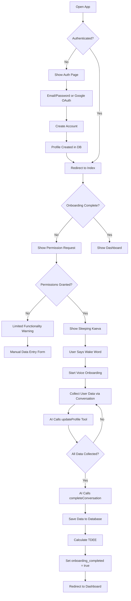

**Duration:** 3-5 minutes (voice) or 5-10 minutes (manual)

**Data Collected:**
- Personal: Name, age
- Biometric: Weight, height, gender, activity level
- Household: Adults, children, pets
- Health: Allergies, dietary restrictions, goals
- Preferences: Language, store

**Completion Criteria:**
- `onboarding_completed = true` in profiles table
- Minimum required: Name, age (other fields optional)

### 2. Adding Inventory Items

#### Via Scanner

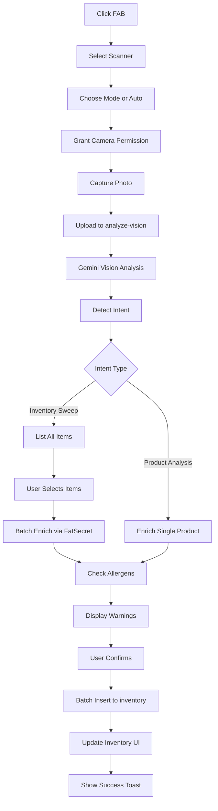

#### Via Voice

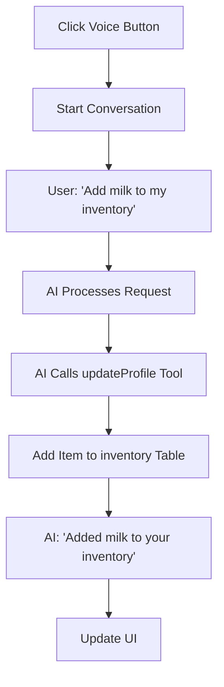

#### Manual Entry

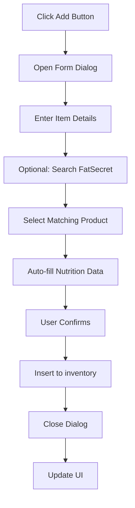

### 3. Meal Logging

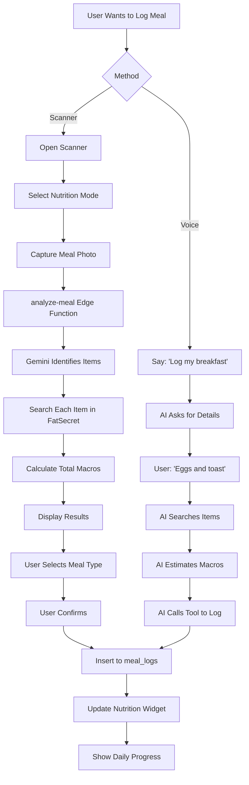

### 4. Shopping Workflow

#### Creating Cart

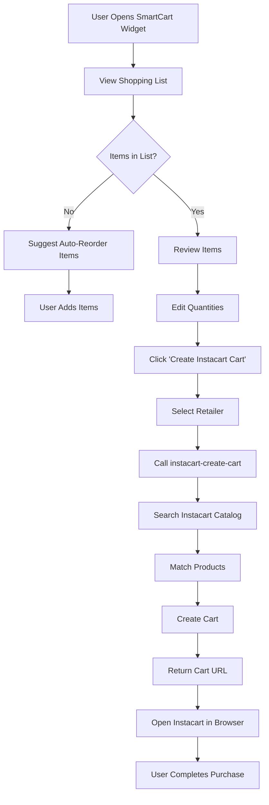

#### Post-Purchase Update

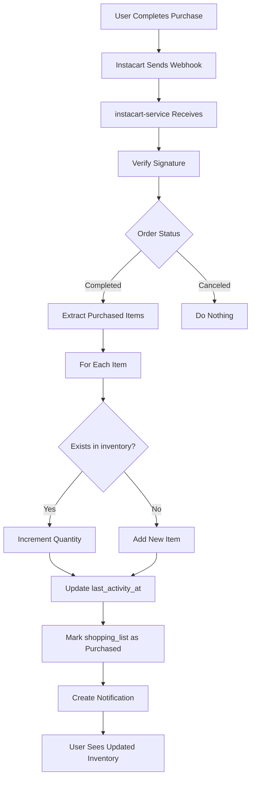

### 5. Safety Check Flow

#### Allergen Warning

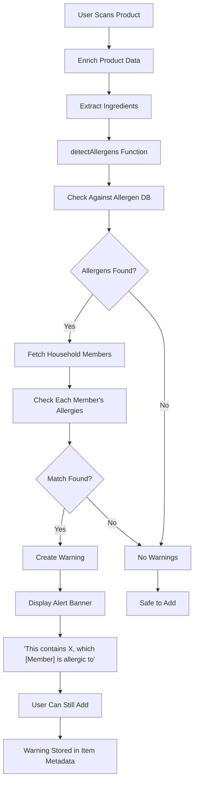

#### Pet Toxicity Warning

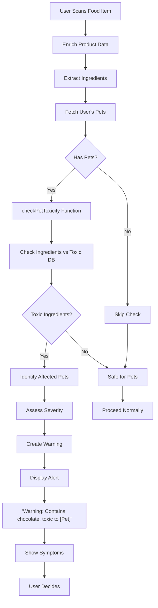

### 6. Recipe Generation Flow

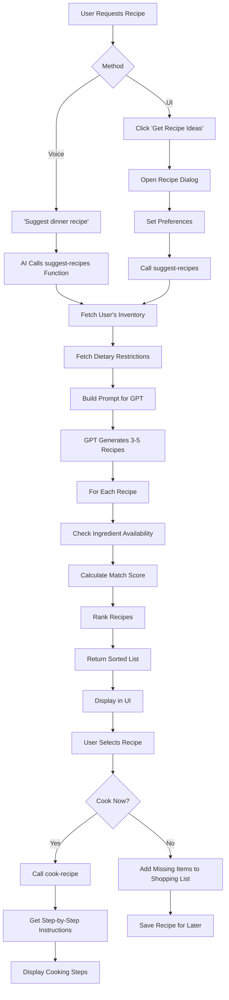

### 7. Spoilage Detection Flow

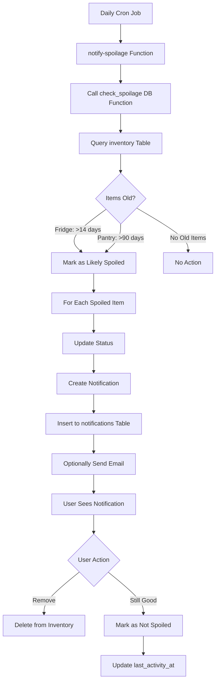

### 8. Agent Configuration Flow

```mermaid
graph TD
    A[User Completes Onboarding] --> B{Agent Configured?}
    B -->|No| C[Redirect to /configure-agent]
    C --> D[Fetch User Profile]
    D --> E[Fetch Household Members]
    E --> F[Fetch Pets]
    F --> G[Fetch Inventory Summary]
    G --> H[Build System Prompt]
    H --> I[Call configure-elevenlabs-agent]
    I --> J[ElevenLabs API Call]
    J --> K[Update Agent Knowledge Base]
    K --> L[Set First Message]
    L --> M[Store agent_id in Profile]
    M --> N[Set agent_configured = true]
    N --> O[Redirect to Dashboard]
    
    B -->|Yes| P[Dashboard Loads]
    P --> Q[Voice Assistant Available]
```

---

## Security & RLS Policies

### Row Level Security Overview

All user-facing tables have RLS enabled with policies enforcing user ownership.

**Principle:** `auth.uid() = user_id`

### Table-by-Table Policies

#### `profiles`

**SELECT:**
```sql
CREATE POLICY "Users can view own profile"
ON profiles FOR SELECT
USING (auth.uid() = id);
```

**UPDATE:**
```sql
CREATE POLICY "Users can update own profile"
ON profiles FOR UPDATE
USING (auth.uid() = id)
WITH CHECK (auth.uid() = id);
```

**INSERT:**
```sql
CREATE POLICY "Users can insert own profile"
ON profiles FOR INSERT
WITH CHECK (auth.uid() = id);
```

**DELETE:**
```sql
CREATE POLICY "Users can delete own profile"
ON profiles FOR DELETE
USING (auth.uid() = id);
```

#### `household_members`

**SELECT:**
```sql
CREATE POLICY "Users can view own household members"
ON household_members FOR SELECT
USING (auth.uid() = user_id);
```

**INSERT:**
```sql
CREATE POLICY "Users can insert own household members"
ON household_members FOR INSERT
WITH CHECK (auth.uid() = user_id);
```

**UPDATE:**
```sql
CREATE POLICY "Users can update own household members"
ON household_members FOR UPDATE
USING (auth.uid() = user_id);
```

**DELETE:**
```sql
CREATE POLICY "Users can delete own household members"
ON household_members FOR DELETE
USING (auth.uid() = user_id);
```

#### `pets`

**Policies:** Same as `household_members`, enforcing `auth.uid() = user_id`

#### `inventory`

**Policies:** Same as `household_members`, enforcing `auth.uid() = user_id`

#### `meal_logs`

**Policies:** Same as `household_members`, enforcing `auth.uid() = user_id`

#### `shopping_list`

**Policies:** Same as `household_members`, enforcing `auth.uid() = user_id`

**Note:** `inventory_id` foreign key allows linking to inventory items.

#### `conversation_history`

**Policies:** Same as `household_members`, enforcing `auth.uid() = user_id`

**Special Consideration:** Used for error logging too, so errors are user-scoped.

#### `notifications`

**SELECT:**
```sql
CREATE POLICY "Users can view own notifications"
ON notifications FOR SELECT
USING (auth.uid() = user_id);
```

**UPDATE:**
```sql
CREATE POLICY "Users can update own notifications"
ON notifications FOR UPDATE
USING (auth.uid() = user_id)
WITH CHECK (auth.uid() = user_id);
```

**DELETE:**
```sql
CREATE POLICY "Users can delete own notifications"
ON notifications FOR DELETE
USING (auth.uid() = user_id);
```

**INSERT:** NOT ALLOWED (system-generated only)

#### `user_roles`

**SELECT:**
```sql
-- Users can view own roles
CREATE POLICY "Users can view own roles"
ON user_roles FOR SELECT
USING (auth.uid() = user_id);

-- Admins can view all roles
CREATE POLICY "Admins can view all roles"
ON user_roles FOR SELECT
USING (has_role(auth.uid(), 'admin'));
```

**ALL (INSERT/UPDATE/DELETE):**
```sql
CREATE POLICY "Admins can manage roles"
ON user_roles FOR ALL
USING (has_role(auth.uid(), 'admin'))
WITH CHECK (has_role(auth.uid(), 'admin'));
```

#### `product_cache`

**RLS DISABLED** - Public cache, no user-specific data

**Rationale:** Cache is shared across all users for efficiency. No sensitive data.

### Admin Role Security

**Function:** `has_role(user_id, role)`

**Definition:**
```sql
CREATE OR REPLACE FUNCTION has_role(_user_id uuid, _role app_role)
RETURNS boolean
LANGUAGE sql
STABLE SECURITY DEFINER
SET search_path = public
AS $$
  SELECT EXISTS (
    SELECT 1 FROM public.user_roles
    WHERE user_id = _user_id AND role = _role
  );
$$;
```

**Security:** `SECURITY DEFINER` allows function to bypass RLS for role check.

**Usage in Policies:**
```sql
USING (has_role(auth.uid(), 'admin'))
```

**Edge Function Protection:**
```typescript
// supabase/functions/check-admin/index.ts
const { data: { user } } = await supabase.auth.getUser(jwt);

const { data: roleData } = await supabase
  .from('user_roles')
  .select('role')
  .eq('user_id', user.id)
  .single();

const isAdmin = roleData?.role === 'admin';

return new Response(JSON.stringify({ isAdmin }), {
  headers: { ...corsHeaders, 'Content-Type': 'application/json' }
});
```

### Edge Function Security

**Authentication Required:** All edge functions except explicitly public ones

**JWT Validation:**
```typescript
const authHeader = req.headers.get('Authorization');
if (!authHeader) {
  return new Response('Unauthorized', { status: 401 });
}

const jwt = authHeader.replace('Bearer ', '');
const { data: { user }, error } = await supabase.auth.getUser(jwt);

if (error || !user) {
  return new Response('Invalid token', { status: 401 });
}
```

**User Scoping:** All queries filtered by `user.id`
```typescript
const { data } = await supabase
  .from('inventory')
  .select('*')
  .eq('user_id', user.id); // RLS ensures this is enforced
```

**API Key Security:**
```typescript
// Never expose API keys to client
const OPENAI_API_KEY = Deno.env.get('OPENAI_API_KEY');

// All external API calls from edge functions only
```

### Input Validation

**SQL Injection Prevention:**
- Supabase client uses parameterized queries
- Never raw SQL execution in edge functions
- Database functions use `SET search_path = public` for safety

**XSS Prevention:**
- React escapes output by default
- User input sanitized before database insertion
- No `dangerouslySetInnerHTML` usage

**CSRF Prevention:**
- Supabase handles CSRF tokens
- All mutations require valid JWT
- Short-lived JWT tokens (1 hour)

### Secrets Management

**Environment Variables:**
Stored in Lovable Cloud secrets manager.

**Never in Code:**
```typescript
// ❌ NEVER
const apiKey = "sk-abc123...";

// ✅ ALWAYS
const apiKey = Deno.env.get('OPENAI_API_KEY');
```

**Secrets:**
- `SUPABASE_URL`
- `SUPABASE_ANON_KEY`
- `SUPABASE_SERVICE_ROLE_KEY`
- `FATSECRET_CLIENT_ID`
- `FATSECRET_CLIENT_SECRET`
- `INSTACART_API_KEY`
- `GOOGLE_GEMINI_API_KEY`
- `OPENAI_API_KEY`
- `ELEVENLABS_API_KEY`

**Rotation:** API keys rotated quarterly or on compromise

---

## Environment Variables

### Frontend (.env)

```bash
# Supabase
VITE_SUPABASE_URL="https://btgmvuieishjiybgcmpj.supabase.co"
VITE_SUPABASE_PUBLISHABLE_KEY="eyJhbGci..."
VITE_SUPABASE_PROJECT_ID="btgmvuieishjiybgcmpj"
```

**Note:** `VITE_` prefix exposes to client. Never store secrets here.

### Edge Functions (Supabase Secrets)

```bash
# Database
SUPABASE_URL="https://btgmvuieishjiybgcmpj.supabase.co"
SUPABASE_ANON_KEY="eyJhbGci..." # Public key, safe in client
SUPABASE_SERVICE_ROLE_KEY="eyJhbGci..." # NEVER expose to client
SUPABASE_DB_URL="postgresql://..." # Direct DB connection

# External APIs
FATSECRET_CLIENT_ID="your-client-id"
FATSECRET_CLIENT_SECRET="your-client-secret"
INSTACART_API_KEY="your-api-key"
GOOGLE_GEMINI_API_KEY="your-api-key"
OPENAI_API_KEY="sk-..."
ELEVENLABS_API_KEY="your-api-key"
```

**Setting Secrets:**
Via Lovable Cloud dashboard or Supabase CLI:
```bash
supabase secrets set OPENAI_API_KEY=sk-...
```

**Accessing in Edge Functions:**
```typescript
const apiKey = Deno.env.get('OPENAI_API_KEY');
```

---

## Deployment & Configuration

### Deployment Process

**Automatic Deployment:**
1. Code pushed to repository
2. Lovable Cloud detects changes
3. Frontend built via Vite
4. Edge functions deployed to Supabase
5. Database migrations applied (if any)
6. Live in <2 minutes

**Manual Deployment:**
Via Lovable Cloud dashboard: Click "Publish"

### Frontend Build

**Build Command:**
```bash
npm run build
```

**Output:** `dist/` directory

**Vite Config:**
```typescript
// vite.config.ts
export default defineConfig({
  plugins: [react()],
  base: '/', // For root domain deployment
  build: {
    outDir: 'dist',
    sourcemap: true, // For debugging
    rollupOptions: {
      output: {
        manualChunks: {
          vendor: ['react', 'react-dom', 'react-router-dom'],
          ui: ['@radix-ui/react-dialog', '@radix-ui/react-dropdown-menu'],
          supabase: ['@supabase/supabase-js']
        }
      }
    }
  }
});
```

**Build Optimizations:**
- Code splitting by route
- Tree shaking for unused code
- Minification & compression
- Asset hashing for cache busting

### Edge Function Deployment

**Deployment:**
Automatic on code push. No manual step required.

**Supabase Config:**
```toml
# supabase/config.toml
project_id = "btgmvuieishjiybgcmpj"

[functions.analyze-meal]
verify_jwt = true  # Requires authentication

[functions.analyze-vision]
verify_jwt = true

[functions.check-admin]
verify_jwt = true

[functions.configure-elevenlabs-agent]
verify_jwt = true

# ... more functions
```

**Testing Deployment:**
```bash
# Test edge function locally
supabase functions serve analyze-meal --env-file .env.local

# Deploy specific function
supabase functions deploy analyze-meal
```

### Database Migrations

**Migration Files:** `supabase/migrations/*.sql`

**Applying Migrations:**
Automatic on deployment or via CLI:
```bash
supabase db push
```

**Creating Migration:**
```bash
supabase migration new add_new_table
# Edit generated SQL file
supabase db push
```

**Rollback:**
```bash
supabase db reset # Dangerous: drops all data
```

**Best Practice:**
- Never edit applied migrations
- Always create new migration for schema changes
- Test migrations locally first

### Monitoring & Logging

**Frontend Errors:**
Logged to browser console. Future: Sentry integration.

**Edge Function Logs:**
```bash
# View logs for specific function
supabase functions logs analyze-meal

# Stream logs in real-time
supabase functions logs analyze-meal --tail
```

**Database Logs:**
Via Supabase dashboard or `conversation_history` table for app errors.

**Metrics:**
- Request counts per function
- Error rates
- Response times
- Database query performance

### Scaling Considerations

**Frontend:**
- Hosted on Lovable Cloud CDN (auto-scales)
- No server-side rendering, scales infinitely

**Database:**
- Lovable Cloud Supabase auto-scales
- Connection pooling via Supavisor
- Upgrade instance size if needed

**Edge Functions:**
- Auto-scale with traffic
- Each invocation is isolated
- No concurrency limits

**Rate Limiting:**
- Implemented per external API
- FatSecret: 10k calls/month (free tier)
- OpenAI: Based on tier (see API limits)
- Instacart: TBD (generous)

### Performance Optimization

**Frontend:**
1. **Code Splitting:** Routes lazy-loaded
   ```typescript
   const Admin = lazy(() => import('./pages/Admin'));
   ```

2. **Image Optimization:** Compress before upload
   ```typescript
   canvas.toDataURL('image/jpeg', 0.8); // 80% quality
   ```

3. **Query Caching:** TanStack Query caches API responses
   ```typescript
   queryClient.setDefaultOptions({
     queries: { staleTime: 5 * 60 * 1000 } // 5 minutes
   });
   ```

**Backend:**
1. **Product Caching:** `product_cache` table (30-day expiry)
2. **Database Indexing:**
   - `inventory(user_id, category)`
   - `meal_logs(user_id, logged_at)`
   - `conversation_history(user_id, conversation_id)`

3. **Connection Pooling:** Supabase handles automatically

### Backup & Recovery

**Database Backups:**
- Lovable Cloud Supabase: Daily automatic backups
- Point-in-time recovery (last 7 days)

**Manual Backup:**
```bash
# Export entire database
supabase db dump > backup.sql

# Restore from backup
psql $DATABASE_URL < backup.sql
```

**User Data Export:**
Via UI: Settings → Export Data (future feature)

### Compliance & Privacy

**GDPR:**
- User can delete account (deletes all data via CASCADE)
- Data export available on request
- Privacy policy URL: TBD

**HIPAA:**
Not HIPAA-compliant (health data is not PHI in this context)

**Data Retention:**
- User data: Indefinite (until account deletion)
- Conversation history: Indefinite
- Product cache: 30 days
- Logs: 7 days

---

## Conclusion

This document provides a comprehensive overview of the Kaeva application architecture, implementation details, and operational procedures. For additional information or support, please refer to:

- **Lovable Cloud Documentation:** https://docs.lovable.dev/
- **Supabase Documentation:** https://supabase.com/docs
- **ElevenLabs Documentation:** https://elevenlabs.io/docs
- **Project Repository:** [GitHub URL]

**Last Updated:** 2025-01-20
**Version:** 1.0.0
**Maintained By:** Kaeva Development Team
