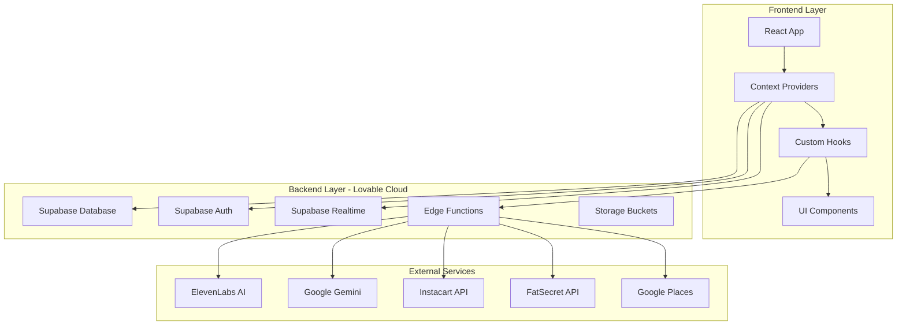
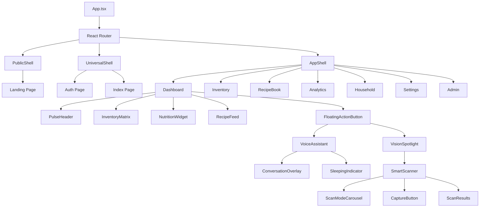
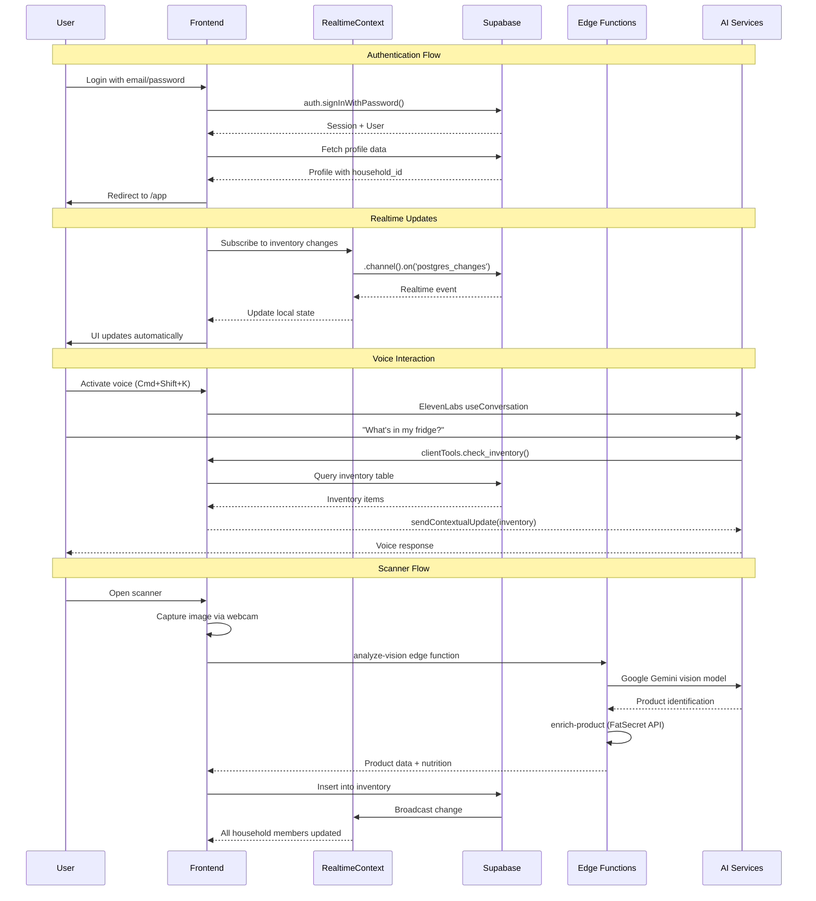
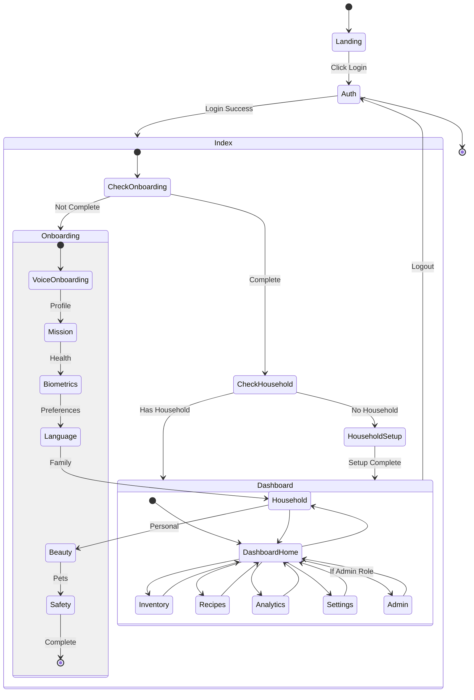
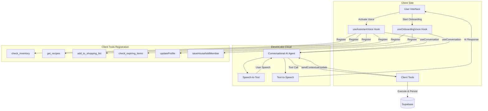

# System Architecture

## High-Level Architecture

The Kaeva application follows a modern client-server architecture with realtime capabilities:



See diagram source: [`/docs/diagrams/system-architecture.mmd`](./diagrams/system-architecture.mmd)

## Routing Structure

The application uses a two-tier routing system separating public marketing pages from authenticated app experiences:

```mermaid
flowchart TD
    Start([User Visits]) --> Root[/ Route]
    Root --> Landing[Landing Page - Marketing]
    Landing --> Auth1[Login Button]
    Auth1 --> AuthPage[/auth Route]
    
    AuthPage --> |Success| AppIndex[/app Route]
    AppIndex --> CheckOnboarding{Onboarding<br/>Complete?}
    
    CheckOnboarding --> |No| Onboarding[Voice Onboarding]
    CheckOnboarding --> |Yes| CheckHousehold{Household<br/>ID Set?}
    
    CheckHousehold --> |No| HouseholdSetup[Household Setup]
    CheckHousehold --> |Yes| Dashboard[Dashboard]
    
    Dashboard --> Inventory[/inventory]
    Dashboard --> Recipes[/recipes]
    Dashboard --> Analytics[/analytics]
    Dashboard --> Household[/household]
    Dashboard --> Settings[/settings]
    Dashboard --> Admin[/admin - Admin Only]
```

See diagram source: [`/docs/diagrams/routing-structure.mmd`](./diagrams/routing-structure.mmd)

### Route Protection

- **Public Routes**: `/`, `/auth`
- **Protected Routes**: All other routes require authentication via `ProtectedRoute` wrapper
- **Admin Routes**: `/admin` requires `admin` role in `user_roles` table

## Component Hierarchy



See diagram source: [`/docs/diagrams/component-hierarchy.mmd`](./diagrams/component-hierarchy.mmd)

## Data Flow Architecture



See diagram source: [`/docs/diagrams/data-flow.mmd`](./diagrams/data-flow.mmd)

## State Management Flow



See diagram source: [`/docs/diagrams/state-management.mmd`](./diagrams/state-management.mmd)

## Voice Agent Architecture



See diagram source: [`/docs/diagrams/voice-architecture.mmd`](./diagrams/voice-architecture.mmd)

## Context Providers

### AuthContext

**Purpose**: Manages authentication session state (session, user, isLoading, isAuthenticated)

**Location**: `src/contexts/` (implicitly used via `useAuth()`)

**Key Responsibilities**:
- Listen to `onAuthStateChange` events
- Maintain session and user state
- Provide authentication status to entire app
- **Does NOT** manage profile data (separated to `useProfile()` hook)

### RealtimeContext

**Purpose**: Provides realtime subscriptions for household data

**Location**: `src/contexts/RealtimeContext.tsx`

**Key Responsibilities**:
- Subscribe to `inventory` table changes for current household
- Subscribe to `household_activity` for activity feed
- Subscribe to `shopping_list` for shared cart updates
- Broadcast changes to all connected household members
- Send contextual updates to voice assistant when data changes

## Mobile & PWA Support

### Viewport Handling

All pages use `UniversalShell` (or `PublicShell` for public pages) to handle:
- **Dynamic Viewport Height**: `h-[100dvh]` instead of `h-screen` fixes Safari address bar
- **Safe Areas**: `env(safe-area-inset-*)` for notches and home bars
- **Fixed Positioning**: Prevents whole-page scrolling, only internal zones scroll
- **Overscroll Prevention**: `overscroll-none` disables iOS rubber-band bounce

### Permission Strategy

Mobile browsers require progressive fallback for media permissions:
1. Request audio + video together
2. Fall back to audio-only if combined fails (audio critical for voice)
3. Fall back to video-only if needed for scanner

iOS-specific workarounds:
- Play silent audio to unlock audio system
- Delay track cleanup for 3 seconds to prevent permission re-prompts
- Detect and warn users in in-app browsers (Instagram/Facebook WebViews)

## Security Model

### Row Level Security (RLS)

All tables enforce RLS policies:

**Household-Based Access**:
```sql
-- Example: inventory table policy
CREATE POLICY "Users can view household inventory"
ON inventory FOR SELECT
USING (
  household_id IN (
    SELECT household_id 
    FROM household_memberships 
    WHERE user_id = auth.uid()
  )
);
```

**User-Based Access**:
```sql
-- Example: profiles table policy
CREATE POLICY "Users can update own profile"
ON profiles FOR UPDATE
USING (id = auth.uid());
```

### Edge Function Security

- All edge functions validate JWT tokens
- Household membership verified before data access
- External API keys stored as secrets, never exposed to client
- Rate limiting via Supabase built-in protections

## Performance Considerations

1. **Lazy Loading**: Scanner camera only activates when scanner page opened
2. **Debouncing**: Voice context updates debounced to avoid flooding
3. **Optimistic UI**: Inventory updates show immediately, sync in background
4. **Caching**: Product data cached in `product_cache` table to reduce API calls
5. **Skeleton Loading**: All data fetches show skeleton states for perceived performance

## Error Handling Patterns

1. **Graceful Degradation**: Voice fails → show manual input forms
2. **Toast Notifications**: User-friendly error messages via `sonner` toast library
3. **Retry Logic**: Failed API calls retry with exponential backoff
4. **Offline Support**: Basic read operations work offline via cached data
5. **Permission Errors**: Clear instructions for enabling camera/microphone in settings

---

For component-specific implementation details, see [COMPONENTS.md](./COMPONENTS.md)

For database structure, see [DATABASE_SCHEMA.md](./DATABASE_SCHEMA.md)

For edge function details, see [EDGE_FUNCTIONS.md](./EDGE_FUNCTIONS.md)
