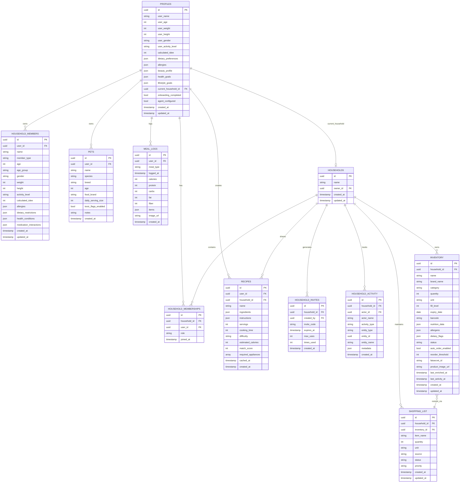

# Database Schema

Complete database schema documentation for the Kaeva application.

## Entity Relationship Diagram



See diagram source: [`/docs/diagrams/database-erd.mmd`](./diagrams/database-erd.mmd)

## Table Specifications

### profiles

**Purpose**: User profiles with onboarding data and preferences

**Row Level Security**:
- Users can view own profile: `id = auth.uid()`
- Users can update own profile: `id = auth.uid()`

**Key Fields**:
- `id` (uuid, PK): Matches auth.users.id (NOT a foreign key - Supabase Auth managed separately)
- `user_name`, `user_age`, `user_weight`, `user_height`, `user_gender`, `user_activity_level`: Biometric data
- `calculated_tdee` (int): Total Daily Energy Expenditure in calories, calculated during onboarding
- `dietary_preferences` (json): Array of preferences (vegan, keto, gluten-free, etc.)
- `allergies` (json): User's allergies
- `beauty_profile` (json): Skin type, hair type, etc.
- `health_goals`, `lifestyle_goals` (json): User's stated goals
- `current_household_id` (uuid, FK): Active household (users can belong to multiple)
- `onboarding_completed` (bool): Gates access to main app
- `agent_configured` (bool): Whether ElevenLabs agents provisioned
- `language` (string): Preferred language for voice interactions

**Indexes**:
- Primary key on `id`
- Index on `current_household_id` for household lookups

### households

**Purpose**: Household containers for shared data

**Row Level Security**:
- Viewable by household members via `household_memberships` join
- Editable by owner or admins

**Key Fields**:
- `id` (uuid, PK)
- `name` (string): Household name (e.g., "Smith Family")
- `owner_id` (uuid): User who created the household
- `created_at`, `updated_at` (timestamp)

**Indexes**:
- Primary key on `id`
- Index on `owner_id`

### household_memberships

**Purpose**: Many-to-many relationship between users and households

**Row Level Security**:
- Viewable by household members
- Editable by owner or admins

**Key Fields**:
- `id` (uuid, PK)
- `household_id` (uuid, FK → households)
- `user_id` (uuid, FK → profiles)
- `role` (string): "owner", "admin", or "member"
- `joined_at` (timestamp)

**Unique Constraint**: (`household_id`, `user_id`) - users can't join same household twice

**Indexes**:
- Primary key on `id`
- Composite index on (`household_id`, `user_id`)

### household_members

**Purpose**: Non-app-using household members (kids, elderly, etc.) tracked for dietary needs

**Row Level Security**:
- Viewable/editable by household members (via `user_id` → `profiles.current_household_id`)

**Key Fields**:
- `id` (uuid, PK)
- `user_id` (uuid): Owner of this member record
- `name` (string): Member's name
- `member_type` (string): "adult", "child", "infant"
- `age`, `age_group`, `gender`, `weight`, `height`, `activity_level`: Biometrics
- `calculated_tdee` (int): Calculated calorie needs
- `allergies`, `dietary_restrictions`, `health_conditions`, `medication_interactions` (json)

**Indexes**:
- Primary key on `id`
- Index on `user_id` for quick lookups

### pets

**Purpose**: Pet profiles for dietary safety monitoring

**Row Level Security**:
- Viewable/editable by owner (`user_id = auth.uid()`)

**Key Fields**:
- `id` (uuid, PK)
- `user_id` (uuid): Owner
- `name`, `species`, `breed`, `age`: Pet info
- `food_brand`, `daily_serving_size`: Dietary tracking
- `toxic_flags_enabled` (bool): Enable toxicity alerts for this pet
- `notes` (string): Additional info

**Indexes**:
- Primary key on `id`
- Index on `user_id`

### inventory

**Purpose**: Household inventory items (food, beauty, pet products)

**Row Level Security**:
- Viewable/editable by household members via `household_id` join to `household_memberships`

**Key Fields**:
- `id` (uuid, PK)
- `household_id` (uuid, FK → households)
- `name`, `brand_name`: Product identification
- `category` (enum): "fridge", "pantry", "beauty", "pets"
- `quantity`, `unit`: Amount (e.g., 2 liters)
- `fill_level` (int): Percentage remaining (0-100)
- `expiry_date` (date): When item expires
- `barcode` (string): UPC/EAN for quick lookup
- `status` (enum): "sufficient", "low", "critical", "out", "out_of_stock", "likely_spoiled"
- `nutrition_data` (json): Calories, protein, carbs, fat per serving from FatSecret
- `allergens` (json): Detected allergens
- `dietary_flags` (json): vegan, gluten-free, etc.
- `auto_order_enabled`, `reorder_threshold`: Auto-restock settings
- `fatsecret_id` (string): FatSecret API food ID for enrichment
- `product_image_url` (string): Product image
- `last_enriched_at`, `last_activity_at`, `consumption_rate`: Usage tracking

**Indexes**:
- Primary key on `id`
- Index on `household_id` for household queries
- Index on `category` for category filtering
- Index on `status` for low stock queries
- Index on `expiry_date` for expiring items

**Realtime**: Enabled via `ALTER PUBLICATION supabase_realtime ADD TABLE inventory;`

**Triggers**:
- `log_inventory_activity_trigger`: Logs INSERT, UPDATE, DELETE to `household_activity`

### shopping_list

**Purpose**: Shared shopping list for household

**Row Level Security**:
- Viewable/editable by household members

**Key Fields**:
- `id` (uuid, PK)
- `household_id` (uuid, FK → households)
- `inventory_id` (uuid, FK → inventory, nullable): Link to inventory item for restock
- `item_name` (string)
- `quantity`, `unit`: Amount needed
- `source` (string): "manual", "auto_restock", "recipe", "voice"
- `status` (string): "pending", "purchased", "out_of_stock"
- `priority` (string): "low", "medium", "high"

**Indexes**:
- Primary key on `id`
- Index on `household_id`
- Index on `status`

**Realtime**: Enabled for live shopping list updates

### meal_logs

**Purpose**: Nutrition tracking for meals

**Row Level Security**:
- Viewable/editable by owner (`user_id = auth.uid()`)

**Key Fields**:
- `id` (uuid, PK)
- `user_id` (uuid): Who logged the meal
- `meal_type` (string): "breakfast", "lunch", "dinner", "snack"
- `logged_at` (timestamp): When meal was consumed
- `calories`, `protein`, `carbs`, `fat`, `fiber` (int): Nutritional totals
- `items` (json): Array of food items with individual nutrition
- `image_url` (string): Captured meal photo

**Indexes**:
- Primary key on `id`
- Index on `user_id`
- Index on `logged_at` for date range queries

### recipes

**Purpose**: Recipe storage and suggestions

**Row Level Security**:
- Viewable by household members
- Editable by creator or household admins

**Key Fields**:
- `id` (uuid, PK)
- `user_id` (uuid): Creator
- `household_id` (uuid, FK → households): Shared with household
- `name` (string): Recipe title
- `ingredients` (json): Array of ingredient objects with names and quantities
- `instructions` (json): Array of step strings
- `servings`, `cooking_time`, `difficulty`, `estimated_calories`: Recipe metadata
- `match_score` (int): How well recipe matches current inventory (0-100)
- `required_appliances` (array): ["oven", "blender", etc.]
- `cached_at` (timestamp): When recipe was generated/cached

**Indexes**:
- Primary key on `id`
- Index on `household_id`
- Index on `match_score` for sorting suggestions

**Triggers**:
- `log_recipe_activity_trigger`: Logs INSERT to `household_activity`

### household_invites

**Purpose**: Secure invite codes for joining households

**Row Level Security**:
- Viewable by household members
- Creatable by members, deletable by owner/admin

**Key Fields**:
- `id` (uuid, PK)
- `household_id` (uuid, FK → households)
- `created_by` (uuid): User who generated invite
- `invite_code` (string): JWT-signed token
- `expires_at` (timestamp): When invite becomes invalid
- `max_uses` (int, nullable): Maximum times invite can be used
- `times_used` (int): Current usage count

**Indexes**:
- Primary key on `id`
- Index on `household_id`
- Index on `invite_code` for validation lookups

### household_activity

**Purpose**: Activity feed for household actions

**Row Level Security**:
- Viewable by household members
- Insertable by system triggers only

**Key Fields**:
- `id` (uuid, PK)
- `household_id` (uuid, FK → households)
- `actor_id` (uuid): User who performed action
- `actor_name` (string): Display name
- `activity_type` (string): "member_joined", "inventory_added", "inventory_updated", "inventory_removed", "recipe_added"
- `entity_type` (string): "member", "inventory", "recipe", etc.
- `entity_id` (uuid): ID of affected entity
- `entity_name` (string): Display name of entity
- `metadata` (json): Additional context

**Indexes**:
- Primary key on `id`
- Index on `household_id` for feed queries
- Index on `created_at` for chronological sorting

**Realtime**: Enabled for live activity feed

**Triggers**: Populated automatically by triggers on `household_memberships`, `inventory`, `recipes` tables

### conversation_events

**Purpose**: Voice agent conversation logging for debugging and analytics

**Row Level Security**:
- Viewable by admin role only
- Insertable by edge functions

**Key Fields**:
- `id` (uuid, PK)
- `user_id` (uuid): User in conversation
- `conversation_id` (string): ElevenLabs conversation ID
- `agent_type` (string): "onboarding" or "assistant"
- `event_type` (string): "tool_call", "response", "error", etc.
- `role` (string): "user" or "agent"
- `event_data` (json): Full event payload

**Indexes**:
- Primary key on `id`
- Index on `user_id`
- Index on `conversation_id`
- Index on `created_at`

**Realtime**: Enabled for admin monitoring

### conversation_history

**Purpose**: Persistent conversation history for context and replay

**Row Level Security**:
- Viewable by owner (`user_id = auth.uid()`)
- Insertable by system

**Key Fields**:
- `id` (uuid, PK)
- `user_id` (uuid): Participant
- `conversation_id` (string): Session ID
- `role` (string): "user" or "assistant"
- `message` (string): Text content
- `metadata` (json): Tool calls, timestamps, etc.

**Indexes**:
- Primary key on `id`
- Index on `conversation_id`
- Index on `user_id`

### user_roles

**Purpose**: Role-based access control (RBAC)

**Row Level Security**:
- Viewable by admin role only
- Editable by admin role only

**Key Fields**:
- `id` (uuid, PK)
- `user_id` (uuid): User being granted role
- `role` (enum): "admin" or "user"

**Unique Constraint**: (`user_id`, `role`) - can't grant same role twice

**Indexes**:
- Primary key on `id`
- Index on `user_id`

**Helper Function**:
```sql
CREATE FUNCTION has_role(_role app_role, _user_id uuid)
RETURNS boolean
LANGUAGE sql
SECURITY DEFINER
AS $$
  SELECT EXISTS (
    SELECT 1 FROM user_roles
    WHERE user_id = _user_id AND role = _role
  );
$$;
```

### product_cache

**Purpose**: Cache external API responses to reduce costs

**Row Level Security**:
- Publicly readable (no sensitive data)
- System-writable only

**Key Fields**:
- `id` (uuid, PK)
- `search_term` (string): Original search query
- `fatsecret_response` (json): Full FatSecret API response
- `nutrition_summary` (json): Extracted nutrition data
- `image_url` (string): Product image
- `cached_at` (timestamp): Cache creation time
- `expires_at` (timestamp): When cache should be invalidated

**Indexes**:
- Primary key on `id`
- Index on `search_term` for cache lookups
- Index on `expires_at` for cleanup

## Database Functions

### check_spoilage()

**Purpose**: Identify inventory items that are expired or expiring soon

**Returns**: Array of objects with `{ inventory_id, item_name, category, days_old }`

**Used By**: `notify-spoilage` edge function scheduled job

### insert_household_batch()

**Purpose**: Atomic insertion of household members and pets during onboarding

**Parameters**: `p_members` (json), `p_pets` (json), `p_user_id` (uuid)

**Returns**: JSON with created member and pet IDs

**Used By**: `saveOnboardingData()` function in frontend

### log_household_activity()

**Purpose**: Insert activity log entries

**Parameters**: `p_household_id`, `p_activity_type`, `p_entity_type`, `p_entity_id`, `p_entity_name`, `p_metadata`

**Used By**: Database triggers on inventory, recipes, household_memberships tables

### mark_spoilage()

**Purpose**: Update inventory item status to "likely_spoiled"

**Parameters**: `_inventory_id` (uuid)

**Used By**: `notify-spoilage` edge function

## Enums

### app_role
- `admin`: Full system access
- `user`: Standard user access

### inventory_category
- `fridge`: Refrigerated items
- `pantry`: Shelf-stable items
- `beauty`: Cosmetics and toiletries
- `pets`: Pet food and supplies

### inventory_status
- `sufficient`: Stock level above threshold
- `low`: Stock level below reorder threshold
- `critical`: Stock level very low
- `out`: Item completely depleted
- `out_of_stock`: Item unavailable at retailer
- `likely_spoiled`: Expiry date passed + time threshold

## Database Triggers

### Inventory Activity Logger
```sql
CREATE TRIGGER log_inventory_activity_trigger
AFTER INSERT OR UPDATE OR DELETE ON inventory
FOR EACH ROW
EXECUTE FUNCTION log_household_activity();
```

### Recipe Activity Logger
```sql
CREATE TRIGGER log_recipe_activity_trigger
AFTER INSERT ON recipes
FOR EACH ROW
EXECUTE FUNCTION log_household_activity();
```

### Membership Activity Logger
```sql
CREATE TRIGGER log_membership_activity_trigger
AFTER INSERT ON household_memberships
FOR EACH ROW
EXECUTE FUNCTION log_household_activity();
```

---

For architecture overview, see [ARCHITECTURE.md](./ARCHITECTURE.md)

For edge function usage of these tables, see [EDGE_FUNCTIONS.md](./EDGE_FUNCTIONS.md)

For component data access patterns, see [COMPONENTS.md](./COMPONENTS.md)
