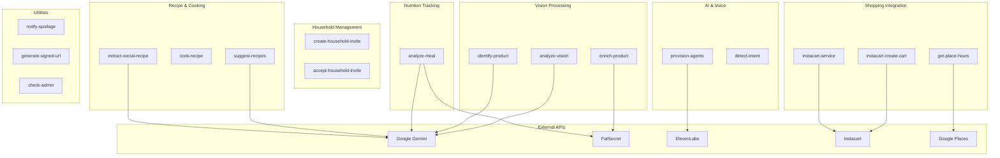

# Edge Functions Reference

Complete reference for all Supabase Edge Functions in the Kaeva application.

## Edge Functions Map



See diagram source: [`/docs/diagrams/edge-functions-map.mmd`](./diagrams/edge-functions-map.mmd)

## Function Reference

### Vision Processing Functions

#### analyze-vision

**Purpose**: Main vision analysis endpoint - identifies products, meals, or other items from images

**Method**: POST

**Auth**: Required (JWT)

**Request Body**:
```json
{
  "imageBase64": "data:image/jpeg;base64,...",
  "mode": "inventory" | "nutrition" | "beauty" | "pets" | "appliances",
  "context": {
    "householdMembers": [...],
    "pets": [...],
    "existingInventory": [...]
  }
}
```

**Response**:
```json
{
  "identified": {
    "name": "Organic Whole Milk",
    "brand": "Horizon",
    "category": "fridge",
    "quantity": 1,
    "unit": "gallon",
    "barcode": "074570061419"
  },
  "enrichedData": {
    "nutrition": { ... },
    "allergens": ["milk"],
    "dietaryFlags": ["vegetarian"]
  },
  "safetyAlerts": [
    { "petName": "Max", "species": "dog", "toxicity": "none" }
  ]
}
```

**External APIs**:
- Google Gemini 2.5 Pro (vision model)
- FatSecret (nutrition enrichment via `enrich-product`)

**Process Flow**:
1. Validate JWT and extract user_id
2. Decode base64 image
3. Build Gemini prompt based on mode and context
4. Call Gemini vision model
5. Parse structured response
6. Enrich with nutrition data (if food item)
7. Check allergens against household members
8. Check toxicity against pets
9. Return combined result

**Error Handling**:
- 400: Invalid image format
- 401: Missing/invalid JWT
- 500: Gemini API error

#### identify-product

**Purpose**: Identify product from barcode or image (legacy, now mostly handled by analyze-vision)

**Method**: POST

**Auth**: Required (JWT)

**Request Body**:
```json
{
  "barcode": "074570061419"
}
```
OR
```json
{
  "imageBase64": "data:image/jpeg;base64,..."
}
```

**Response**:
```json
{
  "name": "Organic Whole Milk",
  "brand": "Horizon",
  "barcode": "074570061419",
  "category": "fridge"
}
```

**External APIs**:
- Google Gemini 2.5 Pro (for image-based identification)

#### enrich-product

**Purpose**: Enrich product data with nutrition information from FatSecret API

**Method**: POST

**Auth**: Required (JWT)

**Request Body**:
```json
{
  "productName": "Organic Whole Milk",
  "brandName": "Horizon"
}
```

**Response**:
```json
{
  "fatsecret_id": "12345",
  "nutrition": {
    "calories": 150,
    "protein": 8,
    "carbs": 12,
    "fat": 8,
    "fiber": 0,
    "servingSize": "1 cup (240ml)"
  },
  "allergens": ["milk"],
  "dietaryFlags": ["vegetarian"],
  "imageUrl": "https://..."
}
```

**External APIs**:
- FatSecret API

**Caching**: Results cached in `product_cache` table for 7 days

### Nutrition Tracking Functions

#### analyze-meal

**Purpose**: Analyze meal photo and extract nutritional information

**Method**: POST

**Auth**: Required (JWT)

**Request Body**:
```json
{
  "imageBase64": "data:image/jpeg;base64,...",
  "mealType": "breakfast" | "lunch" | "dinner" | "snack"
}
```

**Response**:
```json
{
  "items": [
    { "name": "Scrambled Eggs", "calories": 200, "protein": 14, "carbs": 2, "fat": 15 },
    { "name": "Toast", "calories": 80, "protein": 3, "carbs": 15, "fat": 1 },
    { "name": "Avocado", "calories": 160, "protein": 2, "carbs": 9, "fat": 15 }
  ],
  "totals": {
    "calories": 440,
    "protein": 19,
    "carbs": 26,
    "fat": 31,
    "fiber": 7
  }
}
```

**External APIs**:
- Google Gemini 2.5 Pro (vision)
- FatSecret (nutrition enrichment)

**Process Flow**:
1. Identify all food items in image via Gemini
2. Estimate portion sizes
3. Enrich each item with nutrition data
4. Calculate totals
5. Return detailed breakdown

### Household Management Functions

#### create-household-invite

**Purpose**: Generate secure invite link for household

**Method**: POST

**Auth**: Required (JWT)

**Request Body**:
```json
{
  "householdId": "uuid",
  "expiresInDays": 7,
  "maxUses": 5
}
```

**Response**:
```json
{
  "inviteCode": "eyJhbGciOiJIUzI1NiIsInR5cCI6IkpXVCJ9...",
  "inviteUrl": "https://app.kaeva.com/household/join?code=...",
  "expiresAt": "2024-01-15T00:00:00Z"
}
```

**Security**: JWT signed with household secret, includes household_id and expiry

#### accept-household-invite

**Purpose**: Process household invite and add user to household

**Method**: POST

**Auth**: Required (JWT)

**Request Body**:
```json
{
  "inviteCode": "eyJhbGciOiJIUzI1NiIsInR5cCI6IkpXVCJ9..."
}
```

**Response**:
```json
{
  "success": true,
  "householdId": "uuid",
  "householdName": "Smith Family",
  "role": "member"
}
```

**Validation**:
- Verify JWT signature
- Check expiration
- Check max_uses not exceeded
- Prevent duplicate joins
- Log activity to `household_activity`

### Shopping Integration Functions

#### instacart-create-cart

**Purpose**: Create pre-filled Instacart cart from shopping list

**Method**: POST

**Auth**: Required (JWT)

**Request Body**:
```json
{
  "items": [
    { "name": "Organic Whole Milk", "quantity": 1 },
    { "name": "Free Range Eggs", "quantity": 2 }
  ],
  "retailerId": "aldi",
  "zipCode": "90210"
}
```

**Response**:
```json
{
  "cartUrl": "https://www.instacart.com/cart?prefill=...",
  "itemsAdded": 2,
  "itemsFailed": 0
}
```

**External APIs**:
- Instacart Partner API

**Process Flow**:
1. Authenticate with Instacart OAuth
2. Search for each item at specified retailer
3. Add to cart via API
4. Generate shareable cart URL
5. Mark shopping list items as "in_progress"

#### instacart-service

**Purpose**: Generic Instacart API proxy for various operations

**Method**: POST

**Auth**: Required (JWT)

**Request Body**: Varies by operation

**Operations**:
- `searchRetailers`: Find stores by zip code
- `searchItems`: Search catalog
- `getCartStatus`: Check cart state

#### get-place-hours

**Purpose**: Get store hours from Google Places API

**Method**: POST

**Auth**: Required (JWT)

**Request Body**:
```json
{
  "placeName": "Whole Foods Market",
  "zipCode": "90210"
}
```

**Response**:
```json
{
  "hours": {
    "monday": "8:00 AM - 10:00 PM",
    "tuesday": "8:00 AM - 10:00 PM",
    ...
  },
  "openNow": true,
  "nextOpenTime": "8:00 AM tomorrow"
}
```

**External APIs**:
- Google Places API

### Recipe & Cooking Functions

#### suggest-recipes

**Purpose**: Generate recipe suggestions based on current inventory

**Method**: POST

**Auth**: Required (JWT)

**Request Body**:
```json
{
  "householdId": "uuid",
  "maxRecipes": 5,
  "dietaryRestrictions": ["vegan", "gluten-free"],
  "allergens": ["peanuts"]
}
```

**Response**:
```json
{
  "recipes": [
    {
      "name": "Vegetable Stir Fry",
      "ingredients": [...],
      "instructions": [...],
      "matchScore": 85,
      "servings": 4,
      "cookingTime": 30,
      "difficulty": "easy",
      "estimatedCalories": 350,
      "requiredAppliances": ["stove", "wok"]
    }
  ]
}
```

**External APIs**:
- Google Gemini 2.5 Flash (recipe generation)

**Process Flow**:
1. Fetch household inventory
2. Fetch household member dietary restrictions
3. Build prompt with ingredients and constraints
4. Generate recipes via Gemini
5. Calculate match scores
6. Cache recipes in `recipes` table
7. Return sorted by match score

#### cook-recipe

**Purpose**: Voice-guided cooking mode backend

**Method**: POST

**Auth**: Required (JWT)

**Request Body**:
```json
{
  "recipeId": "uuid",
  "action": "start" | "next" | "previous" | "repeat" | "pause"
}
```

**Response**:
```json
{
  "currentStep": 3,
  "totalSteps": 8,
  "instruction": "Heat 2 tablespoons of oil in a large skillet over medium-high heat.",
  "estimatedTimeRemaining": 15,
  "nextInstruction": "Add diced onions and garlic, sauté until fragrant."
}
```

**Features**:
- Step-by-step navigation
- Timer management
- Ingredient tracking
- Auto-deduct from inventory when complete

#### extract-social-recipe

**Purpose**: Extract recipe from social media URL (Instagram, TikTok, etc.)

**Method**: POST

**Auth**: Required (JWT)

**Request Body**:
```json
{
  "url": "https://www.instagram.com/p/..."
}
```

**Response**:
```json
{
  "recipe": {
    "name": "Viral Baked Feta Pasta",
    "ingredients": [...],
    "instructions": [...],
    "source": "Instagram @foodie"
  }
}
```

**External APIs**:
- Google Gemini (content extraction)
- Social media platform APIs (metadata)

### AI & Voice Functions

#### provision-agents

**Purpose**: Provision or update ElevenLabs conversational AI agents

**Method**: POST

**Auth**: Required (admin role)

**Request Body**:
```json
{
  "agentType": "onboarding" | "assistant"
}
```

**Response**:
```json
{
  "success": true,
  "agentId": "agent_0501kakwnx5rffaby5px9y1pskkb",
  "operation": "updated" | "created",
  "toolsRegistered": 6
}
```

**External APIs**:
- ElevenLabs API

**Process Flow**:
1. Verify admin role
2. Load agent configuration from `src/config/agent.ts`
3. Attempt PATCH to known agent ID first (onboarding: agent_0501kakwnx5rffaby5px9y1pskkb, assistant: agent_2601kaqwv4ejfhets9fyyafzj2e6)
4. If 404, fall back to POST (create new)
5. Register client tools with `type: "client"` field
6. Update `profiles.agent_configured` flag

**Agent Tool Definitions**:

Onboarding Agent Tools:
- `updateProfile`: Update user profile fields
- `saveHouseholdMember`: Add household member or pet

Assistant Agent Tools:
- `check_inventory`: Query household inventory
- `get_recipes`: Get recipe suggestions
- `add_to_shopping_list`: Add items to shopping list
- `check_expiring_items`: Find items expiring soon
- `get_nutrition_today`: Get today's nutrition totals
- `search_products`: Search for products

#### detect-intent

**Purpose**: Detect user intent from voice/text input for routing

**Method**: POST

**Auth**: Required (JWT)

**Request Body**:
```json
{
  "input": "I want to add milk to my shopping list"
}
```

**Response**:
```json
{
  "intent": "add_to_shopping_list",
  "confidence": 0.95,
  "entities": {
    "item": "milk"
  }
}
```

**External APIs**:
- Google Gemini 2.5 Flash (intent classification)

### Utility Functions

#### notify-spoilage

**Purpose**: Scheduled job to notify users of expiring inventory

**Method**: POST (cron-triggered)

**Auth**: System (cron secret)

**Process Flow**:
1. Call `check_spoilage()` database function
2. Group items by household
3. Create notifications in `notifications` table
4. Send push notifications (if enabled)
5. Mark items as "likely_spoiled" in inventory

**Schedule**: Runs daily at 8:00 AM user local time

#### generate-signed-url

**Purpose**: Generate temporary signed URL for file uploads

**Method**: POST

**Auth**: Required (JWT)

**Request Body**:
```json
{
  "bucket": "meal-images",
  "filename": "2024-01-15-breakfast.jpg"
}
```

**Response**:
```json
{
  "signedUrl": "https://...",
  "expiresIn": 3600
}
```

**Security**: Validates user ownership of household before generating URL

#### check-admin

**Purpose**: Verify if user has admin role

**Method**: POST

**Auth**: Required (JWT)

**Response**:
```json
{
  "isAdmin": true
}
```

**Used By**: Frontend to conditionally show admin UI

## Shared Utilities

Located in `supabase/functions/_shared/`:

### apiClients.ts

**Exports**:
- `getGeminiClient()`: Initialize Google Gemini client
- `getFatSecretClient()`: Initialize FatSecret OAuth client
- `getElevenLabsClient()`: Initialize ElevenLabs client
- `getInstacartClient()`: Initialize Instacart API client

### productProcessors.ts

**Exports**:
- `processProductImage()`: Extract product info from image
- `enrichProductData()`: Add nutrition data
- `detectAllergens()`: Check for allergens
- `checkPetToxicity()`: Validate pet safety

### allergenDetection.ts

**Exports**:
- `detectAllergensInProduct()`: Scan product for allergens
- `matchAgainstHousehold()`: Compare against household allergies
- `generateWarnings()`: Create user-friendly allergy warnings

### contextHydration.ts

**Exports**:
- `buildVoiceContext()`: Assemble context for voice assistant
- `hydrateInventory()`: Load and format inventory data
- `hydrateHousehold()`: Load household member data
- `hydratePets()`: Load pet data

### oauth1.ts

**Exports**:
- `generateOAuth1Signature()`: Generate OAuth 1.0a signature for FatSecret
- `buildAuthorizationHeader()`: Build Authorization header

## Environment Variables

All edge functions have access to:
- `SUPABASE_URL`: Supabase project URL
- `SUPABASE_ANON_KEY`: Public anon key
- `SUPABASE_SERVICE_ROLE_KEY`: Service role key (edge functions only)

External API keys (configured via secrets):
- `GOOGLE_GEMINI_API_KEY`: Google AI API key
- `FATSECRET_CLIENT_ID`: FatSecret OAuth client ID
- `FATSECRET_CLIENT_SECRET`: FatSecret OAuth secret
- `ELEVENLABS_API_KEY`: ElevenLabs API key
- `INSTACART_API_KEY`: Instacart Partner API key
- `GOOGLE_PLACES_API_KEY`: Google Places API key

## Error Handling Patterns

All edge functions follow consistent error handling:

```typescript
try {
  // Function logic
  return new Response(JSON.stringify(result), {
    headers: { "Content-Type": "application/json" },
    status: 200
  });
} catch (error) {
  console.error(`Error in ${functionName}:`, error);
  return new Response(JSON.stringify({ 
    error: error.message,
    code: error.code || 'INTERNAL_ERROR'
  }), {
    headers: { "Content-Type": "application/json" },
    status: error.status || 500
  });
}
```

## Rate Limiting

Edge functions are rate-limited by Supabase:
- 100 requests/minute per IP (public endpoints)
- 1000 requests/minute per authenticated user

## Monitoring

All edge functions log to Supabase:
- Request logs: View in Supabase Dashboard → Edge Functions → Logs
- Error tracking: Errors automatically surfaced in dashboard
- Performance metrics: Response times, invocation counts

Admin users can view logs via SystemLogs component in Admin Dashboard.

---

For database schema, see [DATABASE_SCHEMA.md](./DATABASE_SCHEMA.md)

For component integration, see [COMPONENTS.md](./COMPONENTS.md)

For architecture overview, see [ARCHITECTURE.md](./ARCHITECTURE.md)
