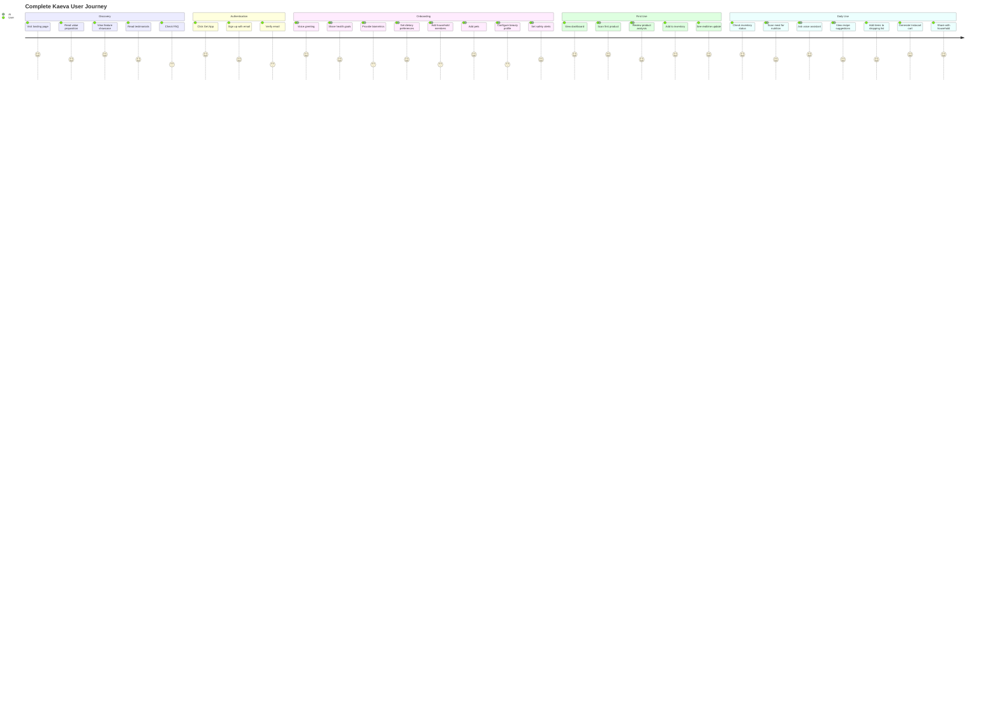

# User Journeys

Complete user journey documentation for the Kaeva application.

## Complete User Journey Map

See diagram source: [`/docs/diagrams/user-journey.mmd`](./diagrams/user-journey.mmd)

## Journey Details

### 1. Discovery Phase

**Entry Point**: User lands on `/` (Landing.tsx)

**User Goals**:
- Understand what Kaeva does
- Evaluate if it solves their problem
- Decide to sign up

**Key Interactions**:
1. **Hero Section**: "Your Home. On Autopilot" - immediate value prop
2. **Trust Bar**: Press logos build credibility
3. **Feature Showcase**: 6-card bento grid showing key features:
   - Vision scanning
   - Nutrition tracking
   - Smart shopping
   - Pet safety
   - Recipe suggestions
   - Household sharing
4. **Testimonials**: Real user stories
5. **FAQ**: Answer common questions before signup

**Success Metrics**:
- Time on page > 30 seconds
- Scroll depth > 60%
- Click-through to signup

### 2. Authentication Phase

**Entry Point**: User clicks "Get App" or "Login" → `/auth`

**User Goals**:
- Create account quickly
- Understand what permissions are needed
- Get into the app

**Key Interactions**:
1. **Value Prop Carousel**: 3-slide carousel explaining key benefits BEFORE asking for email
2. **Email/Password Form**: Simple signup with validation
3. **Auto-confirm**: No email verification needed (non-production setting)
4. **Redirect**: Immediate redirect to `/app` after successful signup

**Friction Points**:
- No social login (Google was removed due to OAuth redirect loops)
- Email/password only for now

**Success Metrics**:
- Signup completion rate
- Time to first successful auth

### 3. Voice Onboarding Phase

**Entry Point**: First-time users land on `/app` → Index.tsx shows VoiceOnboarding

**User Goals**:
- Share personal information quickly
- Understand how voice works
- Complete setup without typing

**Journey Flow**:

#### Cluster 1: Mission (ClusterMission.tsx)
- **AI Prompt**: "What are your health and lifestyle goals?"
- **User Shares**: Weight loss, muscle gain, meal planning, etc.
- **Data Saved**: `profiles.health_goals`, `profiles.lifestyle_goals`

#### Cluster 2: Biometrics (ClusterBiometrics.tsx)
- **AI Prompt**: "Tell me about yourself - age, weight, height, activity level"
- **User Shares**: Personal biometrics
- **Data Saved**: `profiles.user_age`, `profiles.user_weight`, `profiles.user_height`, `profiles.user_activity_level`
- **Calculation**: TDEE calculated and saved to `profiles.calculated_tdee`

#### Cluster 3: Language & Diet (ClusterLanguage.tsx)
- **AI Prompt**: "Any dietary preferences or restrictions?"
- **User Shares**: Vegan, keto, gluten-free, etc.
- **Data Saved**: `profiles.dietary_preferences`, `profiles.language`

#### Cluster 4: Household (ClusterHousehold.tsx)
- **AI Prompt**: "Who else lives with you? Any pets?"
- **User Shares**: Household members (adults, kids), pets (dogs, cats)
- **Data Saved**: `household_members` table, `pets` table
- **Household Created**: Auto-created with pattern "{UserName}'s Household"

#### Cluster 5: Beauty (ClusterBeauty.tsx)
- **AI Prompt**: "Tell me about your beauty routine - skin type, hair type"
- **User Shares**: Oily skin, curly hair, etc.
- **Data Saved**: `profiles.beauty_profile`

#### Cluster 6: Safety (ClusterSafety.tsx)
- **AI Prompt**: "Any allergies or health conditions we should know about?"
- **User Shares**: Peanut allergy, diabetes, etc.
- **Data Saved**: `profiles.allergies`, `household_members.allergies`, `household_members.health_conditions`

**Completion**: `profiles.onboarding_completed` set to `true`

**Voice Features**:
- **Client Tools**: Voice agent calls `updateProfile` and `saveHouseholdMember` tools to persist data immediately
- **Edit Last Answer**: Persistent button below orb allows users to correct previous responses
- **Visual Feedback**: Orb shows "acknowledged" state when user stops speaking
- **Hint Text**: Fleeting hint fades after 3 seconds guiding first-time users

**Success Metrics**:
- Onboarding completion rate
- Average completion time
- Clusters completed per session

### 4. Household Setup Phase

**Entry Point**: Users with `onboarding_completed: true` but no `current_household_id`

**User Goals**:
- Create or join household
- Understand household sharing

**Key Interactions**:
1. **Auto-created During Onboarding**: Household created automatically in `saveOnboardingData()`
2. **Set Current Household**: `profiles.current_household_id` updated
3. **Membership Record**: User added to `household_memberships` with `owner` role
4. **Activity Log**: First activity logged to `household_activity` table

**Alternative Path**: Join existing household via invite code at `/household/join`

**Success Metrics**:
- Time to household setup
- Invite acceptance rate (for multi-user households)

### 5. First Use Phase

**Entry Point**: Dashboard loads after onboarding complete

**User Goals**:
- Understand the dashboard
- Try first feature
- See value immediately

**Onboarding UI**:
1. **Welcome Banner**: First-time tips at top of dashboard
2. **Tutorial Overlay**: Optional guided tour of features (TutorialOverlay.tsx)
3. **Empty States**: Guidance in InventoryMatrix showing "Scan your first item"

**First Actions (Most Common)**:
1. **Scan First Product**: 
   - Click FloatingActionButton camera icon
   - VisionSpotlight slides up with SmartScanner
   - User points at product
   - Fleeting hint text: "Point at a product, barcode, or shelf"
   - Capture button clicks
   - Google Gemini analyzes image
   - Product identified and enriched via FatSecret
   - Results shown with "Add to Inventory" button
   - Item added to `inventory` table
   - Realtime update broadcasts to household
   - InventoryMatrix updates immediately

2. **Try Voice Assistant**:
   - Click mic button in nav dock OR KaevaAperture in FloatingActionButton OR press Cmd+Shift+K
   - ConversationOverlay appears with animated orb
   - User says: "What can you do?"
   - AI responds with capabilities
   - User asks: "What's in my fridge?"
   - AI calls `check_inventory` client tool
   - AI responds with current inventory

3. **View Nutrition**:
   - NutritionWidget on dashboard shows 0 calories logged today
   - User clicks widget → redirects to Analytics page
   - Empty state explains: "Scan a meal to start tracking"

**Success Metrics**:
- Time to first scan
- Features tried in first session
- Return rate after first session

### 6. Daily Use Phase

**Entry Point**: Returning users land on Dashboard

**User Goals**:
- Check inventory status
- Log meals
- Get recipe ideas
- Shop for groceries
- Stay on top of household

**Common Workflows**:

#### Morning Routine
1. User opens app → Dashboard
2. PulseHeader shows: "Good morning, [Name]! Day 7 streak 🔥"
3. Checks InventoryMatrix → sees milk is low (red fill level)
4. Adds "Milk" to shopping list via voice: "Hey Kaeva, add milk to my shopping list"
5. Voice assistant confirms: "Added milk to your shopping list"
6. SmartCartWidget shows updated shopping list

#### Meal Logging
1. User scans breakfast plate with SmartScanner
2. Selects "Nutrition Tracking" mode in ScanModeCarousel
3. Captures image → Google Gemini identifies: scrambled eggs, toast, avocado
4. FatSecret enriches with nutrition data
5. NutritionTrackResult shows total: 450 calories, 25g protein, 30g carbs, 20g fat
6. User confirms → logs to `meal_logs` table
7. NutritionWidget updates: 450 / 2200 calories (TDEE)
8. CalorieChart in Analytics page shows new data point

#### Recipe Discovery
1. User scrolls dashboard → RecipeFeed shows 3 suggested recipes
2. Recipes suggested based on current inventory via `suggest-recipes` edge function
3. User clicks recipe → RecipeDetail page opens
4. User enables Cooking Mode → VoiceCooking hook activates
5. Voice reads instructions step-by-step
6. User says "Next step" to progress
7. When complete, ingredients auto-deducted from inventory

#### Grocery Shopping
1. User checks SmartCartWidget → 8 items in shopping list
2. Clicks "Send to Instacart" button
3. "Building Cart..." loading overlay shows for 1.5 seconds
4. `instacart-create-cart` edge function builds cart via Instacart API
5. User redirected to Instacart with pre-filled cart
6. User completes checkout in Instacart
7. Returns to Kaeva → shopping list items marked as purchased

#### Household Collaboration
1. User's partner scans product and adds to inventory
2. RealtimeContext broadcasts change via Supabase Realtime
3. All household members see InventoryMatrix update immediately
4. HouseholdActivityFeed shows: "[Partner Name] added Oat Milk to Pantry"
5. Voice assistant receives contextual update: "Your partner just added oat milk"
6. Next time user asks voice assistant "Do we have oat milk?", AI knows about it

#### Pet Safety Monitoring
1. User scans grapes at grocery store
2. ToxicityAlert detects: grapes toxic to dogs
3. Full-screen red alert modal appears: "⚠️ TOXIC TO DOGS"
4. Alert explains: "Grapes can cause kidney failure in dogs"
5. User decides not to purchase
6. SafetyShield on dashboard shows: "All items safe ✓"

#### Voice Assistance
1. User activates voice (Cmd+Shift+K)
2. User: "What's expiring soon?"
3. AI calls `check_expiring_items` client tool
4. AI responds: "You have 3 items expiring soon: milk in 2 days, yogurt in 1 day, strawberries today"
5. User: "Add those to my shopping list"
6. AI calls `add_to_shopping_list` for each item
7. AI confirms: "Added milk, yogurt, and strawberries to your shopping list"

**Success Metrics**:
- Daily active users
- Average scans per day
- Voice interactions per session
- Recipe conversions (viewed → cooked)
- Shopping list completion rate

### 7. Household Management

**Entry Point**: User navigates to `/household`

**User Goals**:
- View household members and pets
- Edit profiles
- Generate invite links
- See household activity

**Key Interactions**:
1. **Member Management**:
   - View all household members in grid
   - Edit dietary restrictions, allergies
   - Update biometrics
   - Add new members manually

2. **Pet Management**:
   - View pet profiles (DigitalTwinCard)
   - Edit toxic flags (enable/disable toxicity alerts)
   - Update daily serving sizes

3. **Invite Generation**:
   - Click "Invite Member" button
   - `create-household-invite` edge function generates JWT invite code
   - Shareable URL displayed: `https://app.com/household/join?code=...`
   - Invite expires in 7 days, max 5 uses

4. **Activity Feed**:
   - HouseholdActivityFeed shows recent actions
   - Filtered by household_id
   - Realtime updates via subscription

**Success Metrics**:
- Multi-member household adoption rate
- Invite acceptance rate
- Household member profile completion

### 8. Analytics & Tracking

**Entry Point**: User navigates to `/analytics`

**User Goals**:
- Track nutrition over time
- Compare to TDEE goals
- Identify patterns
- Export data

**Key Interactions**:
1. **Calendar View**: 
   - Monthly calendar with logged days highlighted
   - Click day → DayDetailModal shows meal breakdown

2. **Calorie Chart**:
   - Line chart of daily calories
   - TDEE baseline shown as horizontal line
   - Hover for exact values

3. **Macro Chart**:
   - Stacked bar chart of protein/carbs/fat
   - Color-coded by macronutrient
   - Shows distribution over time

**Success Metrics**:
- Tracking consistency (days logged per month)
- Goal achievement rate (calories within ±200 of TDEE)
- Data export usage

### 9. Admin Management (Admin Users Only)

**Entry Point**: Admin user navigates to `/admin`

**User Goals**:
- Provision voice agents
- Monitor system health
- Manage user roles
- Debug issues

**Key Interactions**:
1. **Agent Provisioning**:
   - Provision onboarding agent (known ID: agent_0501kakwnx5rffaby5px9y1pskkb)
   - Provision assistant agent (known ID: agent_2601kaqwv4ejfhets9fyyafzj2e6)
   - PATCH first, fall back to POST if 404
   - Tools defined in new API format with `type: "client"`

2. **Conversation Monitoring**:
   - Live stream of `conversation_events` table
   - Filter by agent_type, event_type
   - View tool calls and responses

3. **User Management**:
   - Grant/revoke admin roles
   - View user profiles
   - Impersonate users for debugging

**Success Metrics**:
- Agent uptime
- Average response time
- Tool execution success rate

---

## User Pain Points & Solutions

| Pain Point | Kaeva Solution |
|------------|----------------|
| "I forget what's in my fridge" | Real-time inventory tracking with visual status |
| "I waste food because it expires" | Expiry alerts + voice assistant proactive reminders |
| "Meal planning takes too long" | AI recipe suggestions based on current inventory |
| "Grocery shopping is tedious" | Auto-generated shopping lists + Instacart integration |
| "Nutrition tracking is manual" | Scan meals with camera, AI identifies and logs |
| "My pet ate something toxic" | Real-time toxicity alerts when scanning products |
| "Family doesn't communicate about groceries" | Household sharing with realtime updates |
| "I don't know my calorie needs" | TDEE calculated during onboarding based on biometrics |

---

For architecture details, see [ARCHITECTURE.md](./ARCHITECTURE.md)

For component implementation, see [COMPONENTS.md](./COMPONENTS.md)

For database design, see [DATABASE_SCHEMA.md](./DATABASE_SCHEMA.md)
